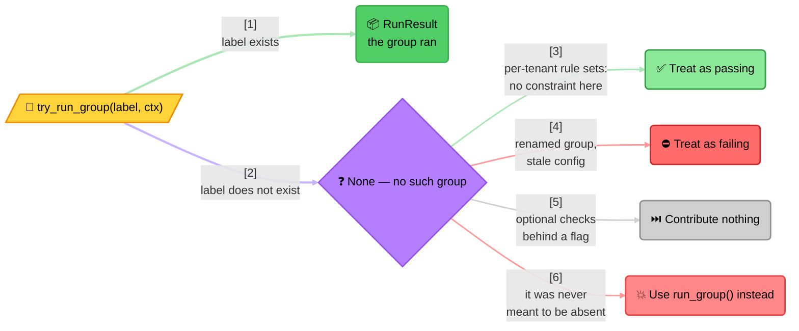

<!-- Title: Extending — Deciding What A Missing Rule Set Means -->
# Extending verdict: decide for yourself what a missing rule set means

> The strict named/group lookup raises when nothing matches; a
> try-prefixed lookup exists for when absence is expected instead —
> and only the caller can say what absence should mean.

The strict lookup raises when nothing matches. That is the right
default: a group exists only because some rule declared it, so a lookup
matching nothing can only be a typo or a stale name, and returning a
passing result there would mean a misspelled group silently approves.

But *sometimes absence is expected*, and then the strict form is the
wrong tool. The try-prefixed lookup returns nothing instead of raising.

**Absent means absent, never failed.** A rule that exists and fails is
still a real result with `passed=False`. Collapsing the two would make a
typo indistinguishable from a legitimate rejection.

## Why the library does not pick a fallback for you

Because the right answer differs per consumer, and the engine has no way
to tell which case it is in:

| Situation | What absence should mean |
| :-- | :-- |
| **Per-tenant rule sets.** One config, many deployments; not every tenant has every group | Pass — no constraint applies here |
| **Optional checks behind a flag.** A group exists only where the feature is on | Skip — do not count it either way |
| **Version skew.** A group added in a later release; older deployments lack it | Log and pass, until the rollout completes |
| **Renamed group, stale config.** The old label lingers somewhere | **Fail loudly** — this is the bug the strict form exists to catch |

Four situations, four different answers, and a library default would be
wrong for three of them. So the choice is handed back:

> **Reading the branches**: the top path is ordinary — the label exists
> and you get a result like any other call. Everything below it is one
> absent case, four possible meanings, and **only the caller knows
> which**. That is the entire reason the try-prefixed lookup exists
> rather than a parameter telling the engine what to do.
>
> **Design note**: the fourth branch is not a fallback at all. If a
> label was never meant to be absent, reaching for the try-prefixed
> lookup and defaulting is how a rule set silently stops being
> enforced — use the strict form and hear about it.

## The try-prefixed lookup is the primitive, not the convenience

Worth knowing because it explains why the two can never disagree: the
strict form is implemented as a two-line assertion on top of the
lenient one — raise if the try-prefixed lookup returned nothing,
otherwise return what it found. There is one lookup path, never a
second implementation that could drift from it.

## Prefer the strict form by default

Reach for the try-prefixed lookup when your own domain has an answer for
absence — not to avoid thinking about it. A raised error from the strict
form in development is a typo found in seconds; the same typo behind a
try-prefixed lookup defaulting to a pass is a rule set that silently
stopped being enforced, and nothing will tell you.

If you only need to enumerate what exists, the engine's own name/group
listings report exactly the lookups that will not raise — see that
language's own file in [`../../architecture/`](../../architecture/README.md)
for the concrete names.

## The fallback only applies to absence

Worth stating plainly, because it is what makes these idioms safe to
write: a default reached only on absence does **not** mean "sometimes
that default". A group that exists always reports its real verdict, and
the fallback is reached only when nothing matched. So a failing group is
still a failure under every one of the four shapes above — the default
cannot mask it.

If you are testing code that uses one of these, assert that too: the
case worth covering is a *present, failing* group, not the absent one
everybody thinks of first. See [`../../testing/`](../../testing/README.md).

## What this demonstrates

- An absent lookup and a present-but-failing lookup are two different
  outcomes, never collapsed into one.
- The choice of what absence means is made by the caller, per situation,
  never assumed by the library.
- The strict and lenient lookups share one implementation, so they can
  never silently disagree.

## Related

- [`../../architecture/`](../../architecture/README.md) — that
  language's own concrete method names behind the strict/lenient
  lookups.
- [`../../testing/`](../../testing/README.md) — why the present-and-failing
  case is the one worth a dedicated test.
- [`../isolating-flaky-predicates/README.md`](../isolating-flaky-predicates/README.md) —
  the same "the library will not guess for you" reasoning, applied to a
  predicate's own exception instead of a missing lookup.
