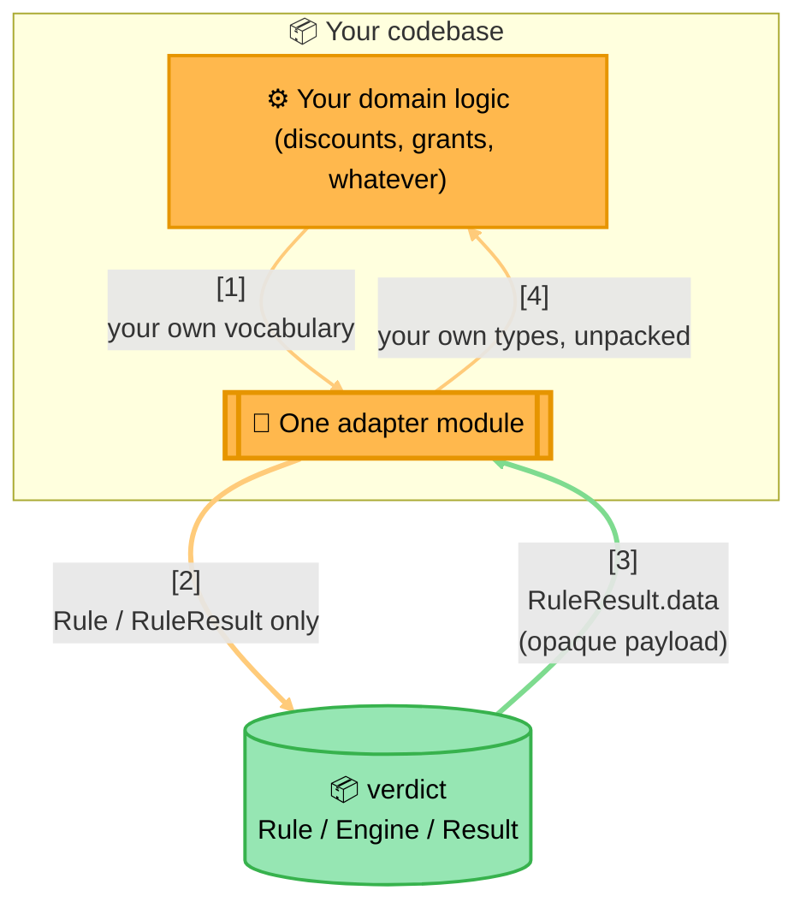

<!-- Title: Extending — Keep Your Own Domain Out Of Verdict -->
# Extending verdict: keep your own domain out of it, in one adapter module

> The single most important extension pattern — an architectural
> boundary, not a rule shape, so the code below is illustrative rather
> than a scenario the way the others here are. Each language's own file
> in this directory — [`python.md`](python.md) today — shows a small,
> generic worked instance; every sample in
> [`../../samples/`](../../samples/README.md) is a concrete instance of
> it in practice, at full scale.

Build **one** module that translates your domain's own vocabulary into
`Rule` objects and back out of `RuleResult.data`, and never let that
vocabulary leak into verdict itself or scatter across multiple call
sites.

- **A rate-limiting adapter** — the *only* place your codebase's
  rate-limiting logic imports `verdict` directly. It builds one
  `FunctionRule` per configured rate-limit window, combines them under
  an `AndRule`, and packages its own rate-limit status object as each
  rule's opaque `RuleResult.data` — everything above this one adapter
  talks in its own rate-limit vocabulary, never in `Rule`/`RuleResult`.
- **A second, independent adapter in that same codebase** — for an
  entirely unrelated domain (category/group-based access control),
  reusing the identical engine with **zero changes to `verdict`
  itself**. This is how the pattern scales past one domain per
  codebase: two adapters, same package, no coupling between them.

> **The Adapter Boundary**:
>
> 1. **Your domain logic never imports `verdict` directly** — it hands
>    its own facts to one adapter module in your own codebase.
> 2. **The adapter is the only place `verdict` gets imported** — it
>    builds `Rule`/`FunctionRule`/`AndRule`/`OrRule` objects and calls
>    into the engine, using nothing but verdict's own vocabulary.
> 3. **`RuleResult.data` is the payload channel back out** — verdict
>    never reads or constrains its shape, so the adapter can stash
>    whatever domain object it wants there and unpack it on the way back
>    to your own domain logic.
> 4. **The same shape repeats per domain, without interacting** — a
>    rate-limiting adapter and an access-control adapter in one
>    codebase are two independent instances of this diagram, sharing
>    the engine and nothing else.

Why this matters: the moment domain vocabulary (a rate-limit window, a
grant row, a discount code) leaks into a `Rule` implementation that isn't
confined to one adapter module, `verdict` stops being reusable for the
*next* domain in the same codebase — the whole reason a second consumer
could be added here with no engine-side changes at all.

## What this demonstrates

- Domain vocabulary never crosses into a `Rule`/`RuleResult` shape
  directly — one adapter module owns that translation both ways.
- A second, unrelated domain in the same codebase is a second adapter
  module, not a change to the first one or to verdict itself.
- `RuleResult.data` is deliberately opaque to verdict, which is what
  makes it a safe channel for a domain-specific payload.

## Related

- [`../../samples/README.md`](../../samples/README.md) — every worked
  sample is, underneath, an instance of this boundary.
- [`../new-rule-shape/README.md`](../new-rule-shape/README.md) — the
  other place a domain-specific need becomes consumer code rather than
  a request against this package.
