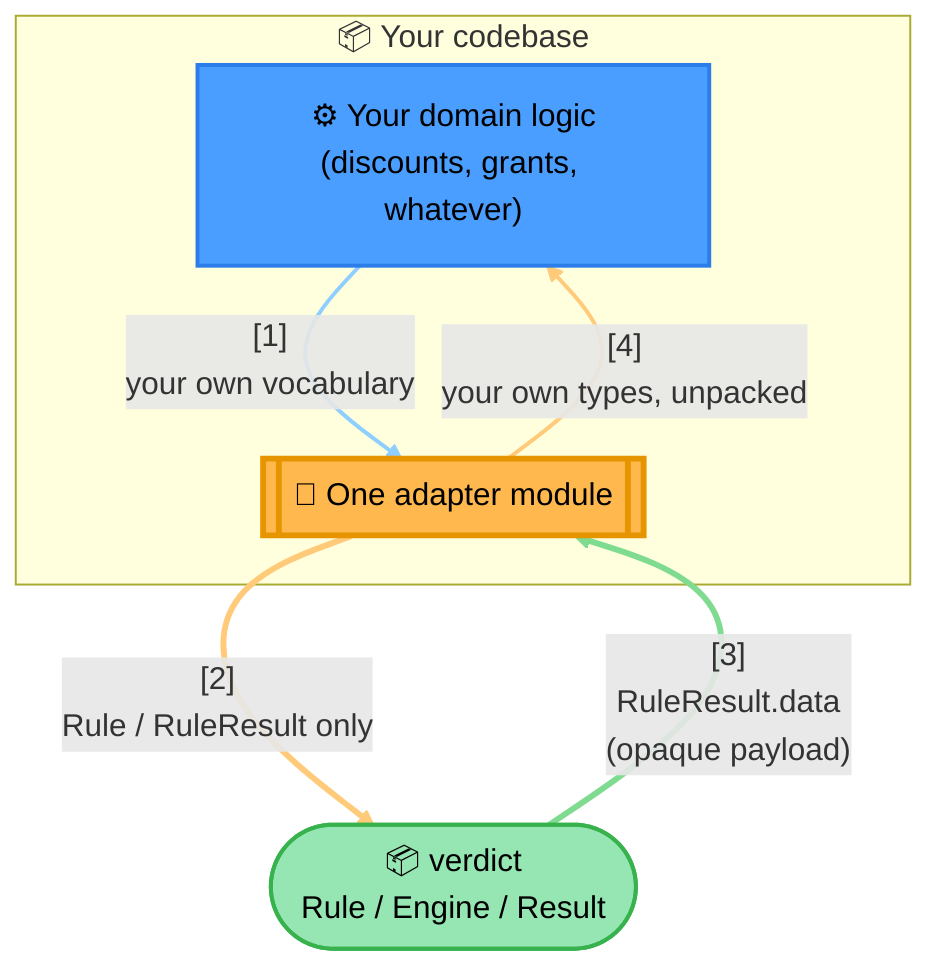

<!-- Title: Extending — Keep Your Own Domain Out Of Verdict -->
# Extending verdict: keep your own domain out of it, in one adapter module

> An architectural boundary, not a rule shape — every sample in
> [`../../../fixtures/README.md`](../../../fixtures/README.md) is already a full-scale
> instance of it in practice.

Build **one** module that translates your domain's own vocabulary into
`Rule` objects and back out of `RuleResult.data`, and never let that
vocabulary leak into verdict itself or scatter across multiple call
sites.

- **A rate-limiting adapter** — the *only* place your codebase's
  rate-limiting logic imports `verdict` directly. It builds one
  `FunctionRule` per configured rate-limit window, runs them through the
  engine's run-everything mode, and packages its own rate-limit status
  object as each rule's opaque `RuleResult.data` — everything above this
  one adapter talks in its own rate-limit vocabulary, never in
  `Rule`/`RuleResult`. Run-everything, not a composite, because the
  adapter's own contract promises one status per window and a composite
  stops at the first failure.
- **A second, independent adapter in that same codebase** — for an
  entirely unrelated domain (category/group-based access control),
  reusing the identical engine with **zero changes to `verdict`
  itself**. This is how the pattern scales past one domain per
  codebase: two adapters, same package, no coupling between them.

```mermaid
graph TB
    subgraph YourCode["📦 Your codebase"]
        direction TB
        Domain["⚙️ Your domain logic<br/>(discounts, grants, whatever)"]
        Adapter[["🔌 One adapter module"]]
    end
    Verdict(["📦 verdict<br/>Rule / Engine / Result"])

    %% Link 0: Domain -> Adapter
    Domain -->|"[1]<br/>your own vocabulary"| Adapter
    %% Link 1: Adapter -> Verdict
    Adapter -->|"[2]<br/>Rule / RuleResult only"| Verdict
    %% Link 2: Verdict -> Adapter
    Verdict -->|"[3]<br/>RuleResult.data<br/>(opaque payload)"| Adapter
    %% Link 3: Adapter -> Domain
    Adapter -->|"[4]<br/>your own types, unpacked"| Domain

    style Domain fill:#4A9EFF,stroke:#2B7DE9,stroke-width:2px,color:#000
    style Adapter fill:#FFB84D,stroke:#E69500,stroke-width:3px,color:#000
    style Verdict fill:#96E6B3,stroke:#37B24D,stroke-width:2px,color:#000

    %% Link Index:
    %% 0: domain logic hands its own facts to the adapter
    %% 1: the adapter builds Rule objects, the only place verdict is imported
    %% 2: verdict hands back RuleResult, whose .data is an opaque payload
    %% 3: the adapter unpacks that payload back into your own domain types
    linkStyle 0 stroke:#8ECFFF,stroke-width:2px
    linkStyle 1 stroke:#FFCB7A,stroke-width:3px
    linkStyle 2 stroke:#7EDB8F,stroke-width:3px
    linkStyle 3 stroke:#FFCB7A,stroke-width:2px
```

> **The Adapter Boundary**:
>
> 1. **Your domain logic never imports `verdict` directly** — it hands
>    its own facts to one adapter module in your own codebase.
> 2. **The adapter is the only place `verdict` gets imported** — it
>    builds `Rule`/`FunctionRule`/`AndRule`/`OrRule` objects and calls
>    into the engine, using nothing but verdict's own vocabulary.
> 3. **`RuleResult.data` is the payload channel back out** — verdict
>    never reads or constrains its shape, so the adapter can stash
>    whatever domain object it wants there and unpack it on the way back
>    to your own domain logic.
> 4. **The same shape repeats per domain, without interacting** — a
>    rate-limiting adapter and an access-control adapter in one
>    codebase are two independent instances of this diagram, sharing
>    the engine and nothing else.

Why this matters: the moment domain vocabulary (a rate-limit window, a
grant row, a discount code) leaks into a `Rule` implementation that isn't
confined to one adapter module, `verdict` stops being reusable for the
*next* domain in the same codebase — the whole reason a second consumer
could be added here with no engine-side changes at all.

## What this demonstrates

- One adapter module owns the translation both ways; domain vocabulary
  never crosses into a `Rule`/`RuleResult` shape directly.
- A second, unrelated domain in the same codebase is a second adapter
  module, not a change to the first one or to verdict itself.
- The adapter's own contract determines which run mode it reaches for —
  a promise of one result per input rules out a short-circuiting
  composite.

## Related

- [`../../../fixtures/README.md`](../../../fixtures/README.md) — every worked
  sample is, underneath, an instance of this boundary.
- [`../new-rule-shape/README.md`](../new-rule-shape/README.md) — the
  other place a domain-specific need becomes consumer code rather than
  a request against this package.

## This is an option, not a mandate

The boundary is what keeps a consumer from being locked into `verdict`
at all: if it ever needs replacing, the adapter module is the only thing
that changes. Each language's page below demonstrates exactly that, with
a second implementation of the same contract that does not use `verdict`.

Coupling domain logic straight to `Rule`/`RuleResult` throughout a
codebase is a legitimate choice too, if the indirection is not worth it.
Nothing in this package enforces either way.
