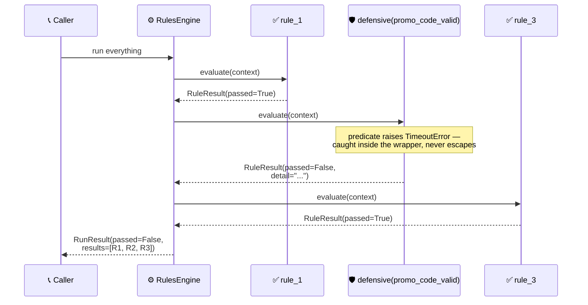

<!-- Title: Extending — Isolating A Flaky Predicate -->
# Extending verdict: stop one flaky predicate from taking out the whole run

> Nothing in this package catches an exception a predicate raises. That
> is a deliberate boundary, and this page is why, plus how to opt out of
> it for one rule.

**Nothing in this package catches an exception a predicate raises.** Not
a composite, not a run-everything mode, not a named or grouped lookup. If
a predicate's own code raises — an HTTP call timing out, a database
lookup failing — that exception propagates straight out of whichever
call you made, exactly as if you had called the failing code yourself
with nothing in between.

This earns a scenario rather than a line in
[`../../architecture/README.md`](../../architecture/README.md) because
"rules *engine*" invites the opposite assumption: that the engine is the
fault-tolerant layer keeping twenty independent checks going when one
breaks. It is not, and the cost of guessing wrong is severe — one flaky
external call takes out every other rule's diagnostics in the same run,
not just its own.

If that is not what you want, wrap the predicate so its own exception
becomes a failing outcome instead of propagating. The wrapped check then
reports as a normal failing entry, and every other rule in that run
still runs and still reports.

> **`rule_3` Still Runs**: without the wrapper, `R2`'s own `TimeoutError`
> propagates straight out of the run — `Engine` never calls `R3` at all,
> and the caller gets a stack trace instead of a `RunResult`. Wrapping
> `R2` alone keeps the other two rules' diagnostics intact; nothing about
> `R1` or `R3` changes.

## Why the library does not catch this for you

Whether a given exception means "the condition failed" or "the code is
broken" is a fact about your own predicate, not something readable off
the exception — and both answers are right somewhere:

| The failure | What it should probably do |
| :-- | :-- |
| A promo-code service times out | Report "not valid" and let checkout continue — the customer just misses the discount |
| A database connection fails inside an access-control check | **Not** quietly report "access denied" — that is a system fault being misreported as a policy decision |

A default either way is wrong for one of those.

Catching unconditionally would also mean deciding that the difference
between a domain outcome and a code bug does not matter. A discount
calculation dividing by a quantity of `0` is not "this rule failed," it
is a bug in the predicate. Caught unconditionally it *becomes* "this rule
failed" — a silent wrong answer sitting in the run's results, looking
exactly like a legitimate rejection. Left to propagate it is a stack
trace pointing at the line that is wrong, in front of whoever can fix it.

So the decision stays with whoever wrote the predicate, opted into per
rule, never assumed for all of them — the same reasoning
[`../absence-vs-failure/README.md`](../absence-vs-failure/README.md)
applies to a missing lookup.

## What this demonstrates

- A predicate's own exception propagates unchanged; nothing here
  intercepts it.
- Turning one into a failing outcome is a consumer decision, per rule.
- Isolating one flaky check needs no change on this package's side.

## Related

- [`../../architecture/README.md`](../../architecture/README.md) — the
  execution-model guarantees this behavior sits alongside.
- [`../absence-vs-failure/README.md`](../absence-vs-failure/README.md) —
  the same "the library will not guess for you" reasoning, applied to a
  missing lookup.
