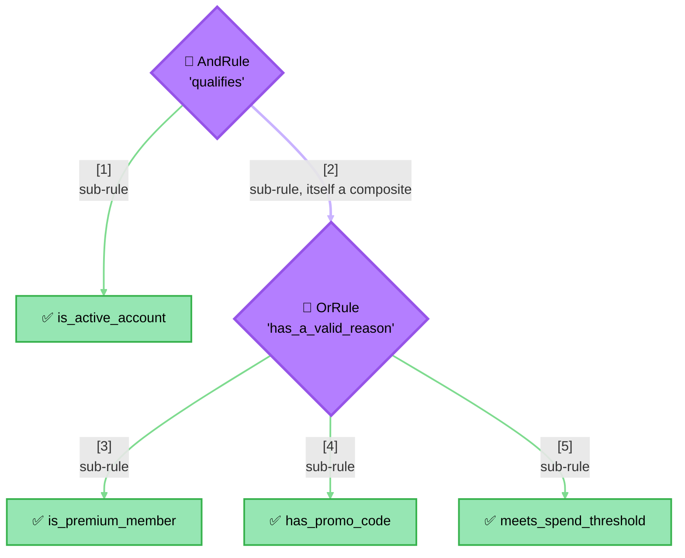

<!-- Title: Extending — Nesting Composites Arbitrarily -->
# Extending verdict: nest composites arbitrarily

> Because `AndRule`/`OrRule` satisfy `Rule` themselves, they can hold
> each other as sub-rules to any depth, with no special-casing anywhere.
> Each language's own file in this directory — [`python.md`](python.md)
> today — shows the concrete code.

> **What Makes This Free**: the purple diamonds (`qualifies`,
> `has_a_valid_reason`) are composites; the green boxes are plain leaf
> rules — but nothing in the tree's shape marks a depth *limit*, and
> nothing holding `qualifies` (a `RulesEngine`, another `AndRule`, a
> direct caller) can tell from the outside that one of its two
> sub-rules is itself a three-rule `OrRule` rather than another leaf.
> That's the whole payoff of `Rule` being a structural type rather than
> a fixed type hierarchy — see
> [`../../architecture/README.md`](../../architecture/README.md#type-structure).

`qualifies` reads exactly like a plain rule to anything holding it — a
`RulesEngine`, another `AndRule`, or a direct call to its own
`evaluate` — since a composite rule is structurally indistinguishable
from a plain one from the outside.

## What this demonstrates

- A composite rule nested inside another composite is structurally
  indistinguishable from a plain leaf rule to whatever holds it.
- Nesting has no built-in depth limit — the tree's shape is entirely a
  consumer decision, not a constraint this package imposes.

## Related

- [`../../architecture/README.md`](../../architecture/README.md#type-structure) —
  why `Rule` being a structural type is what makes nesting free.
- [`../new-rule-shape/README.md`](../new-rule-shape/README.md) — a
  custom combinator nests exactly the same way as `AndRule`/`OrRule` do.
