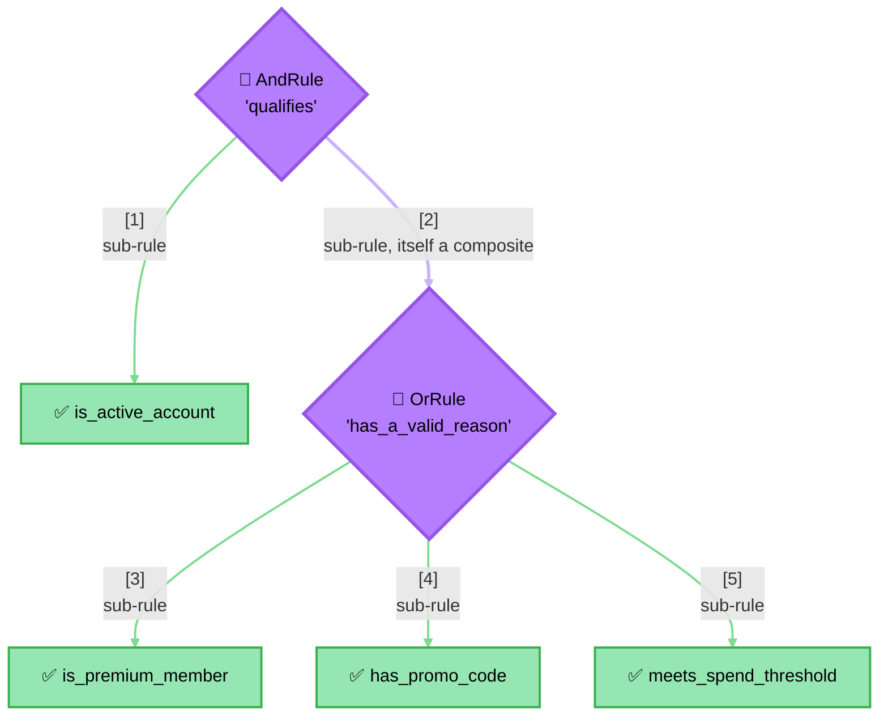

<!-- Title: Extending — Nesting Composites Arbitrarily -->
# Extending verdict: nest composites arbitrarily

> Because `AndRule`/`OrRule` satisfy `Rule` themselves, they can hold
> each other as sub-rules to any depth, with no special-casing anywhere.

```mermaid
graph TB
    Qualifies{"🔀 AndRule<br/>'qualifies'"}
    Active["✅ is_active_account"]
    Reason{"🔀 OrRule<br/>'has_a_valid_reason'"}
    Premium["✅ is_premium_member"]
    Promo["✅ has_promo_code"]
    Spend["✅ meets_spend_threshold"]

    %% Link 0: Qualifies -> Active
    Qualifies -->|"[1]<br/>sub-rule"| Active
    %% Link 1: Qualifies -> Reason
    Qualifies -->|"[2]<br/>sub-rule, itself a composite"| Reason
    %% Link 2: Reason -> Premium
    Reason -->|"[3]<br/>sub-rule"| Premium
    %% Link 3: Reason -> Promo
    Reason -->|"[4]<br/>sub-rule"| Promo
    %% Link 4: Reason -> Spend
    Reason -->|"[5]<br/>sub-rule"| Spend

    style Qualifies fill:#B47EFF,stroke:#9654E8,stroke-width:3px,color:#000
    style Active fill:#96E6B3,stroke:#37B24D,stroke-width:2px,color:#000
    style Reason fill:#B47EFF,stroke:#9654E8,stroke-width:3px,color:#000
    style Premium fill:#96E6B3,stroke:#37B24D,stroke-width:2px,color:#000
    style Promo fill:#96E6B3,stroke:#37B24D,stroke-width:2px,color:#000
    style Spend fill:#96E6B3,stroke:#37B24D,stroke-width:2px,color:#000

    %% Link Index:
    %% 0: qualifies' first sub-rule is a plain leaf rule
    %% 1: its second sub-rule is itself a composite — arbitrary nesting, no special-casing
    %% 2-4: the nested OrRule has its own three plain leaf sub-rules
    linkStyle 0 stroke:#7EDB8F,stroke-width:2px
    linkStyle 1 stroke:#C9B3FF,stroke-width:3px
    linkStyle 2 stroke:#7EDB8F,stroke-width:2px
    linkStyle 3 stroke:#7EDB8F,stroke-width:2px
    linkStyle 4 stroke:#7EDB8F,stroke-width:2px
```

> **What Makes This Free**: the purple diamonds (`qualifies`,
> `has_a_valid_reason`) are composites; the green boxes are plain leaf
> rules — but nothing in the tree's shape marks a depth *limit*, and
> nothing holding `qualifies` (a `RulesEngine`, another `AndRule`, a
> direct caller) can tell from the outside that one of its two
> sub-rules is itself a three-rule `OrRule` rather than another leaf.
> That's the whole payoff of `Rule` being a structural type rather than
> a fixed type hierarchy — see
> [`../../architecture/README.md`](../../architecture/README.md#type-structure).

## Reading a result of this shape

Depth is where the three result views stop being interchangeable, so it
is worth knowing which answers what before walking a nested result:

| View | Answers | Depth |
| :-- | :-- | :-- |
| sub-results | What this node actually evaluated | One level |
| decided-by | Which of those children explain *this* node's verdict | One level |
| leaves / failing-leaves | The terminal checks the whole tree bottoms out in | Fully recursive |

On the tree above, the outer composite's decided-by names both its own
children, while the inner one's names only the sub-rule that stopped it —
same tree, two levels, two different answers. Each language's page below
shows all three against this exact shape.

A composite's children are in its sub-results, never in `data`, which is
an opaque slot for a caller's own payload and is never written to by a
composite.

## What this demonstrates

- A composite nested inside another is structurally indistinguishable
  from a plain leaf to whatever holds it.
- Nesting has no built-in depth limit — the tree's shape is a consumer
  decision, not a constraint this package imposes.
- Reading a nested result means picking the view that matches the
  question; depth is what makes choosing wrong easy.

## Related

- [`../../architecture/README.md`](../../architecture/README.md#type-structure) —
  why `Rule` being a structural type is what makes nesting free.
- [`../new-rule-shape/README.md`](../new-rule-shape/README.md) — a
  custom combinator nests exactly the same way as `AndRule`/`OrRule` do.
