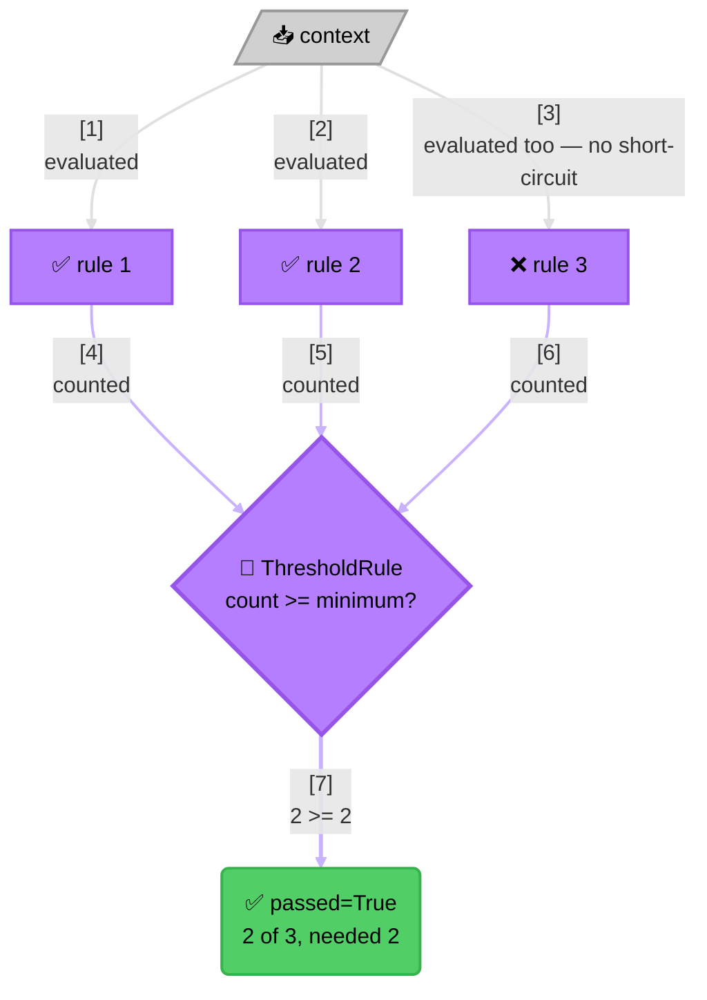

<!-- Title: Extending — A Genuinely New Rule Shape -->
# Extending verdict: a genuinely new rule shape

> `AndRule`/`OrRule` cover "every sub-rule must pass" and "at least one
> must pass." A requirement that doesn't fit either is a new type,
> written entirely in your own code. Each language's own file in this
> directory — [`python.md`](python.md) today — shows the concrete code.

"At least N of these M must pass," a weighted score threshold, anything
with its own combination logic — none of that needs a change on
`verdict`'s side. A new combinator is a new type in **your own** code,
satisfying `Rule` structurally, exactly as free to exist as
`AndRule`/`OrRule` are.

Once written, that type can be handed to a `RulesEngine`, nested inside
an `AndRule`, or hold an `AndRule` as one of its own sub-rules — every
existing piece of this package already knows how to run it, because
nothing anywhere checks a concrete type; the `Rule` structural contract
is the only thing that matters. See
[`../../architecture/README.md`](../../architecture/README.md#type-structure)
for why that's true.

> **The One Real Trade-Off Here**: this shape evaluates every sub-rule
> unconditionally rather than short-circuiting — a threshold count can't
> be decided early the way a plain `and`/`or` can, so rule 3 above still
> runs even though it ends up failing. That's a legitimate property of
> *this* rule shape to have, not something `verdict` imposes on it —
> contrast with `AndRule`/`OrRule`'s own diagrams in
> [`../../architecture/README.md`](../../architecture/README.md#execution-model-sequential-not-concurrent),
> where stopping early is the entire point.

## What this demonstrates

- A combination shape `AndRule`/`OrRule` don't cover is a new type in
  consumer code, not a change requested of this package.
- The new type composes with everything already built on `Rule` —
  engines, other composites, direct callers — with no registration step.
- Evaluating every sub-rule unconditionally (no short-circuit) is a
  legitimate, deliberate property for a shape like this to have, not a
  limitation to work around.

## Related

- [`../../architecture/README.md`](../../architecture/README.md#type-structure) —
  why `Rule` being a structural type is what makes this free.
- [`../../samples/graduation-requirement-verdict/README.md`](../../samples/graduation-requirement-verdict/README.md) —
  a full worked example whose elective requirement is a real instance of
  this pattern (`AtLeastNRule`).
