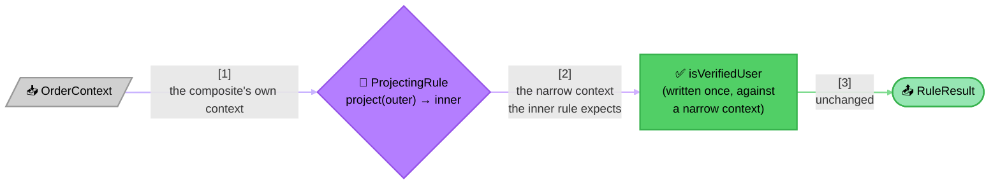

<!-- Title: Extending — Reusing a Typed Rule Across Contexts -->
# Extending verdict: reusing a typed rule across contexts

> `AndRule[TContext]`/`OrRule[TContext]` require every sub-rule to share
> the exact same `TContext` — a real guarantee a typed composite buys
> that dict-context never could. Reusing one rule inside a composite
> built on a different context goes through a small, explicit adapter
> in your own code, never a special case in `AndRule`, `OrRule`, or the
> engine.

A rule genuinely meant to run against more than one context shape — an
`is_verified_user` check wanted inside both a checkout flow's
`OrderContext` and an onboarding flow's `SignupContext`, where the fact
lives at a different nesting path in each — has two honest options:
write it against a plain `dict` (see
[`../../architecture/README.md`](../../architecture/README.md#type-structure)
for why dict-context stays first-class, permanently, not a fallback for
the untyped), or write it once against its own narrow context and
**project** the wider context down to it at each reuse site.

The projecting adapter is the second option: a small `Rule` wrapping an
inner rule, translating an outer context into the inner one before
delegating. It satisfies `Rule[TOuter]` structurally, so it composes
inside an `AndRule[TOuter]`/`OrRule[TOuter]` or a
`RulesEngine[TOuter]` exactly like any other rule — nothing anywhere
needs to know it's a projection rather than a leaf.

> **Why this lives in your own code, not `verdict`'s**: no generics
> design in any language can make `AndRule`'s sub-rules genuinely
> heterogeneous in context without losing the "every sub-rule shares one
> `TContext`" guarantee that makes the composite worth typing at all.
> Weakening that guarantee to accommodate one mixed-context reuse would
> cost every consumer who never needed it. A one-class adapter, written
> once per reuse boundary, keeps the guarantee intact for everyone else.

## What this demonstrates

- `AndRule[TContext]`/`OrRule[TContext]`'s same-context requirement is a
  real constraint, not a formality — mixing contexts inside one
  composite is a type error, catching today what dict-context could
  only fail on at runtime with a missing key.
- Reusing a rule across two differently-shaped contexts is possible
  without weakening that constraint, via a small, additive adapter — the
  same "new capability, new file, nothing existing moves" shape as
  [`new-rule-shape/`](../new-rule-shape/README.md)'s own combinator.
- The adapter is invisible to everything downstream: an engine or a
  composite holding a `ProjectingRule` cannot tell it apart from a leaf
  rule written natively against that context.
- This is a real, additive escape valve from "generics forced me to
  duplicate my rule" — not a sign that typed contexts were the wrong
  choice.

## Related

- [`../../architecture/README.md`](../../architecture/README.md#type-structure) —
  why `Rule` is generic over context, and why dict-context stays
  first-class rather than becoming a fallback.
- [`new-rule-shape/`](../new-rule-shape/README.md) — the same
  "write it once in your own code, it composes for free" pattern,
  applied to a combination strategy instead of a context adapter.
- [`domain-adapter-module/`](../domain-adapter-module/README.md) — the
  companion discipline of keeping a consumer's own domain vocabulary out
  of `verdict`, relevant here because a projection function is exactly
  the kind of domain-specific glue that belongs in a consumer's adapter
  module, not in `verdict` itself.
