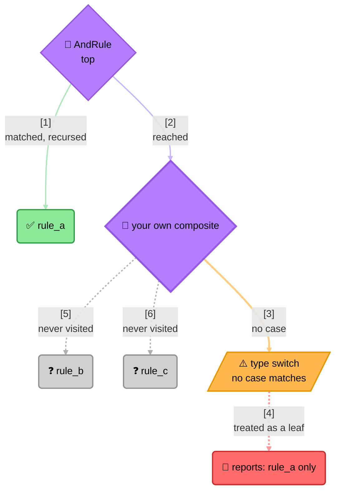

<!-- Title: Extending — Walking a Rule Tree -->
# Extending verdict: walking a rule tree

> A composite exposes the rules it was built from, before anything is
> evaluated. That makes a rule *tree* walkable — listing every named rule a
> decision could consult, checking for duplicate names, resolving each one
> against your own registry — all without running it.

The result surface answers *what ran*. This answers *what was built*, and the
two genuinely differ, because a composite short-circuits: a rule that never
got evaluated is absent from the result and present in the tree.

The capability is a contract separate from `Rule` — a composite satisfies
both, a leaf only `Rule`. That separation is the whole design, and the reason
is the trap below.

## The trap: a type switch silently under-reports

The obvious walk tests for the three built-in composites:

```text
if rule is AndRule  -> recurse into its parts
if rule is OrRule   -> recurse into its parts
if rule is NotRule  -> recurse into its one part
otherwise           -> it is a leaf
```

That is wrong the moment anyone nests a fourth kind of composite — a
threshold rule from
[`new-rule-shape/`](../new-rule-shape/README.md), an adapter from
[`reusing-a-rule-across-contexts/`](../reusing-a-rule-across-contexts/README.md),
or your own. The switch falls through to "it is a leaf", so every rule inside
that subtree is reported as **absent**. Nothing throws. A registry lookup
silently resolves fewer rules than the decision will actually consult, and a
duplicate-name check silently misses the duplicates.



> **Reading the Diagram**: the walk is correct for everything the switch has
> a case for, which is exactly why the bug survives review — it works on
> every tree built only from built-ins. The failure needs a *fourth* kind of
> composite to appear, which is normal the moment anyone follows
> [`new-rule-shape/`](../new-rule-shape/README.md). Testing for the contract
> instead has no cases to be missing: a composite is anything that says it
> has parts.

## The fix: test for the contract

One capability test replaces the switch, and the walk reaches every composite
— including ones verdict has never seen, because yours satisfies the same
contract with no registration:

- **Python** — [`python.md`](python.md)
- **JS/TS** — [`js.md`](js.md)
- **Dart** — [`dart.md`](dart.md)
- **C#** — [`csharp.md`](csharp.md)

## What this demonstrates

- A composite's parts are readable without evaluating it, so the shape of a
  decision is inspectable before any predicate runs.
- A **leaf deliberately does not** satisfy the contract, so "structure or
  terminal check" never needs a concrete type.
- The member is **uniform**: a negation reports a one-element list rather
  than a differently-named single rule, so a walk needs no knowledge of which
  composite it is holding. A vacuous composite reports an empty list, which
  is a composite with no parts, not a leaf.
- Your own composite joins in by satisfying the contract. Nothing registers,
  and verdict does not need to know the type exists — the same property that
  makes `Rule` itself work.

## What this does not give you

**Rebuilding a composite over new parts.** Reading parts is total; rebuilding
is partial, because a composite may hold state that is not in its parts —
`new-rule-shape/`'s own threshold rule carries a minimum alongside its
sub-rules, and "the same composite over new parts" is not something a contract
can promise on its behalf. If you need to substitute a rule inside a tree,
rebuild the composites whose construction *you* know and treat anything else
as an error rather than guessing: that fails loudly instead of quietly
dropping a composite's own configuration.

## Related

- [`new-rule-shape/`](../new-rule-shape/README.md) — writing the kind of
  composite that makes the type-switch trap above real.
- [`nesting-composites/`](../nesting-composites/README.md) — the nesting this
  walks over.
- [`../../architecture/README.md`](../../architecture/README.md#type-structure)
  — why a structural contract is what every part of this package dispatches
  on.
