<!-- Title: Extending — Wrapping A Predicate -->
# Extending verdict: wrapping a predicate you already have

> The common case, and the one `verdict` itself expects to cover most
> needs.

Any async function that inspects a context and decides pass/fail is a
rule the moment it's wrapped in the language's own `FunctionRule`. No
new class, no new file needed for this shape — it's what the large
majority of rules should end up being.

Because `Rule` is a structural type, not an abstract base class, this
wrapping requires **zero registration, zero imports beyond the ones you
already need, and zero subclassing**. You never ask this package's
permission to add a new kind of rule.

```mermaid
graph LR
    Predicate[/"📥 async predicate<br/>(context) -> pass/fail"/]
    Wrap[["🔌 FunctionRule(name, predicate)"]]
    RuleShape("✅ satisfies Rule<br/>structurally")
    Holder[["⚙️ RulesEngine /<br/>AndRule / OrRule"]]

    %% Link 0: Predicate -> Wrap
    Predicate -->|"[1]<br/>wrapped, not subclassed"| Wrap
    %% Link 1: Wrap -> RuleShape
    Wrap -->|"[2]<br/>name + group + evaluate()"| RuleShape
    %% Link 2: RuleShape -> Holder
    RuleShape -->|"[3]<br/>held like any other Rule"| Holder

    style Predicate fill:#D0D0D0,stroke:#999999,stroke-width:2px,color:#000
    style Wrap fill:#FFB84D,stroke:#E69500,stroke-width:3px,color:#000
    style RuleShape fill:#51CF66,stroke:#37B24D,stroke-width:2px,color:#000
    style Holder fill:#B47EFF,stroke:#9654E8,stroke-width:2px,color:#000

    %% Link Index:
    %% 0: a plain predicate is wrapped, not extended or registered
    %% 1: the wrapper adds exactly what Rule's structural contract needs
    %% 2: nothing downstream can tell this apart from a built-in rule
    linkStyle 0 stroke:#FFCB7A,stroke-width:2px
    linkStyle 1 stroke:#FFCB7A,stroke-width:2px
    linkStyle 2 stroke:#C9B3FF,stroke-width:2px
```

> **Nothing After The Wrap Knows The Difference**: `RulesEngine` and
> `AndRule`/`OrRule` hold whatever satisfies `Rule`'s structural
> contract — a wrapped predicate is indistinguishable from a custom
> `Rule` implementation ([`../new-rule-shape/`](../new-rule-shape/README.md))
> from the outside, which is exactly why reaching for the wrapper first
> costs nothing to reconsider later.

## What this demonstrates

- A plain predicate function becomes a `Rule` by construction, not by
  inheritance.
- `FunctionRule` is the on-ramp for the overwhelming majority of rules;
  reaching for a custom `Rule` implementation (see
  [`../new-rule-shape/`](../new-rule-shape/README.md)) is the exception,
  not the default.

## Related

- [`../new-rule-shape/`](../new-rule-shape/README.md) — for when
  `AndRule`/`OrRule` don't cover the combination logic you need and a
  predicate wrapper isn't enough either.
- [`../README.md`](../README.md) — the full index of extension
  scenarios.
