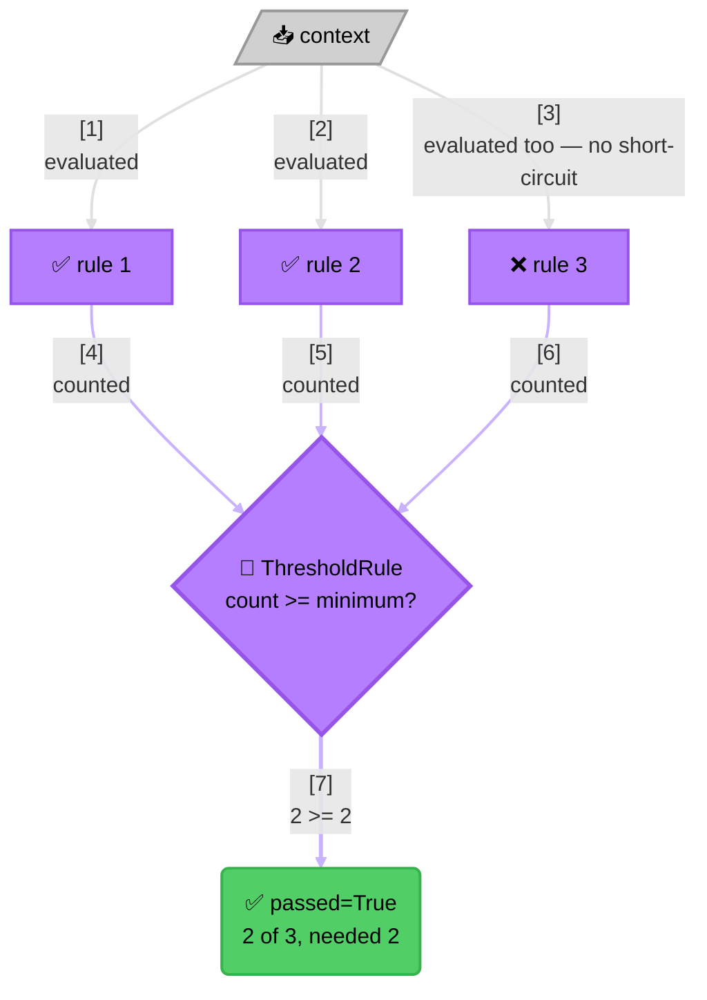
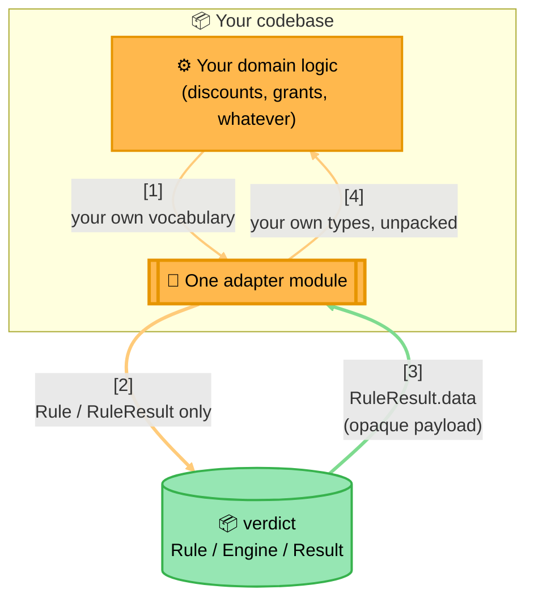
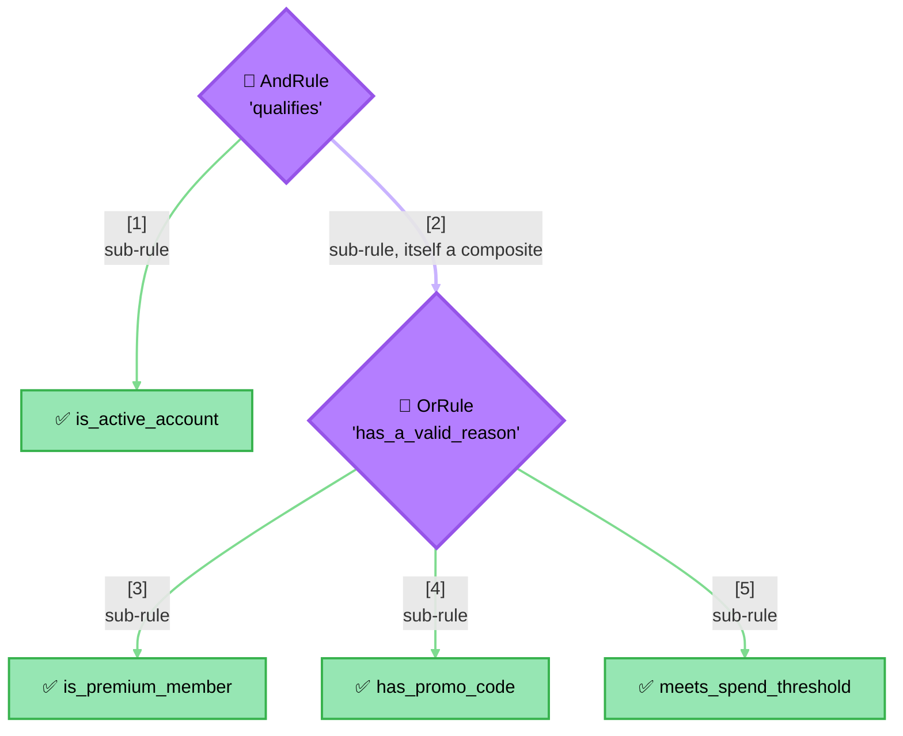
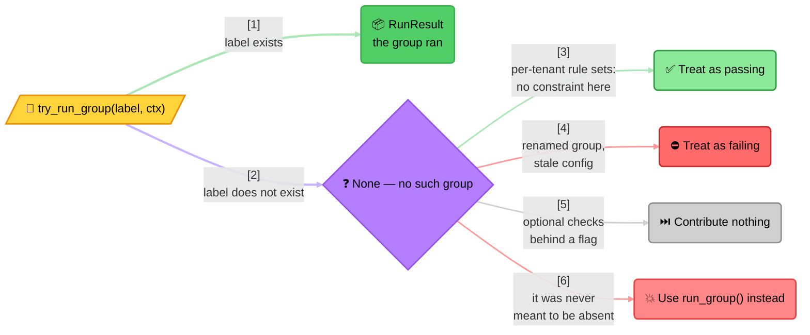

<!-- Title: Verdict Extension Guide -->
# Verdict — Extension Guide

> For people building *on top of* Verdict from their own codebase — a new
> rule shape, a new domain, a new way of assembling rules — without
> changing anything under the package's own source itself (today, that's
> Python's `python/src/verdict/`; the same recipes apply unchanged in any
> future language this package ships for, against that language's own
> source tree). If the change you're making genuinely belongs inside this
> package, see [`maintenance.md`](maintenance.md) instead.

The short version: because [`Rule`](architecture.md#type-structure) is a
structural `Protocol`, not an abstract base class, everything below is
possible with **zero registration, zero imports beyond the ones you
already need, and zero subclassing**. You never ask this package's
permission to add a new kind of rule.

## Recipe 1 — wrap a predicate you already have

The common case, and the one `verdict` itself expects to cover most
needs: any async function that inspects a `dict` and decides pass/fail
is a rule the moment it's wrapped in `FunctionRule`.

```python
from verdict import FunctionRule, RuleResult

async def cart_meets_minimum(context: dict) -> RuleResult:
    total = context["cart_total"]
    minimum = context["minimum_for_offer"]
    return RuleResult(
        rule_name="cart_meets_minimum",
        passed=total >= minimum,
        detail=f"{total} vs minimum {minimum}",
    )

rule = FunctionRule("cart_meets_minimum", cart_meets_minimum)
```

No new class, no new file needed for this shape of rule — it's what
the large majority of rules should end up being.

## Recipe 2 — a genuinely new rule shape

`AndRule`/`OrRule` cover "every sub-rule must pass" and "at least one
must pass." A requirement that doesn't fit either — "at least N of these
M must pass," a weighted score threshold, anything with its own
combination logic — is a new class implemented entirely in **your own**
code, satisfying `Rule` structurally:

```python
from verdict import Rule, RuleResult


class ThresholdRule:
    """Passes if at least `minimum` of the given sub-rules pass.

    Not part of verdict itself — a consumer-defined combinator, exactly
    as free to exist as AndRule/OrRule are, with no changes needed on
    verdict's side to support it.
    """

    def __init__(self, name: str, rules: list[Rule], minimum: int, group: str | None = None) -> None:
        self.name = name
        self.group = group
        self._rules = rules
        self._minimum = minimum

    async def evaluate(self, context: dict) -> RuleResult:
        sub_results = [await rule.evaluate(context) for rule in self._rules]
        passed_count = sum(1 for r in sub_results if r.passed)
        return RuleResult(
            rule_name=self.name,
            passed=passed_count >= self._minimum,
            detail=f"{passed_count} of {len(self._rules)} passed, needed {self._minimum}",
            data=sub_results,
        )
```

`ThresholdRule` can now be handed to a `RulesEngine`, nested inside an
`AndRule`, or hold an `AndRule` as one of its own sub-rules — every
existing piece of this package already knows how to run it, because
nothing anywhere checks `isinstance(x, FunctionRule)` or similar; the
`Rule` `Protocol` (`@runtime_checkable`) is the only contract that
matters.



> **The One Real Trade-Off Here**: this shape evaluates every sub-rule
> unconditionally rather than short-circuiting — a threshold count can't
> be decided early the way a plain `and`/`or` can, so rule 3 above still
> runs even though it ends up failing. That's a legitimate property of
> *this* rule shape to have, not something `verdict` imposes on it —
> contrast with `AndRule`/`OrRule`'s own diagrams in
> [`architecture.md`](architecture.md#execution-model-sequential-not-concurrent),
> where stopping early is the entire point.

## Recipe 3 — keep your own domain out of `verdict`, in one adapter module

The single most important extension pattern: build **one** module
that translates your domain's own vocabulary into `Rule` objects and
back out of `RuleResult.data`, and never let that vocabulary leak into
verdict itself or scatter across multiple call sites.

- **A rate-limiting adapter** — the *only* place your codebase's
  rate-limiting logic imports `verdict` directly. It builds one
  `FunctionRule` per configured rate-limit window, combines them under
  an `AndRule`, and packages its own rate-limit status object as each
  rule's opaque `RuleResult.data` — everything above this one adapter
  talks in its own rate-limit vocabulary, never in `Rule`/`RuleResult`.
- **A second, independent adapter in that same codebase** — for an
  entirely unrelated domain (category/group-based access control),
  reusing the identical engine with **zero changes to `verdict`
  itself**. This is how the pattern scales past one domain per
  codebase: two adapters, same package, no coupling between them.



> **The Adapter Boundary**:
> 1. **Your domain logic never imports `verdict` directly** — it hands
>    its own facts to one adapter module in your own codebase.
> 2. **The adapter is the only place `verdict` gets imported** — it
>    builds `Rule`/`FunctionRule`/`AndRule`/`OrRule` objects and calls
>    into the engine, using nothing but verdict's own vocabulary.
> 3. **`RuleResult.data` is the payload channel back out** — verdict
>    never reads or constrains its shape, so the adapter can stash
>    whatever domain object it wants there and unpack it on the way back
>    to your own domain logic.
> 4. **The same shape repeats per domain, without interacting** — a
>    rate-limiting adapter and an access-control adapter in one
>    codebase are two independent instances of this diagram, sharing
>    the engine and nothing else.

Why this matters: the moment domain vocabulary (a rate-limit window, a
grant row, a discount code) leaks into a `Rule` implementation that isn't
confined to one adapter module, `verdict` stops being reusable for the
*next* domain in the same codebase — the whole reason a second consumer
could be added here with no engine-side changes at all.

## Recipe 4 — build rule sets from stored configuration at runtime

Because rules are plain objects, nothing stops building them from
whatever configuration a caller already has — a list of dicts, DB rows,
a settings file — rather than hand-writing one `FunctionRule` per case
at import time:

```python
from verdict import AndRule, FunctionRule, RuleResult


def make_rule(rule_config: dict) -> FunctionRule:
    async def predicate(context: dict) -> RuleResult:
        actual = context.get(rule_config["field"])
        passed = actual == rule_config["expected"]
        return RuleResult(rule_name=rule_config["name"], passed=passed)
    return FunctionRule(rule_config["name"], predicate)


configured_rules = [make_rule(cfg) for cfg in load_rule_configs()]
combined_rule = AndRule("combined", configured_rules)
```

An empty `load_rule_configs()` produces an empty `AndRule`, which
vacuously passes — "nothing configured" and "nothing to enforce" fall
out of the same rule, no special-casing needed at the call site. See
[`python/docs/samples/6_data-driven-rule-sets.md`](../python/docs/samples/6_data-driven-rule-sets.md)
for a fuller worked version of this, worked through for both
rate-limit windows and access-control conditions.

## Recipe 5 — nest composites arbitrarily

Because `AndRule`/`OrRule` satisfy `Rule` themselves, they can hold each
other as sub-rules to any depth, with no special-casing anywhere:

```python
from verdict import AndRule, OrRule

# is_active_account, is_premium_member, has_promo_code, and meets_spend_threshold
# are all already-built Rule instances (e.g. FunctionRule) from elsewhere in your
# own code — nesting doesn't care what built them.
qualifies = AndRule("qualifies", [
    is_active_account,
    OrRule("has_a_valid_reason", [is_premium_member, has_promo_code, meets_spend_threshold]),
])
```



> **What Makes This Free**: the purple diamonds (`qualifies`,
> `has_a_valid_reason`) are composites; the green boxes are plain leaf
> rules — but nothing in the tree's shape marks a depth *limit*, and
> nothing holding `qualifies` (a `RulesEngine`, another `AndRule`, a
> direct caller) can tell from the outside that one of its two
> sub-rules is itself a three-rule `OrRule` rather than another leaf.
> That's the whole payoff of `Rule` being a structural `Protocol`
> rather than a fixed type hierarchy — see
> [`architecture.md`](architecture.md#type-structure).

`qualifies` reads exactly like a plain rule to anything holding it — a
`RulesEngine`, another `AndRule`, or a direct `await qualifies.evaluate(context)`
call — since a composite rule is structurally indistinguishable from a
plain one from the outside.

## Recipe 6 — decide for yourself what a missing rule set means

`run_named` and `run_group` raise `KeyError` when nothing matches. That is
the right default: a group exists only because some rule declared it, so a
lookup matching nothing can only be a typo or a stale name, and returning a
passing `RunResult` there would mean a misspelled group silently approves.

But *sometimes absence is expected*, and then the strict form is the wrong
tool. `try_run_named` and `try_run_group` return `None` instead:

```python
result = await engine.try_run_group("beta_checks", context)
```

**`None` means absent, never failed.** A rule that exists and fails is still
a `RuleResult` with `passed=False`. Collapsing the two would make a typo
indistinguishable from a legitimate rejection.

### Why the library does not pick a fallback for you

Because the right answer differs per consumer, and the engine has no way to
tell which case it is in:

| Situation | What absence should mean |
| :-- | :-- |
| **Per-tenant rule sets.** One config, many deployments; not every tenant has every group | Pass — no constraint applies here |
| **Optional checks behind a flag.** `beta_checks` exists only where the feature is on | Skip — do not count it either way |
| **Version skew.** A group added in a later release; older deployments lack it | Log and pass, until the rollout completes |
| **Renamed group, stale config.** The old label lingers somewhere | **Fail loudly** — this is the bug the strict form exists to catch |

Four situations, four different answers, and a library default would be
wrong for three of them. So the choice is handed back:



> **Reading the branches**: the top path is ordinary — the label exists
> and you get a `RunResult` like any other call. Everything below it is
> one `None`, four possible meanings, and **only the caller knows which**.
> That is the entire reason this method exists rather than a parameter
> telling the engine what to do.
>
> **Design note**: the fourth branch is not a fallback at all. If a label
> was never meant to be absent, reaching for `try_run_group` and
> defaulting is how a rule set silently stops being enforced — use the
> strict form and hear about it.


```python
# 1. Absence means "no constraint applies"
result = await engine.try_run_group(group, context)
allowed = result.passed if result is not None else True

# 2. Absence means "the configuration is wrong"
allowed = result.passed if result is not None else False

# 3. Absence means "skip it" — contributes nothing either way
checks = [r for r in (result,) if r is not None]

# 4. Absence is genuinely unexpected — say so immediately
result = await engine.run_group(group, context)  # raises
```

### `try_run_group` is the primitive, not the convenience

Worth knowing because it explains why the two can never disagree:

```python
async def run_group(self, group, context):
    result = await self.try_run_group(group, context)
    if result is None:
        raise KeyError(...)
    return result
```

There is one lookup path. The strict form is a two-line assertion on top of
the lenient one, rather than a second implementation that could drift from
it.

### Prefer the strict form by default

Reach for `try_*` when your own domain has an answer for absence — not to
avoid thinking about it. A `KeyError` from `run_group` in development is a
typo found in seconds; the same typo behind
`try_run_group(...) or default_pass` is a rule set that silently stopped
being enforced, and nothing will tell you.

If you only need to enumerate what exists, `engine.rule_names` and
`engine.group_names` report exactly the lookups that will not raise.

### The fallback only applies to absence

Worth stating plainly, because it is what makes these idioms safe to
write: `try_run_group(...) or True` does **not** mean "sometimes True".
A group that exists always reports its real verdict, and the fallback is
reached only when nothing matched. So a failing group is still a failure
under every one of the four shapes above — the default cannot mask it.

If you are testing code that uses one of these, assert that too: the
case worth covering is a *present, failing* group, not the absent one
everybody thinks of first. See [`testing.md`](testing.md).

## Recipe 7 — stop one flaky predicate from taking out the whole run

State this one plainly, because it is the kind of fact a consumer has no
way to arrive at except by being told: **nothing in this package catches
an exception a predicate raises.** Not `AndRule`/`OrRule`, not
`run_all`/`run_group`, not `run_named`. If a predicate's own code raises
— an HTTP call to a promo-validation service timing out, a database
lookup failing — that exception propagates straight out of whichever
call you made, exactly as if you'd called the failing code yourself with
nothing in between.

This is worth a Recipe of its own, and not just a line in
[`architecture.md`](architecture.md), because "rules *engine*" invites
the opposite assumption. A consumer reaching for this package is not
reading its source to find out what it does with a predicate's
exception — verdict is something you install and call, not something
you read line-by-line before trusting — so the natural guess is that an
*engine* is the fault-tolerant layer, the thing that keeps a batch of
twenty independent checks going even if one of them breaks. It isn't,
deliberately, and the cost of that assumption being wrong is severe: one
flaky external call takes out every other rule's diagnostics in the same
`run_all`/`run_group`, not just its own.

If that's not what you want, wrap the predicate:

```python
from verdict import FunctionRule, RuleResult

def defensive(name: str, predicate) -> FunctionRule:
    """Turn a predicate's own exception into a failing RuleResult,
    instead of letting it propagate out of the run that contains it."""

    async def wrapped(context: dict) -> RuleResult:
        try:
            return await predicate(context)
        except Exception as exc:
            return RuleResult(rule_name=name, passed=False, detail=str(exc))

    return FunctionRule(name, wrapped)

rule = defensive("promo_code_valid", check_promo_code_against_external_service)
```

Now a timeout in the promo-code check reports as `passed=False, detail="..."`
— one entry in `RunResult.results`, same as any other failing rule — and
every other rule in that `run_all`/`run_group` still runs and still
reports.

### Why the library does not catch this for you

Because whether a flaky external check failing should count as "the
condition failed" or should stop everything and surface the exception is
a call only the rule's author can make, and the two answers are both
right somewhere:

- **A promo-code service timing out** probably should report as
  "not valid" and let checkout continue — the customer just doesn't get
  that discount this time.
- **A database connection failing inside an access-control check**
  probably should *not* quietly report "access denied" — that's a system
  fault, not a policy decision, and swallowing it would misreport an
  outage as a legitimate rejection.

A default either way is wrong for one of those. Catching every exception
unconditionally would also mean this package deciding it doesn't need to
care whether what it just caught was a legitimate domain outcome or a
genuine code bug — and those are not the same thing. A discount
calculation that divides by a `quantity` of `0` is not "this rule
failed," it's a bug in the predicate. Catch it unconditionally and it
*becomes* "this rule failed" — a silent, wrong result sitting in a
`RunResult` that looks exactly like every other legitimate rejection. Let
it propagate and it's a stack trace pointing at the exact line that's
wrong, in front of the developer who can fix it, the moment it happens.
Silent-and-wrong beats loud-and-obvious for no one. That is the same
failure mode
[Recipe 6](#recipe-6--decide-for-yourself-what-a-missing-rule-set-means)
already rejects a built-in fallback for: a library default that is right
for some consumers is wrong, silently, for the rest — so the choice
stays with whoever wrote the predicate, opted into per rule, not assumed
for all of them.

## What you never need to do

- Register a new rule shape anywhere in this package.
- Subclass anything — `Rule` is a `Protocol`, not an `ABC`.
- Import `verdict` from more than one adapter module per domain (Recipe
  3) — if you find yourself doing that, that's the signal to consolidate.
- Change anything under a language's own package source for any of the
  recipes above — if a recipe seems to require that, it likely belongs
  in [`maintenance.md`](maintenance.md) instead, as a change to the
  package itself rather than an extension of it.

## Related docs

- [`architecture.md`](architecture.md) — why `Rule` being a `Protocol`
  is what makes all of the above free.
- [`maintenance.md`](maintenance.md) — changing this package itself.
- [`testing.md`](testing.md) — testing verdict itself, if a recipe here
  turns out to need a change on that side after all.
- [`python/docs/samples/`](../python/docs/samples/1_README.md) — full
  worked examples using these recipes end-to-end.
