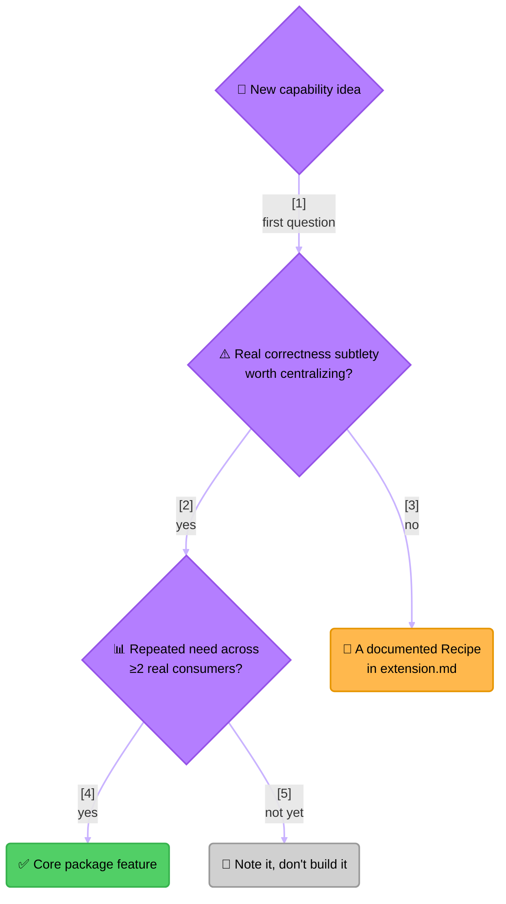

<!-- Title: Verdict Future Feature Candidates -->
# Verdict — Future Feature Candidates (Exploratory)

> **Status: exploratory, not a committed roadmap.** This is a maintainer's
> dated thinking exercise — a record of *how* to evaluate a proposed
> addition to this package, applied honestly to a few real candidates,
> not a backlog anyone is committed to building. Re-derive the reasoning
> below before treating any item here as decided; a candidate's status
> can and should change if real usage changes. The evaluation test
> itself applies to every language this package ever ships for; only
> Python ships today, so every candidate and file path below is
> Python's.

## The actual test, not "does it sound useful"

`AndRule`/`OrRule` earned a place in this package for a specific
reason that has nothing to do with how often "and"/"or" logic comes up:
short-circuiting is a real behavioral contract with a genuine way to
get it subtly wrong (evaluate everything but still return the right
boolean), vacuous-truth polarity is easy to get backwards (`AndRule([])`
passes, `OrRule([])` fails — not obviously symmetric), and
`RuleResult.data`'s "only what actually ran, never padded, never
flattened" invariant is a real, non-obvious design decision (see
[`architecture.md`](architecture.md#type-structure)). None of that is
true of most "convenience" additions someone might propose — most
boolean combinators are one-line-obvious the moment you write them, and
[`extension.md`](extension.md)'s whole existence is proof that writing
one yourself, in your own code, costs nothing and risks nothing on this
package's side.

So the question for any candidate below is genuinely two questions, not
one:

> **Reading the Diagram**: a "yes" to *both* questions is what
> `AndRule`/`OrRule` themselves would answer if proposed today. Anything
> answering "no" to the first question isn't a rejected idea, exactly —
> it's already-solved by [`extension.md`](extension.md)'s Recipe 2, at
> zero cost and zero risk to this package. Anything answering "yes" to
> the first but "not yet" to the second is a real, watched idea without
> a real, demonstrated need yet — building it now would be speculating
> ahead of actual usage, which is exactly the packaged-domain-knowledge
> mistake [`architecture.md`](architecture.md) already argues against
> in a different form.

## Considered and rejected: XOR, NOT, and "at-least-N" combinators

These were the first candidates worth naming, precisely because they
look like the obvious next step after `AndRule`/`OrRule` — and applying
the test above to them is exactly what makes it worth having a test
instead of instinct:

- **`XorRule`** (passes iff exactly one sub-rule passes) has no
  short-circuit optimization available at all — you can't know the
  final parity until every sub-rule has been evaluated, so there's no
  "stop early" contract to get subtly wrong the way `AndRule`/`OrRule`
  have. Its vacuous case (`XorRule([])`) is arguably `False` — zero is
  an even count — but that's a one-line decision, not a subtle one.
  **No real subtlety → doesn't clear the bar.** It's already exactly
  what [`extension.md`](extension.md#recipe-2--a-genuinely-new-rule-shape)'s
  `ThresholdRule` example demonstrates (a threshold of exactly 1, with
  an "and not more than 1" check added) — a five-minute exercise in a
  consumer's own code, today, with zero changes here.
- **`NotRule`** (negates one wrapped rule) is even simpler than `XorRule`
  — `not (await rule.evaluate(context)).passed`, no loop, no ordering
  question, nothing to get wrong. Being logically more "primitive" than
  `AndRule`/`OrRule` (Boolean AND+OR+NOT is a complete basis; XOR is
  derived from them) doesn't matter here — the bar isn't "is this a
  fundamental logical operator," it's "does centralizing this prevent a
  real mistake." It doesn't. **Same verdict as XOR: a Recipe, not a
  core feature.**
- **"At-least-N-of-M"** is the general form of both of the above, and is
  *literally* `extension.md`'s own worked example already. Proposing it
  for core would mean duplicating a recipe this doc set already
  demonstrates costs nothing to write yourself.

None of these are wrong ideas — they're evidence the test above works:
it correctly filters out additions that feel like natural extensions of
`AndRule`/`OrRule` but don't actually carry the kind of risk that
justified those two living in this package in the first place.

## Worth watching, not yet justified: concurrent `run_all`/`run_group`

`RulesEngine.run_all()` and `run_group()` already never short-circuit —
that's their entire point (a full diagnostic picture, not the fastest
path to a boolean; see
[`architecture.md`](architecture.md#three-ways-to-run-rules-and-when-each-is-the-right-one)).
Unlike `AndRule`/`OrRule`, where sequential evaluation is load-bearing
*because* of short-circuiting, nothing about these two methods' current
contract actually requires evaluating rules one at a time — `engine.py`
does today (`[await rule.evaluate(context) for rule in self._rules]`),
but that's an implementation choice, not something either method's own
docstring promises. For a rule set where each rule is I/O-bound (a DB
read, an external check — exactly the shape `data-driven-rule-sets.md`
and `shipping-fee-waiver.md`'s samples both use), running them
concurrently via `asyncio.gather` while still returning results in the
original order is a real latency win sitting on the table.

This clears the *first* question — the subtlety is real: concurrent
evaluation would newly expose whatever ordering assumptions a
consumer's own side-effecting predicates might have (two rules that
read-then-write shared state would now race, where today they run in a
defined order), so it can't simply become the default without silently
changing behavior for any future rule set that happens to depend on
sequential timing — it would need to be opt-in (a `concurrent=True` flag
or a separate method), with the ordering-safety tradeoff spelled out
plainly in whichever doc introduces it.

It does *not* yet clear the second question. The rule shapes this
package is built around don't obviously want it: a rate-limiting-style
adapter reaches for `AndRule`, where sequential evaluation is
correctness-critical rather than merely the default, and
access-control-style condition rows are cheap, in-memory comparisons
rather than I/O. Concurrency would buy nothing in either.
**Trigger condition for revisiting**: a rule set grows large and
I/O-bound enough that `run_all`/`run_group` latency shows up in an
actual profile — not before.

## Two smaller, better-grounded candidates

Unlike the two sections above, these follow directly from the shape of
the API rather than from a hypothetical — worth naming even though
neither is urgent enough to build without a specific trigger:

- **Read-only introspection on `RulesEngine`** (e.g. `rule_names`,
  `group_names`, or simple iteration) — `_by_name`/`_by_group` already
  hold exactly this data privately; nothing needs to be computed, only
  exposed. The recurring gap this would close showed up organically
  while writing [`samples/5_content-moderation-routing.md`](../python/docs/samples/5_content-moderation-routing.md)
  and [`samples/6_data-driven-rule-sets.md`](../python/docs/samples/6_data-driven-rule-sets.md)'s
  own "naive way" sections: an admin/audit screen that wants to list
  "every currently-active rule" has no way to ask an engine that today
  short of reaching into its private attributes. Real subtlety is mild
  (return an immutable view, not the live internal dict), but the
  repeated, organic demand is the stronger signal here.
- **A shared, tested helper for walking a `RuleResult`/`RunResult` tree**
  into a plain, JSON-able structure — every sample in this doc set that
  needs a "why did/didn't this pass" breakdown
  ([`samples/2_dynamic-discounts.md`](../python/docs/samples/2_dynamic-discounts.md),
  [`samples/4_loyalty-tier-promotion.md`](../python/docs/samples/4_loyalty-tier-promotion.md))
  manually destructures `result.results[0].data`, and the
  rate-limiting adapter mentioned above does the identical thing in
  production (`[r.data for r in combined.data]`). The real subtlety:
  telling apart "`.data` is itself a `list[RuleResult]`" (the composite convention)
  from "`.data` is an opaque domain payload" without any type
  information verdict is allowed to have — a duck-typed check
  (`isinstance(data, list) and all(isinstance(x, RuleResult) for x in data)`)
  is workable but easy to get subtly wrong per-consumer if everyone
  writes their own. Worth a single, tested implementation rather than
  N slightly-different ones.

Neither has a demonstrated failure yet — both are "the next time this
pattern is hand-written a third time, promote it" candidates, not
"build now."

## Explicitly out of scope for this package

- **A generic timeout/retry wrapper for a rule's predicate** — a real
  need (an I/O-bound predicate, like `shipping-fee-waiver.md`'s
  external promo-code check, can hang), but it's exactly a
  Recipe-2-shaped exercise (wrap `asyncio.wait_for` around `evaluate()`,
  decide fail-open vs. fail-closed) with no correctness subtlety this
  package would centralize better than a consumer's own code would.
  Worth adding as a documented Recipe in [`extension.md`](extension.md)
  if it comes up again — not a core feature.
- **A weighted/scored combinator** (rules contribute a numeric score,
  aggregated against a threshold rather than boolean pass/fail) — a
  legitimate pattern in the abstract, but zero real demand from either
  current consumer today. Watching for repeated demand across ≥2 real
  consumers, per the test above, before considering it further.
- **Publishing this package to a real index instead of an editable
  local path dependency** — was an open question as of this section's
  original writing; superseded by events. This package now *is* a
  standalone, publicly-published repo distributing to PyPI as
  `verdict-rules` — see the repo-root `README.md` and
  [`maintenance.md`](maintenance.md#how-this-package-is-typically-consumed--plan-for-no-release-step)
  for the model that decision replaced.

## Related docs

- [`extension.md`](extension.md) — the recipes that already cover most
  of what's rejected above, at zero cost to this package.
- [`architecture.md`](architecture.md) — the design philosophy this
  whole evaluation test is derived from.
- [`maintenance.md`](maintenance.md) — what actually changes, file by
  file, on the day a candidate here does clear the bar.
