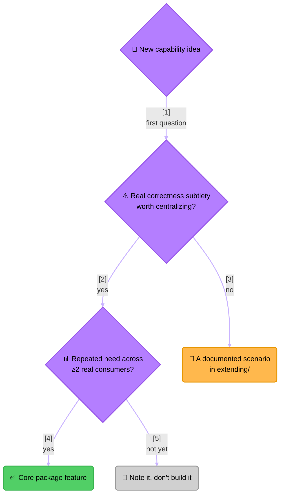

<!-- Title: Verdict Future Feature Candidates -->
# Verdict — Future Feature Candidates (Exploratory)

> **Status: exploratory, not a committed roadmap.** A record of *how* to
> evaluate a proposed addition to this package, applied honestly to real
> candidates — not a backlog anyone is committed to building. Re-derive
> the reasoning before treating any item as decided; a candidate's status
> can and should change when real usage changes, and one below already
> has. The test applies to every language this package ships for;
> candidates are illustrated in whichever language's syntax is clearest,
> and nothing here is one language's alone.

## The actual test, not "does it sound useful"

`AndRule`/`OrRule` earned a place here for reasons that have nothing to do
with how often "and"/"or" logic comes up: short-circuiting is a real
behavioral contract with a genuine way to get it subtly wrong (evaluate
everything but still return the right boolean), vacuous-truth polarity is
easy to get backwards (`AndRule([])` passes, `OrRule([])` fails — not
obviously symmetric), and a composite's children living in its result's
sub-results — exactly what ran, never padded to the full sub-rule list,
never flattened into the parent — is a real, non-obvious design decision
(see
[`architecture/README.md`](architecture/README.md#type-structure)). None
of that holds for most "convenience" additions, and
[`extending/`](extending/README.md)'s existence is proof that writing one
yourself costs nothing and risks nothing on this package's side.

So any candidate faces two questions, not one:

```mermaid
graph TB
    Idea{"🔀 New capability idea"}
    Subtle{"⚠️ Real correctness subtlety<br/>worth centralizing?"}
    Demand{"📊 Repeated need across<br/>≥2 real consumers?"}
    Core("✅ Core package feature")
    Scenario("📖 A documented scenario<br/>in extending/")
    Watch("👀 Note it, don't build it")

    %% Link 0: Idea -> Subtle
    Idea -->|"[1]<br/>first question"| Subtle
    %% Link 1: Subtle -> Demand
    Subtle -->|"[2]<br/>yes"| Demand
    %% Link 2: Subtle -> Scenario
    Subtle -->|"[3]<br/>no"| Scenario
    %% Link 3: Demand -> Core
    Demand -->|"[4]<br/>yes"| Core
    %% Link 4: Demand -> Watch
    Demand -->|"[5]<br/>not yet"| Watch

    style Idea fill:#B47EFF,stroke:#9654E8,stroke-width:2px,color:#000
    style Subtle fill:#B47EFF,stroke:#9654E8,stroke-width:2px,color:#000
    style Demand fill:#B47EFF,stroke:#9654E8,stroke-width:2px,color:#000
    style Core fill:#51CF66,stroke:#37B24D,stroke-width:2px,color:#000
    style Scenario fill:#FFB84D,stroke:#E69500,stroke-width:2px,color:#000
    style Watch fill:#D0D0D0,stroke:#999999,stroke-width:2px,color:#000

    %% Link Index:
    %% 0: every idea starts by asking whether it has real subtlety
    %% 1-2: no subtlety means it's already a trivial new-rule-shape-style exercise
    %% 3-4: real subtlety plus repeated demand clears the bar for core
    %% 4: real subtlety but no demonstrated demand yet means watch, don't build ahead of need
    linkStyle 0 stroke:#C9B3FF,stroke-width:2px
    linkStyle 1 stroke:#C9B3FF,stroke-width:2px
    linkStyle 2 stroke:#C9B3FF,stroke-width:2px
    linkStyle 3 stroke:#C9B3FF,stroke-width:2px
    linkStyle 4 stroke:#C9B3FF,stroke-width:2px
```

> **Reading the Diagram**: a "yes" to *both* questions is what
> `AndRule`/`OrRule` would answer if proposed today. A "no" to the first
> isn't a rejected idea — it's already solved by
> [`extending/new-rule-shape/`](extending/new-rule-shape/README.md), at
> zero cost and zero risk here. "Yes" to the first but "not yet" to the
> second is a watched idea without demonstrated need; building it then
> would be speculating ahead of usage, the same mistake
> [`architecture/README.md`](architecture/README.md) argues against in its
> packaged-domain-knowledge form.

## One verdict this test got wrong: `NotRule`

`NotRule` was rejected here, and then shipped. The rejection reasoned that
negation is `not (await rule.evaluate(context)).passed` — no loop, no
ordering question, no short-circuit contract — and that being logically
primitive (AND+OR+NOT is a complete basis) doesn't matter when the bar is
"does centralizing this prevent a real mistake." That reasoning was sound
about short-circuiting and wrong about the package, because it looked for
subtlety in only one place.

The subtlety is real and lives in the **result** contract instead. A
negation inverts its child's verdict, so a failed `NotRule` wraps a child
that *passed*: it is its own failing leaf, and its one-level
decided-by view names its passing child. That asymmetry is what makes a
hand-rolled negation subtly wrong — it returns the right boolean while
reporting a result that explains nothing, and nothing in a consumer's own
test suite distinguishes the two. It is also what made a filtering
implementation of `RunResult`'s failing-leaves view incorrect in all four
SDKs. See
[`architecture/README.md`](architecture/README.md#inspecting-a-composites-own-decision).

**The lesson for every candidate below**: the first question is "is there
a real correctness subtlety," not "is there a real *short-circuiting*
subtlety." Ask it of the result surface too.

## Declined so far: XOR, and "at-least-N-of-M" on demand alone

- **`XorRule`** (passes iff exactly one sub-rule passes) has no
  short-circuit optimization available — final parity isn't knowable until
  every sub-rule has run, so there is no "stop early" contract to get
  wrong. Its vacuous case is arguably false (zero is an even count), but
  that is a one-line decision, not a subtle one. It also has no result-side
  asymmetry of the kind that earned `NotRule` a place: a failed `XorRule`'s
  children already explain it. Already demonstrated by
  [`extending/new-rule-shape/`](extending/new-rule-shape/README.md)'s own
  `AtLeastNRule` — a threshold of exactly one, plus a not-more-than-one
  check.
- **"At-least-N-of-M"** is the general form, and *is* that worked example
  already, shipping in every language's `graduation_verdict` as
  consumer-side code. **Rejected on the second question, not the first** --
  and that distinction was wrong here until a consumer asked for it
  directly.

  The first question is yes. Its stopping rule is a genuine short-circuit
  contract with a silent way to get it wrong: decide as soon as the
  threshold is *reached*, and also as soon as it becomes *unreachable* even
  if every remaining sub-rule passed. Deferring until all have run returns
  the identical boolean while evaluating work the threshold had already
  settled -- the contract broken with nothing failing. Omitting only the
  unreachable branch is the same bug, half the time. That is exactly the
  shape this test's first question exists to catch, and an earlier version
  of this entry claimed the opposite.

  What it fails is the demand bar: one consumer, where two unrelated ones
  are asked for. That bar had already been overridden once in the same
  cycle, for the composite-parts contract; overriding it twice in
  succession would leave this test unapplied rather than applied strictly.
  **Trigger for reconsidering**: a second, unrelated consumer wanting the
  same shape. At that point it is reconsidered on its merits rather than
  re-argued from scratch, and the honest reason it was declined is on the
  record here instead of a wrong one.

  The guidance given meanwhile, which is what makes declining cheap: the
  public `SequentialEvaluator` plus a `StepDecider` is the primitive, so a
  consumer composes rather than hand-rolls a loop, and the worked decider
  -- including the vacuous case, which should pass only when the minimum is
  zero or less -- is in
  [`extending/new-rule-shape/`](extending/new-rule-shape/README.md) to be
  copied rather than derived.

## Worth watching, not yet justified: concurrent run-everything modes

The engine's run-all and run-group modes already never short-circuit —
that is their point (a full diagnostic picture, not the fastest path to a
boolean; see
[`architecture/README.md`](architecture/README.md#three-ways-to-run-rules-and-when-each-is-the-right-one)).
Unlike `AndRule`/`OrRule`, where sequential evaluation is load-bearing
*because* of short-circuiting, nothing in either mode's contract requires
one-at-a-time evaluation. Every SDK does it today — Python's
`[await rule.evaluate(context) for rule in self._rules]` and its
equivalents — but that is an implementation choice, not a documented
promise. For a rule set where each rule is I/O-bound (a database read, a
call to an external service), running them concurrently while still
returning results in registration order is a real latency win sitting on
the table.

This clears the *first* question. Concurrent evaluation would newly expose
whatever ordering assumptions a consumer's side-effecting predicates have
— two rules that read-then-write shared state would race where today they
run in a defined order — so it cannot become the default without silently
changing behavior for any rule set that depends on sequential timing. It
would have to be opt-in, with the ordering-safety tradeoff stated plainly
wherever it is introduced.

It does not yet clear the second question. The rule shapes this package is
built around don't obviously want it: a rate-limiting-style adapter
reaches for `AndRule`, where sequential evaluation is correctness-critical
rather than merely the default, and access-control-style condition rows
are cheap in-memory comparisons. Concurrency buys nothing in either.
**Trigger for revisiting**: a rule set grows large and I/O-bound enough
that run-all latency shows up in an actual profile — not before.

## A third, shipped on one consumer's evidence

**Reading a composite's own parts** -- a contract separate from `Rule` that a
composite satisfies, exposing the rules it was built from before anything is
evaluated. Recorded here because the *second* question was overridden, not
met, and that should be visible rather than tidied away.

The first question is clearly yes, and not about short-circuiting: a consumer
that resolves named rules through its own registry, rejects duplicate names at
build time, and records which rules a decision used has to enumerate the named
rules inside a composite. Where it cannot, nothing fails -- it reports *fewer*
rules than were used and its duplicate check misses the duplicates. The design
answer is the subtle part, and it is why this is a contract rather than three
accessors: accessors on `AndRule`/`OrRule`/`NotRule` alone leave a walk
switching on concrete types, which falls through to the leaf case on a fourth
kind of composite and reports the rules inside it as absent. That is the
silent-wrong-answer shape, and it is introduced by the half-measure.

The second question had **one** consumer, with a concrete and specific
requirement, where the bar asks for two. The maintainer judged the subtlety
sufficient on its own. The precedent is the engine introspection below, which
shipped on one organically recurring need -- and the `NotRule` lesson above,
where this test's first question was once applied too narrowly.

Rebuilding a composite over new parts was considered in the same pass and is
an explicit non-goal: reading parts is total, rebuilding is partial, and a
contract cannot promise "the same composite over new parts" on behalf of a
composite that holds state outside them -- `AtLeastNRule`'s own threshold
being the worked example. See
[`extending/walking-a-rule-tree/`](extending/walking-a-rule-tree/README.md).

## Two candidates this file named, both now shipped

Recorded rather than deleted, because what each turned out to need is the
useful part:

- **Read-only introspection on `RulesEngine`** — now `rule_names` /
  `group_names` (`RuleNames` / `GroupNames` in C#, `ruleNames` /
  `groupNames` in JS/TS and Dart). The demand was organic: an admin or
  audit screen listing every currently-active rule had no way to ask an
  engine, short of reaching into private attributes. The subtlety was
  milder than the shipped version needed — an immutable view is the easy
  half, but an aliased internal list also let the names report what was
  *registered* while a run iterated something else, which is the bug the
  copy-on-construction guarantee now prevents.
- **A helper for walking a result tree into a plain structure** — now the
  result surface itself: the recursive leaves and failing-leaves views, the
  one-level decided-by view, and a result being encodable by the language's
  own serializer. The predicted subtlety (a duck-typed check for whether a
  payload holds child results) disappeared entirely once children got
  their own field instead of sharing the opaque `data` slot — the type
  information verdict was not allowed to have in `data` is simply present
  in a sub-results list. The real subtlety was elsewhere again: which view
  answers which question, and that the failing view is an independent
  recursion rather than a filter.

## Explicitly out of scope

- **A generic timeout/retry wrapper for a rule's predicate** — a real need
  (an I/O-bound predicate can hang), but exactly the exercise
  [`extending/new-rule-shape/`](extending/new-rule-shape/README.md)
  already demonstrates: wrap the language's own timeout primitive around
  `evaluate`, and decide fail-open versus fail-closed. No correctness
  subtlety this package would centralize better than a consumer's own
  code. Worth a documented scenario in
  [`extending/`](extending/README.md) if it comes up again — not a core
  feature.
- **A weighted/scored combinator** (rules contribute a numeric score,
  aggregated against a threshold rather than boolean pass/fail) — a
  legitimate pattern in the abstract, with no repeated demand across real
  consumers yet. Watching for that, per the test above, before considering
  it further.
- **Publishing instead of an editable local path dependency** — superseded
  by events: this is a standalone, publicly published repo, and each
  language distributes to its own registry. See the
  [repo-root `README.md`](../README.md) and
  [`maintenance/releases/`](maintenance/releases/README.md).

## Related docs

- [`extending/`](extending/README.md) — the scenarios that already cover
  most of what's rejected above, at zero cost to this package.
- [`architecture/README.md`](architecture/README.md) — the design
  philosophy this evaluation test derives from.
- [`maintenance/`](maintenance/README.md) — what actually changes, file by
  file, the day a candidate here does clear the bar.
