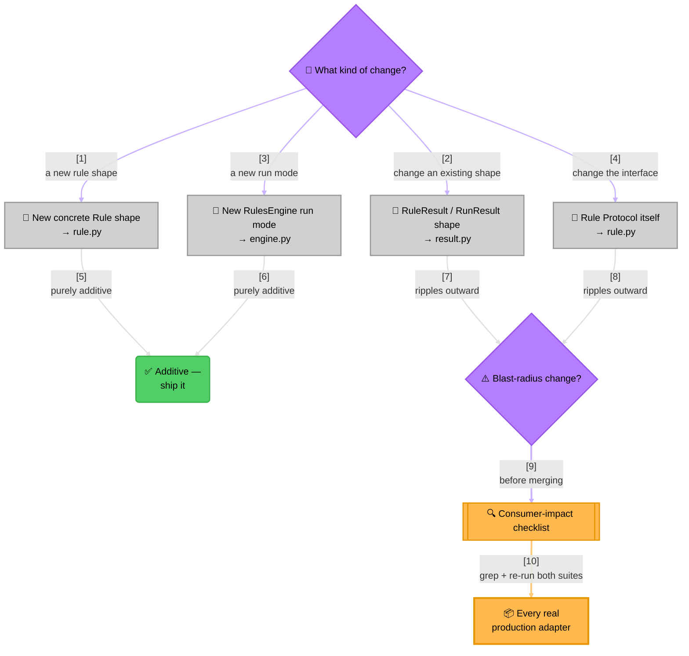

<!-- Title: Verdict Maintenance Guide -->
# Verdict — Maintenance Guide

> For people changing *this package's own code* — not for people building
> rules on top of it (see [`extension.md`](extension.md) for that) and not
> for the design rationale behind what's already here (see
> [`architecture.md`](architecture.md) for that). This doc is about
> keeping the package correct and true to its own stated constraints as it
> grows.

## The two constraints that must never quietly slip

Both are called out in the root [`README.md`](../README.md) as
load-bearing, not incidental — a maintainer's first job on any change
is checking it doesn't erode either one:

1. **Zero external dependencies.** `pyproject.toml`'s `dependencies` list
   is empty on purpose. A change that reaches for a third-party package —
   even a small, well-regarded one — is a discussion-worthy exception,
   not a default. If a future need genuinely can't be met without one,
   that's a real design conversation (does it belong in this package at
   all, or in a consumer's own adapter?), not a routine dependency bump.
2. **No knowledge of any specific domain.** Nothing under a language's
   own package source (today: `python/src/verdict/`) should ever import
   or reference rate limiting, access grants,
   discounts, or any other consumer's vocabulary. Domain-specific logic
   belongs in the *consumer's own* adapter module — see
   [`extension.md`](extension.md#recipe-3--keep-your-own-domain-out-of-verdict-in-one-adapter-module)
   for two living examples of where that vocabulary actually goes. If a
   change to this package only makes sense described in terms of one
   consumer's problem, it's in the wrong file.

## How this package is released and consumed

This package is published to PyPI as `verdict-rules`, with a real
version pin standing between a change here and any consumer's
production code — the normal "cut a release, consumers upgrade when
ready" safety net applies, unlike an internal package vendored via an
editable local path.

Release procedure, once a change is ready to ship:

1. Bump `python/pyproject.toml`'s `version` (semver;
   `0.x` while the public API is still settling — a breaking change
   bumps `MINOR` pre-1.0, `MAJOR` after).

   **One carve-out, pre-1.0 only**: removing behaviour that was never
   intended and has no valid use may go in `PATCH`. The bar is
   deliberately high — not "we think nobody relies on it" but "there is
   no way to rely on it correctly." `0.1.1` is the precedent: an unknown
   group returned a vacuous pass, which could only ever fire on a typo
   or a stale name, because a group exists exactly when some rule
   declares it. Anything a caller could legitimately have depended on is
   a breaking change and takes `MINOR`, however unlikely that dependency
   seems.
2. Add a `## [X.Y.Z] - YYYY-MM-DD` entry to
   [`../python/CHANGELOG.md`](../python/CHANGELOG.md), in the same commit
   as the version bump — never backfilled later. The release body is built
   from it, and a missing section fails the release rather than publishing
   empty notes.
3. **Merge to `main`. That is the whole release.**

`release-python.yml` notices the version has no matching tag, runs the
full test matrix, builds, publishes to PyPI via Trusted Publishing, then
tags and cuts the GitHub release — in that order, each step gated on the
one before it.

### Nothing is tagged or published by hand

Merging the version bump is the decision to release; there is no
separate tag step. That is not only convenience. A hand-pushed tag can
point at any commit, including one whose tests never ran — and since
publishing is irreversible on every registry this repo targets, an
untested release is a version number burned. Making the test matrix a
dependency of the publish job removes that possibility rather than
relying on discipline.

The ordering matters and is enforced by job dependencies: **test →
build → publish → tag → release**. The tag is created *after* a
successful publish, so a tag existing means that version really shipped.
Re-running is safe: the detect job compares the manifest version against
existing tags and does nothing if one already matches, so merging to
`main` repeatedly cannot double-release.

The parts of a release that are identical for every language — the
changelog section, the skill artifacts, the tag, the GitHub release —
live in `release-github.yml`, a reusable workflow the per-language ones
call. Adding a language is a thin caller, not another copy.

**Publishing itself deliberately stays in each language's own workflow**,
and must. PyPI Trusted Publishing does not work with reusable workflows —
a documented limitation, not a configuration problem — so moving the
publish step would break authentication outright. That constraint costs
nothing, because publishing is the one genuinely per-language part of a
release: PyPI publishes over OIDC directly, npm cannot bootstrap a first
publish at all, NuGet exchanges a token for a one-hour key, and pub.dev
drives its own reusable workflow from a tag pattern. There is no shared
step there to factor out — only the tail after it.

### Verifying a release, and when

Checks are worth having at the earliest point they can possibly run, because
the tail of a release is too late to learn anything: the registry upload
happens before the tag and the GitHub release, and no registry this repo
targets lets you take a version back.

So the checks are spread across three moments rather than gathered into one:

**Before merging** — `check-release-readiness.yml`, on every pull request.
Every manifest version has a matching section in *its own* changelog, each
changelog is ordered newest-first, and `scripts/build.sh` produces all three
skill artifacts with an intact payload.
A missing changelog section fails here, while the change is still a proposal.

**Before publishing** — the `detect` job re-checks the changelog section, so
anything that reached `main` another way still cannot publish. Without it, a
missing section would be discovered *after* the registry upload, leaving a live
version with no tag and no release.

**After publishing** — the release job verifies what is deterministic: the
notes rendered with their code spans intact (a regression guard for
`.agents/incidents/001`), every expected asset attached, and `scripts/get.sh`
still resolving `verdict-tools.zip` with a real payload inside it.

**By hand, once propagation settles** — two things a job should not wait on:

1. The version is live and **installable** from the registry.
2. **Provenance is present** where the registry offers it — see below. Its
   absence is silent, which is exactly why it is worth looking at.

### A changelog lives beside its own manifest

Not at the repository root, and not at the language directory's root if the
manifest sits deeper. That is where packaging tools look for it, and it gives
each release track exactly one writer — so two releases can never contend for
one file, however many languages ship.

For Python that is `python/CHANGELOG.md`, because `pyproject.toml` and
`README.md` are both at `python/`. For C# it will be beside the `.csproj`,
which sits at `csharp/src/VerdictRules/` rather than at `csharp/`.

**One ambiguity worth naming**, since it is invisible today: `python/` is
currently *both* the language directory *and* the `verdict-rules` distribution
root, because there is exactly one Python distribution. A second one — say a
`verdict-rules-concurrent` — would separate those meanings, and the answer is
to restructure so each distribution has its own root (`python/packages/<dist>/`
or similar), moving its manifest, README, `src/` and changelog together. The
rule does not change; only the layout does.

That restructure is safe to defer precisely because shipped links are
version-pinned (below): tags are immutable, so every already-published link
keeps resolving after the files move. Under `main`-pinning it would have broken
every published version at once.

### Links in shipped content are pinned to a version, never to `main`

A README bundled into a package is rendered on **every version's** registry
page, permanently. A link in it pointing at `main` therefore shows someone
reading an old version the *current* documentation — describing APIs that
version does not have, with no way for them to tell. It is the same failure the
skill's fetch tier avoids by pinning, and worse here because there is no
warning.

So every GitHub link in content that ships — a package README, package metadata
— points at that release's own tag:

```
https://github.com/pawan-vyas/verdict-rules/blob/python-v0.2.1/docs/architecture.md
```

Tags are immutable, so such a link resolves forever and always describes what
the reader actually installed. The cost is that these URLs move with each
release; `scripts/check_shipped_links.py` enforces it, and `--fix` does the
rewriting mechanically, so a release is: bump the version, run the fixer,
write the changelog entry.

Two consequences worth knowing:

- **The links are briefly dead during a release.** They reference a tag the
  workflow creates *after* publishing, so between merge and tag there is a
  short window where they 404. That is the correct trade: the alternative is
  tagging before publishing, which would mean a tag that does not correspond to
  anything released.
- **A moved file breaks any `main`-pinned link permanently** if it was already
  published, because registry metadata is immutable. That is how `0.1.0`,
  `0.1.1` and `0.2.0` ended up with a dead Changelog link when the repo-root
  changelog was removed — those cannot be corrected, only superseded.

### Supply-chain integrity, per registry

This package has **zero runtime dependencies**, so it cannot transmit a
compromised dependency to anyone. That removes the most common supply-chain
risk and none of the others: a published artifact could still be replaced,
or published by something that is not our CI. Provenance is what makes that
checkable by a consumer rather than merely asserted by us.

What each registry actually provides, verified rather than assumed:

| Registry | Mechanism | Automatic? | Verified |
| :-- | :-- | :-- | :-- |
| **PyPI** | PEP 740 attestations | ✅ with Trusted Publishing | **Yes — on our own `0.2.0`** |
| **npm** | SLSA provenance attestations | ✅ with Trusted Publishing | Field present on packages that have it |
| **NuGet** | Repository signature (`.signature.p7s`) | ✅ applied by nuget.org | Present in a downloaded `.nupkg` |
| **pub.dev** | `archive_sha256` per version | ✅ published with the package | Exposed by the package API |

**PyPI is already done and provable.** Our `0.2.0` release carries an
attestation naming the publisher (`GitHub`), the repository, and the
workflow file — fetchable at
`pypi.org/integrity/verdict-rules/<version>/<file>/provenance`. Nothing was
configured for it; it falls out of publishing over OIDC rather than with a
token, which is a good reason to keep doing that.

**npm needs nothing extra either**, but it needs the *right* setup: the
`--provenance` flag is obsolete, and attestations are published
automatically when the release runs under Trusted Publishing with
`id-token: write`. A release workflow that used a long-lived token instead
would silently produce no provenance.

**NuGet signs every package itself.** A repository signature is applied by
nuget.org on upload, so a consumer can verify the package came from
nuget.org unmodified. *Author* signing is a separate thing requiring a
code-signing certificate, and buys little for a package already
repository-signed and published from CI — not worth pursuing.

**pub.dev is the weakest of the four, and the gap is worth naming.** It
publishes a `sha256` per version, which detects a modified archive but says
nothing about *who produced it*. There is no attestation or signing
mechanism to opt into. Automated publishing over OIDC is still worth using
— it means no long-lived credential exists to steal — but a Dart consumer
has no equivalent of `pypi attestation` or `npm audit signatures` to run.
That is a property of the ecosystem, not something to design around.

### Ownership and namespaces across registries

This package is published by an **individual** on every registry, and
stays that way — no organization, no verified publisher, no team
account. Each registry offers something org-shaped that looks like a
prerequisite until you check what it buys, and in every case the answer
is nothing we need: everything ships from **one package per language**,
so there is no family of names to protect.

One exception, which is not an organization: **NuGet ID prefix
reservation for `VerdictRules.*` is worth applying for** once the base
package exists. NuGet is the one registry where a plausible-looking
`VerdictRules.Extensions` could be published by somebody else and read
as ours. We will never publish that package — which is precisely why
nobody else should be able to. The reservation is tied to the package
owner, not to an organization.

### The skill's version is a separate number, on its own schedule

`.claude-plugin/plugin.json`'s `version` is **not** part of the release
procedure above and is not meant to match `python/pyproject.toml`. It
measures the *skill* under `skills/verdict/`, and it exists for one
consumer: Claude Code's marketplace, which compares it against a user's
vendored copy to decide whether that copy is stale. No other harness
reads it — `scripts/install.sh` and `scripts/get.sh` vendor the skill
by copying files, with no version check anywhere.

So the two numbers drift apart in normal operation, and that drift is
correct. A library release with no skill change shouldn't touch
`plugin.json`; a wording tweak to `SKILL.md` with no library change
should bump `plugin.json` and nothing else.

**Bump `plugin.json`'s `version` in the same commit as any change to
`skills/verdict/`.** It's the only signal a marketplace user has that
an update exists, so a skill change shipped without a bump is invisible
to them. `.github/workflows/check-skill-version.yml` enforces this: it
fails a PR or a push to `main` that changes shipped skill content
without changing that version. (`skills/verdict-workspace/` is eval
working material, never ships, and is excluded.)

Release procedure for a skill-only change — the same shape as the
language procedure above, on its own tag prefix:

1. Bump `.claude-plugin/plugin.json`'s `version` in the same commit as
   the skill change itself (the check above requires this anyway).
2. Add a `## [X.Y.Z] - YYYY-MM-DD` entry to
   `skills/verdict/CHANGELOG.md`.
3. Commit, then tag `skill-vX.Y.Z` and push the tag.
   `release-skill.yml` verifies the tag matches `plugin.json`, runs
   `scripts/build.sh`, and attaches the artifacts to a GitHub Release.

That last step matters for one specific audience.
[`scripts/get.sh`](../scripts/get.sh) — the `curl … | sh` install path
— pulls `verdict-tools.zip` from whatever GitHub reports as the
*latest* release, so a skill change that never gets a release of its
own would stay invisible to those users until the next language
release happened to carry it. Marketplace and clone installs read the
repo directly and are already current the moment a change lands on
`main`. Both release workflows attach the **full** set of skill
artifacts for the same reason: whichever kind of release came last,
`latest` always has a usable `verdict-tools.zip`.

Two things stay true independent of the release step:

- `pyproject.toml`'s `version` field is the single source of truth for
  what shipped — CI asserts it matches the tag being pushed and fails
  loudly on drift, rather than silently publishing a mismatch.
- Before merging a change to a public type's shape, run this package's
  own test suite (`uv run pytest`, below) *and* grep every consumer
  codebase you know about for `from verdict import` — a version pin
  protects a consumer from an *unwanted* upgrade, not from a real bug in
  a version they do take — see "Consumer impact checklist" below.

A consumer can still choose to vendor this package via an editable
local path instead of a normal PyPI dependency (e.g. inside their own
monorepo, before it's ready to depend on a public release). That
carries a sharper version of the same risk: no version pin at all
between a change here and that consumer's next process restart, so the
same test-suite-plus-grep discipline above matters even more in that
setup, not less.

### The import name, and what a second distribution would look like

This package installs a directory named `verdict` containing an
`__init__.py`, which is what makes `from verdict import RulesEngine`
work. That is a deliberate, settled choice, and it decides the shape of
any future add-on package.

If a second distribution is ever published — a testing helper, say — it
takes its **own top-level import name**:

```python
from verdict import RulesEngine          # this package
from verdict_testing import FakeRule     # a hypothetical add-on
```

rather than extending this one's namespace as `verdict.testing`. The
alternative would require `verdict/` to have no `__init__.py`, since
only a directory without one can be shared across installed
distributions. Dropping it would break `from verdict import …` for
every existing user and every code sample in these docs, in exchange for
an import style no planned package needs. The separate-name convention
is also what most of the ecosystem already does — `pytest-cov` imports
as `pytest_cov`, and so on.

Note that PyPI offers nothing that reserves `verdict-rules-*` names, so
an add-on distribution's name is held the same way this one's is: by
publishing it. A registry-level namespace mechanism has been designed
but is not deployed; there is nothing to apply for today.

If a recipe from [`extension.md`](extension.md) ever earns a place in
the shipped package — a `ThresholdRule`, say — the answer is a
**submodule of this same distribution**, `verdict/extensions/`, giving
`from verdict.extensions import ThresholdRule`. That is available at any
time and is purely **additive**: nothing existing breaks, no user
changes anything, and it costs exactly the same whether it happens next
month or in three years. It is the reason the question above does not
need revisiting — the growth path stays open without any restructuring.
Whether a given recipe *should* graduate is a separate judgement, and
[`future_plan.md`](future_plan.md) sets that bar.

**A note for other languages.** This constraint does not transfer, and
assuming it does will mislead. In .NET a namespace is purely logical and
decoupled from the assembly that provides it, so many packages can
contribute types under one `Foo.Bar.*` root — which is why
`Microsoft.Extensions.*` looks the way it does. In Python the import
path *is* the directory layout, so which distribution installs a module
and what its import looks like are welded together. Each language's SDK
should follow its own ecosystem's convention rather than copying this
one's.

**Not to be confused with extras.** `pip install verdict-rules[x]`
syntax refers to *optional dependency groups* declared by a package
about itself — it installs the same distribution plus some extra
dependencies. It creates no new distribution and no new import name.
Crucially, an extra gates **dependencies, not code** — the whole
distribution installs either way, and the extra only adds third-party
packages on top. So an extra can never make part of this package
optional. Combined with the zero-dependency constraint, that rules
extras out entirely: there is nothing optional to gate. This package
declares `dependencies = []` and no optional groups, so it has no extras
to offer, and adding one would mean taking a dependency — a decision
this doc's first section covers. The `[dependency-groups]` block in
`python/pyproject.toml` is a separate, development-only mechanism and is
not published.

## Where to make a change

| I want to... | Touch this file |
|---|---|
| Add a new concrete `Rule` shape (a new composite, a weighted combinator) | `python/src/verdict/rule.py` — or a new module if it doesn't naturally fit alongside `FunctionRule`/`AndRule`/`OrRule`; export it from `python/src/verdict/__init__.py`'s `__all__` either way |
| Change what `RuleResult`/`RunResult` carries | `python/src/verdict/result.py` — both are frozen dataclasses, so adding a *required* field breaks every construction site in `rule.py` and `engine.py`, and in every consumer's own adapter (see checklist below) |
| Add a new `RulesEngine` run mode (a new selection axis beyond "by name"/"by group") | `python/src/verdict/engine.py` — needs its own index built in `__init__`, the same way `_by_name`/`_by_group` already are |
| Change the `Rule` `Protocol` itself (its required attributes/method signature) | `python/src/verdict/rule.py` — the highest-blast-radius change this package can make; every existing `Rule` implementation anywhere (including in consumers) must still satisfy the new shape |
| Update *why* something is built this way | `architecture.md` (this directory) |
| Update the quickstart's concepts/example | `python/docs/quickstart.md` |
| Update the narrative front door | the root `README.md` — a distinct doc from `python/docs/quickstart.md`, not a copy of it |



> **Reading the Diagram**:
> 1. **Most changes are additive**: a new concrete `Rule` shape or a new
>    `RulesEngine` run mode never touches an existing consumer's code —
>    `Rule`'s structural typing means nothing needs to know about a new
>    shape in advance for it to work.
> 2. **Two specific changes are not additive**: touching `RuleResult`/
>    `RunResult`'s shape, or the `Rule` `Protocol` itself, ripples into
>    every consumer that already depends on the old shape.
> 3. **The checklist is the gate, not a suggestion**: grep every real
>    adapter you know about and re-run their own test suites before
>    merging either kind of blast-radius change — an editable-path
>    consumption model (see above) means there's often no version pin
>    to catch a mistake here later.

## Consumer-impact checklist for a shape change

Because `Rule` is a structural `Protocol`, most extensions (a new rule
shape, a new composite) are purely additive and can't break an existing
consumer — nothing has to import from this package or subclass anything
to remain a valid `Rule`. The one class of change that *does* ripple
outward is altering something every consumer already depends on the
shape of:

- `RuleResult`'s or `RunResult`'s field names/types.
- `Rule`'s required attributes (`name`, `group`) or its `evaluate`
  signature.

Before merging a change in either category:

1. `grep -rn "from verdict import" --include="*.py" <path to your consumer codebase>` for every consumer you know about, and read every hit.
2. Confirm every real adapter module still constructs/consumes the
   changed type correctly — walk each one found above by hand; see
   [`extension.md`](extension.md#recipe-3--keep-your-own-domain-out-of-verdict-in-one-adapter-module)
   for what a well-formed adapter looks like.
3. Run this package's own test suite, then each consumer's own test
   suite for whatever real adapters exist — a change that's internally
   consistent here can still break a consumer's own assumptions about
   field names it reads out of `RuleResult.data`.
4. Run `uv run pytest examples/graduation_verdict/` (from `python/`) too
   — the one "consumer" always available without needing access to
   anyone else's codebase, and broad enough (heterogeneous rule shapes,
   a custom `Rule` type, all three run modes together) to catch an
   interaction bug the narrower checks above might miss. See its own
   [`../python/examples/graduation_verdict/docs/testing.md`](../python/examples/graduation_verdict/docs/testing.md)
   for why it plays this role.

## When `architecture.md` needs updating, and when it doesn't

- A new concrete `Rule` shape usually **doesn't** need the class diagram
  updated unless it changes the Composite-pattern shape itself (e.g. a
  combinator that *doesn't* implement `Rule` the same way `AndRule`/
  `OrRule` do, breaking the "arbitrarily deep nesting is free" claim).
- A new `RulesEngine` run mode **does** need the "Three ways to run
  rules" table extended — that table is meant to be exhaustive.
- A change to the execution model (e.g. introducing concurrent sub-rule
  evaluation somewhere) is architecture-doc-worthy by definition — that
  section exists specifically to explain why evaluation is sequential
  today, so reversing that decision anywhere needs its own updated
  rationale, not just a code diff.

## Testing a change

A new `Rule` shape added under "Where to make a change" above needs a
short-circuit-and-vacuous-case test (if it's a composite) or a plain
delegation test (if it isn't) — see [`testing.md`](testing.md) for the
full checklist by change type, the current suite's coverage, and why
line coverage alone doesn't prove the contracts that actually matter
here (short-circuiting, vacuous truth).

## Related docs

- [`../README.md`](../README.md) — the narrative front door.
- [`../python/docs/quickstart.md`](../python/docs/quickstart.md) — core
  concepts and the one worked example.
- [`architecture.md`](architecture.md) — type structure, execution
  model, and the reasoning behind each design choice.
- [`extension.md`](extension.md) — building on top of this package from
  a consumer's own code, without changing anything here.
- [`testing.md`](testing.md) — the full testing checklist and current
  suite coverage.
- [`../python/docs/samples/`](../python/docs/samples/1_README.md) —
  worked, domain-flavored examples of where a rule engine like this
  earns its keep.
- [`future_plan.md`](future_plan.md) — exploratory, not-yet-decided
  feature candidates and the test used to evaluate them; read before
  proposing a new core `Rule` shape.
