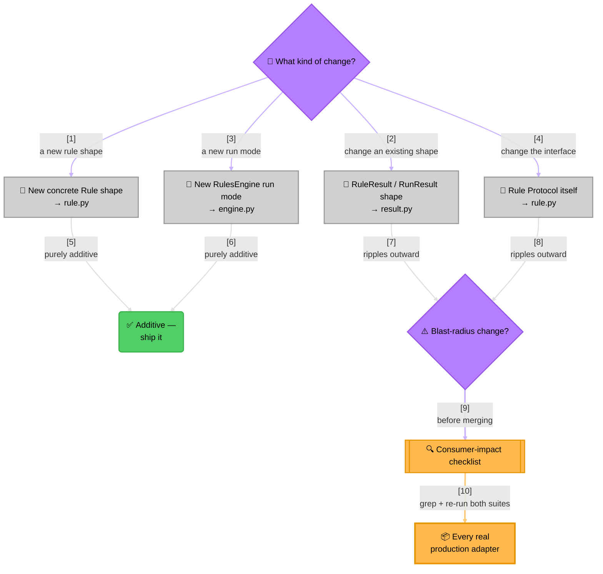

<!-- Title: Verdict Maintenance Guide -->
# Verdict — Maintenance Guide

> For people changing *this package's own code* — not for people building
> rules on top of it (see [`../extending/`](../extending/README.md) for that) and
> not for the design rationale behind what's already here (see
> [`../architecture/`](../architecture/README.md) for that). This directory is
> about keeping the package correct and true to its own stated constraints
> as it grows, split into one focused doc per concern rather than one long
> page, so fetching what a given change needs doesn't mean pulling in
> everything else too. Files are named for what they cover, not numbered —
> there's no real order among them, and a name doesn't need renumbering
> every time a doc is split or merged.

## Where to make a change

| I want to... | Touch this file |
| --- | --- |
| Add a new concrete `Rule` shape (a new composite, a weighted combinator) | `python/packages/verdict-rules/src/verdict/rule.py` — or a new module if it doesn't naturally fit alongside `FunctionRule`/`AndRule`/`OrRule`; export it from `python/packages/verdict-rules/src/verdict/__init__.py`'s `__all__` either way |
| Change what `RuleResult`/`RunResult` carries | `python/packages/verdict-rules/src/verdict/result.py` — both are frozen dataclasses, so adding a *required* field breaks every construction site in `rule.py` and `engine.py`, and in every consumer's own adapter (see [`before-merging-checklists.md`](before-merging-checklists.md)) |
| Add a new `RulesEngine` run mode (a new selection axis beyond "by name"/"by group") | `python/packages/verdict-rules/src/verdict/engine.py` — needs its own index built in `__init__`, the same way `_by_name`/`_by_group` already are |
| Change the `Rule` `Protocol` itself (its required attributes/method signature) | `python/packages/verdict-rules/src/verdict/rule.py` — the highest-blast-radius change this package can make; every existing `Rule` implementation anywhere (including in consumers) must still satisfy the new shape |
| Update *why* something is built this way | [`../architecture/`](../architecture/README.md) |
| Update the quickstart's concepts/example | [`python/packages/verdict-rules/docs/quickstart.md`](../../python/packages/verdict-rules/docs/quickstart.md) |
| Update the narrative front door | the [root `README.md`](../../README.md) — a distinct doc from [`python/packages/verdict-rules/docs/quickstart.md`](../../python/packages/verdict-rules/docs/quickstart.md), not a copy of it |

> **Reading the Diagram**:
>
> 1. **Most changes are additive**: a new concrete `Rule` shape or a new
>    `RulesEngine` run mode never touches an existing consumer's code —
>    `Rule`'s structural typing means nothing needs to know about a new
>    shape in advance for it to work.
> 2. **Two specific changes are not additive**: touching `RuleResult`/
>    `RunResult`'s shape, or the `Rule` `Protocol` itself, ripples into
>    every consumer that already depends on the old shape.
> 3. **The checklist is the gate, not a suggestion**: grep every real
>    adapter you know about and re-run their own test suites before
>    merging either kind of blast-radius change — an editable-path
>    consumption model (see
>    [`before-merging-checklists.md`](before-merging-checklists.md)) means
>    there's often no version pin to catch a mistake here later.

### When `architecture/` needs updating, and when it doesn't

- A new concrete `Rule` shape usually **doesn't** need the class diagram
  updated unless it changes the Composite-pattern shape itself (e.g. a
  combinator that *doesn't* implement `Rule` the same way `AndRule`/
  `OrRule` do, breaking the "arbitrarily deep nesting is free" claim).
- A new `RulesEngine` run mode **does** need the "Three ways to run
  rules" table extended — that table is meant to be exhaustive.
- A change to the execution model (e.g. introducing concurrent sub-rule
  evaluation somewhere) is architecture-doc-worthy by definition — that
  section exists specifically to explain why evaluation is sequential
  today, so reversing that decision anywhere needs its own updated
  rationale, not just a code diff.

## The rest of this directory

| Doc | Covers |
| --- | --- |
| [`constraints.md`](constraints.md) | The two constraints that must never quietly slip |
| [`adding-a-language.md`](adding-a-language.md) | The one-time ritual for bringing a new language SDK from nothing to a first real release |
| [`adding-a-fixture.md`](adding-a-fixture.md) | The template for a new cross-language parity fixture, if the need arises |
| [`releases/`](releases/README.md) | The shared release pipeline, and each target's own concrete release procedure |
| [`packages-and-changelogs.md`](packages-and-changelogs.md) | Why a package is a directory under `packages/`, and the per-ecosystem workspace layout |
| [`versioned-links.md`](versioned-links.md) | Why links in shipped content are pinned to a version, never to `main` |
| [`supply-chain-and-ownership.md`](supply-chain-and-ownership.md) | Provenance per registry, and how ownership/namespaces are handled |
| [`import-name-and-second-distribution.md`](import-name-and-second-distribution.md) | The Python import-name decision, and what a second distribution or a promoted [`extending/`](../extending/README.md) scenario would look like |
| [`before-merging-checklists.md`](before-merging-checklists.md) | The consumer-impact checklist for a shape change, and what a change needs tested |
| [`discoverability-metadata.md`](discoverability-metadata.md) | Why every package's keywords/topics/tags stay in sync across registries, and pub.dev's one real structural exception |
| [`doc-authoring/`](doc-authoring/README.md) | The standard every doc in this repo follows, the per-category templates built on top of it, and [how to add a new sample](doc-authoring/samples.md#adding-a-new-sample) |

## A doc category that will grow per-variant is a directory, not a flat file family

`releases/` is the pattern: [`releases/README.md`](releases/README.md)
holds only what's identical across every release target, and each
target — the skill, a language's own package registry — gets its
**own** file next to it
([`releases/verdict-agent-skill.md`](releases/verdict-agent-skill.md),
[`releases/python.md`](releases/python.md), and a future
`releases/<language>.md` per language). Adding a target is a new file
in that directory; nothing already there is edited to make room for it.
A bare directory README also renders automatically on GitHub, so
linking to the directory itself (`releases/`) already shows the right
landing page.

[`supply-chain-and-ownership.md`](supply-chain-and-ownership.md) follows
the same rule in reverse, one file at a time: a registry's detailed
provenance paragraph lives there
only until that language ships and gets its own `releases/<language>.md`,
at which point it moves — PyPI's already has, into
[`releases/python.md`](releases/python.md).

The same test decides it for any future doc, not just these two: if a
second variant showing up would mean editing a file the first variant
already owns, that doc is a directory-with-README, not a flat file.

## Related docs

- [`../../README.md`](../../README.md) — the narrative front door.
- [`../../python/packages/verdict-rules/docs/quickstart.md`](../../python/packages/verdict-rules/docs/quickstart.md) —
  core concepts and the one worked example.
- [`../architecture/`](../architecture/README.md) — type structure, execution
  model, and the reasoning behind each design choice.
- [`../extending/`](../extending/README.md) — building on top of this
  package from a consumer's own code, without changing anything here.
- [`../testing/`](../testing/README.md) — the full testing checklist.
- [`../samples/`](../samples/README.md) —
  worked, domain-flavored examples of where a rule engine like this
  earns its keep.
- [`../future_plan.md`](../future_plan.md) — exploratory, not-yet-decided
  feature candidates and the test used to evaluate them; read before
  proposing a new core `Rule` shape.
