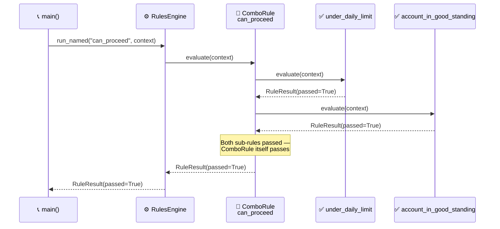

<!-- Title: Verdict Quickstart -->
# Verdict — Quickstart

> The five names you need, and one complete example using all of them.
> See the top-level [`README.md`](../README.md) for what this package is
> and why it's shaped this way in narrative form, and
> [`architecture.md`](architecture.md) for the full design reasoning —
> this doc is just "how do I start."

## Core concepts

- **`Rule`** — anything with a `name`, an optional `group`, and an
  `async evaluate(context: dict) -> RuleResult` method. The structural
  `Protocol` any custom rule implementation can satisfy without
  inheriting from anything.
- **`FunctionRule`** — wraps a plain async predicate as a `Rule`. The
  common case: most rules are "run this function against the context."
- **`ComboRule`** / **`OrRule`** — composite rules that combine other
  rules, short-circuiting the same way a boolean `and`/`or` expression
  would (`ComboRule` stops at the first failure, `OrRule` stops at the
  first pass).
- **`RulesEngine`** — holds a set of rules and runs them three ways:
  `run_all` (every rule, full diagnostic picture — deliberately does
  **not** short-circuit), `run_named` (one specific rule by name),
  `run_group` (every rule sharing a group label).
- **`RuleResult`** / **`RunResult`** — plain, immutable outcome types.
  `RuleResult.data` is a fully opaque slot for a caller's own domain
  object to ride through evaluation — Verdict never reads or depends on
  its shape.

## One complete example

```python
import asyncio
from verdict import ComboRule, FunctionRule, RuleResult, RulesEngine


async def under_daily_limit(context: dict) -> RuleResult:
    spent_today = context["spent_today"]
    limit = context["daily_limit"]
    return RuleResult(
        rule_name="under_daily_limit",
        passed=spent_today < limit,
        detail=f"{spent_today} of {limit}",
    )


async def account_in_good_standing(context: dict) -> RuleResult:
    return RuleResult(
        rule_name="account_in_good_standing",
        passed=context["account_status"] == "active",
    )


async def main() -> None:
    can_proceed = ComboRule(
        "can_proceed",
        [
            FunctionRule("under_daily_limit", under_daily_limit),
            FunctionRule("account_in_good_standing", account_in_good_standing),
        ],
    )

    engine = RulesEngine([can_proceed])
    result = await engine.run_named(
        "can_proceed",
        {"spent_today": 42, "daily_limit": 100, "account_status": "active"},
    )
    print(result.passed)  # True


asyncio.run(main())
```



> **Reading the Sequence**:
> 1. **The engine looks up `"can_proceed"` by name** — `run_named` is
>    exactly one dict lookup plus one `evaluate()` call on whatever it
>    finds.
> 2. **`ComboRule` evaluates its two sub-rules in order** — the plain
>    field comparison, then the account-status check — stopping at the
>    first failure if there is one (neither fails here, so both run).
> 3. **The composite's own result is what the engine hands back** — the
>    caller only sees one `RuleResult`, `passed=True`; the two sub-rules'
>    own results live nested in that one result's `data`, not flattened
>    into anything the caller has to unpack for this simple case.

## Next: build rules from your own configuration, not just hard-coded ones

Because rules are just objects, they're straightforward to build up at
runtime from whatever configuration a caller already has, rather than
hand-writing one `FunctionRule` per case — see
[`extension.md`](extension.md#recipe-4--build-rule-sets-from-stored-configuration-at-runtime)
for the recipe and
[`samples/6_data-driven-rule-sets.md`](samples/6_data-driven-rule-sets.md)
for a fuller worked version grounded in how this package is actually
used in production.

## Related docs

- [`../README.md`](../README.md) — the narrative front door.
- [`architecture.md`](architecture.md) — the full design reasoning.
- [`extension.md`](extension.md) — building on top of this package from
  your own code.
- [`testing.md`](testing.md) — `uv sync && uv run pytest`, and what a
  test here actually needs to prove.
- [`samples/`](samples/1_README.md) — more worked examples.
