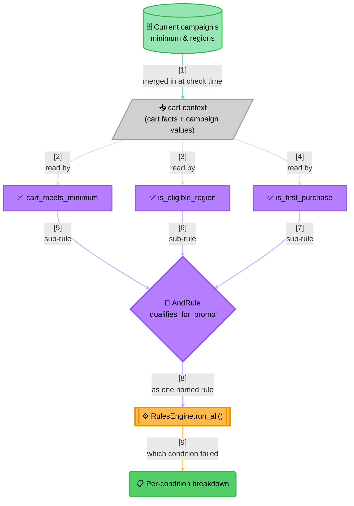

<!-- Title: Sample — Dynamic Discount Eligibility -->
# Sample: Dynamic Discount Eligibility

> **The question**: does this cart qualify for a promotional discount,
> under a promo policy that always checks the same three things — a
> minimum cart value, an eligible region, and first-purchase status — but
> whose *thresholds* (the minimum amount, which regions count) are set by
> marketing and change on their own schedule? **Why it's a good fit for a
> rule engine**: the checkout code shouldn't need a deploy every time
> marketing runs a weekend campaign with a lower minimum, and a customer
> asking "why didn't my discount apply?" deserves a real answer, not just
> a `False`.

## The naive way (and why it breaks down)

The obvious first implementation is a nested `if` chain, checked
straight against the cart, with the current campaign's numbers baked
directly into the code:

```python
async def qualifies_for_promo(cart: dict) -> bool:
    if cart["total"] >= 100:
        if cart["region"] in ("US", "CA"):
            if cart["is_first_purchase"]:
                return True
    return False
```

This is fine for exactly as long as the campaign's numbers never change.
In practice:

- **Every marketing adjustment is a code change.** Lowering the minimum
  from `100` to `75` for a weekend campaign, or adding `"MX"` to the
  region list, means editing this function and shipping a deploy — for
  a change that has nothing to do with how the checkout code itself
  works.
- **A fourth condition means a fourth nesting level.** The function only
  gets harder to read as more conditions accumulate, and nothing stops
  two conditions from silently depending on evaluation order in a way
  nobody intended.
- **"Why didn't my discount apply?" has no good answer.** The function
  returns a single `bool` — a support agent (or the customer-facing UI)
  can't tell *which* of the three conditions failed without re-deriving
  it by hand from the cart data.

## The verdict way

The three *kinds* of check stay fixed in code — a minimum-value
comparison, a region-membership check, a boolean flag — each a genuine,
distinct predicate rather than one generic comparison forced to cover
all three. What marketing actually changes (the minimum amount, the
eligible-region list) travels in as plain values on the context, sourced
from wherever the current campaign's config actually lives — a settings
table, a feature-flag service, whatever the checkout code already reads
campaign data from. Changing a threshold is a data change; it never
touches this code.



> **Why `run_all()`, not just `AndRule.evaluate()`**:
> 1. **A single `passed=False` isn't useful to a support agent** — "why
>    didn't the discount apply?" needs to know *which* condition failed,
>    not just that one did.
> 2. **`AndRule.evaluate()` alone would still tell you** — its own
>    `RuleResult.data` carries the sub-results up to and including the
>    first failure — **but stops early**, so a cart failing on the first
>    of three conditions never reveals whether it would have failed the
>    other two as well.
> 3. **`RulesEngine.run_all()` evaluates every configured condition
>    unconditionally** — the right choice when the answer needs to be a
>    full checklist, not the fastest possible yes/no.

## The code

```python
from verdict import AndRule, FunctionRule, RuleResult, RulesEngine


async def cart_meets_minimum(context: dict) -> RuleResult:
    total, minimum = context["cart_total"], context["promo_minimum"]
    return RuleResult(
        rule_name="cart_meets_minimum",
        passed=total >= minimum,
        detail=f"cart_total={total}, needs >= {minimum}",
    )


async def is_eligible_region(context: dict) -> RuleResult:
    region, eligible = context["region"], context["eligible_regions"]
    return RuleResult(
        rule_name="is_eligible_region",
        passed=region in eligible,
        detail=f"region={region!r} not in {sorted(eligible)}",
    )


async def is_first_purchase(context: dict) -> RuleResult:
    return RuleResult(rule_name="is_first_purchase", passed=context["is_first_purchase"])


qualifies_for_promo = AndRule(
    "qualifies_for_promo",
    [
        FunctionRule("cart_meets_minimum", cart_meets_minimum),
        FunctionRule("is_eligible_region", is_eligible_region),
        FunctionRule("is_first_purchase", is_first_purchase),
    ],
)
engine = RulesEngine([qualifies_for_promo])


async def check_cart(cart: dict, campaign: dict) -> RulesEngine:
    """Check one cart against the currently-active campaign's own numbers.

    `campaign` (e.g. `{"promo_minimum": 100, "eligible_regions": {"US", "CA"}}`)
    is whatever the checkout code already reads the active campaign's
    configured values from — nothing here cares where it came from.
    """
    context = {**cart, **campaign}
    return await engine.run_all(context)
    # result.passed is the decision; result.results[0].data is the
    # per-condition RuleResult list a "why not?" screen actually needs.
```

Swapping the campaign's minimum from `100` to `75`, or adding `"MX"` to
`eligible_regions`, is now a data change passed into `check_cart` — no
edit to `cart_meets_minimum`/`is_eligible_region`/`is_first_purchase`
or to the `AndRule` they're wired into. See
[`6_data-driven-rule-sets.md`](6_data-driven-rule-sets.md) for the
further step this sample deliberately stops short of: building the
*rules themselves* (not just their threshold values) from stored
configuration, for when the *kinds* of check need to change without a
deploy too, not just their numbers.

## Related

- [`3_shipping-fee-waiver.md`](3_shipping-fee-waiver.md) — the `OrRule`
  mirror image of this same idea (any one qualifying path, not all).
- [`6_data-driven-rule-sets.md`](6_data-driven-rule-sets.md) — building
  the rules themselves from stored config, not just their values.
