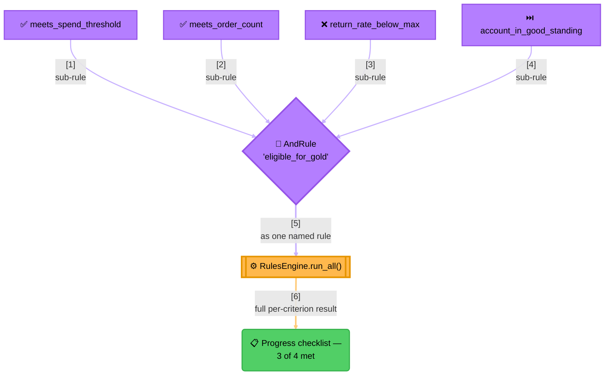

<!-- Title: Sample — Loyalty Tier Promotion -->
# Sample: Loyalty Tier Promotion

> **The question**: should this customer be promoted to the next loyalty
> tier? **Why it's a good fit**: promotion requires *every* one of several
> independent criteria (trailing-12-month spend, order count, a low return
> rate, an account in good standing) — a natural `AndRule` — but the
> customer-facing "your progress toward Gold" screen needs to show which
> criteria are already met and which aren't, not just a final yes/no. That
> need is exactly what `RulesEngine.run_all()` is for, as distinct from a
> bare composite's own `evaluate()`.

## The naive way (and why it breaks down)

The obvious first implementation ends up as *two* functions that have to
be kept in sync by hand — one for the yes/no decision, one for the
customer-facing checklist:

```python
async def gold_checklist(customer: dict) -> dict:
    return {
        "spend": customer["trailing_12mo_spend"] >= customer["gold_spend_threshold"],
        "orders": customer["trailing_12mo_orders"] >= customer["gold_order_threshold"],
        "returns": customer["return_rate"] <= customer["gold_max_return_rate"],
        "standing": customer["account_status"] == "active",
    }


async def is_eligible_for_gold(customer: dict) -> bool:
    checklist = await gold_checklist(customer)
    return all(checklist.values())
```

This works, but the coupling between the two functions is enforced by
nothing except a developer remembering it exists:

- **A new criterion means editing two places, not one.** Adding a fifth
  requirement to `is_eligible_for_gold` without also adding it to
  `gold_checklist` produces a promotion decision the UI's own checklist
  can't explain — a customer who "shouldn't" be eligible sees a screen
  showing all checks passed.
- **Nothing catches the two functions drifting apart.** There's no
  compiler error, no test failure by default — just a UI that quietly
  stops matching the real decision the day someone edits only one of
  the two functions.
- **The pattern gets worse with every additional consumer.** A third
  place that needs "which criteria are met" (an internal ops dashboard,
  an email template) is a third function to keep in sync, or a
  reference back to one of the first two that's easy to get wrong.

## The verdict way



> **Why the checklist needs `run_all()`, not `AndRule.evaluate()`**:
> 1. **`AndRule.evaluate()` alone would short-circuit at `Returns`** —
>    the diagram shows a customer meeting the first two criteria, failing
>    the third; a plain `AndRule.evaluate()` call would never even reach
>    `Standing`, so its own result would be unknown to the caller.
> 2. **`run_all()` evaluates every rule the engine holds, unconditionally**
>    — wrapping the same `AndRule` as the engine's one registered rule and
>    calling `run_all()` instead of `combined.evaluate()` directly gets a
>    result for every sub-rule regardless of where the composite itself
>    would have stopped.
> 3. **The UI reads `result.results[0].data`** — the `AndRule`'s own
>    `RuleResult.data` is the full list of sub-results *only up to its
>    own short-circuit point* even under `run_all()` (short-circuiting is
>    the composite's own behavior, unaffected by how it's invoked) — so a
>    checklist that must show *every* criterion regardless of an early
>    failure needs the sub-rules run individually, not nested in one
>    `AndRule`. See the code below for the actual shape that achieves
>    that.

## The code

```python
from verdict import FunctionRule, RuleResult, RulesEngine


async def meets_spend_threshold(context: dict) -> RuleResult:
    passed = context["trailing_12mo_spend"] >= context["gold_spend_threshold"]
    return RuleResult(rule_name="meets_spend_threshold", passed=passed)


async def meets_order_count(context: dict) -> RuleResult:
    passed = context["trailing_12mo_orders"] >= context["gold_order_threshold"]
    return RuleResult(rule_name="meets_order_count", passed=passed)


async def return_rate_below_max(context: dict) -> RuleResult:
    passed = context["return_rate"] <= context["gold_max_return_rate"]
    return RuleResult(rule_name="return_rate_below_max", passed=passed)


async def account_in_good_standing(context: dict) -> RuleResult:
    return RuleResult(rule_name="account_in_good_standing", passed=context["account_status"] == "active")


# Registered as four independent named rules on one engine — not nested
# in an AndRule — precisely so run_all() reports every criterion's own
# outcome, with no short-circuiting hiding a later criterion's result.
engine = RulesEngine([
    FunctionRule("meets_spend_threshold", meets_spend_threshold),
    FunctionRule("meets_order_count", meets_order_count),
    FunctionRule("return_rate_below_max", return_rate_below_max),
    FunctionRule("account_in_good_standing", account_in_good_standing),
])


async def promotion_checklist(customer_context: dict):
    result = await engine.run_all(customer_context)
    # result.passed is True only if all four passed — the actual promotion decision.
    # result.results is one RuleResult per criterion, always all four — the UI checklist.
    return result
```

This is the one case where reaching for a bare `AndRule` and reaching
for the engine's `run_all()` produce genuinely different, both-correct
answers depending on what the caller actually needs — see
[`../architecture.md`](../architecture.md#three-ways-to-run-rules-and-when-each-is-the-right-one)
for the general rule of thumb.

## Related

- [`content-moderation-routing.md`](5_content-moderation-routing.md) —
  another `run_*` (this time `run_group()`) example, for when a single
  engine needs to serve more than one independent decision.
