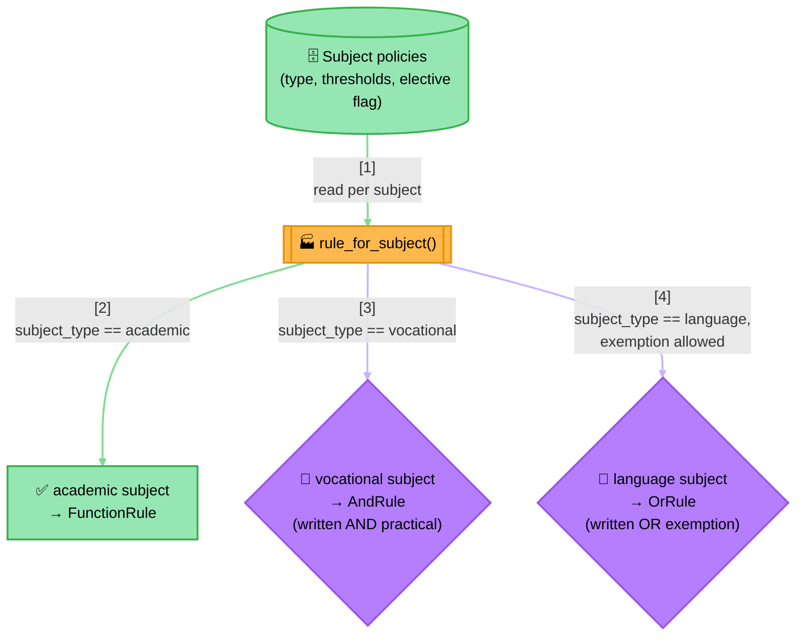

<!-- Title: Sample — Graduation Requirement Verdict -->
# Sample: Graduation Requirement Verdict

> **The question**: does this student qualify to graduate? **Why it's a
> good fit**: a real graduation policy isn't one uniform check — an
> academic subject just needs a passing written score, a vocational
> subject needs a written score *and* a separate practical score to both
> clear their own bars, and a language subject can be satisfied by
> either the written paper *or* an approved exemption. On top of every
> subject's own shape, the student needs at least a handful of their
> elective subjects to pass (not all of them), plus an overall CGPA and
> attendance floor. This sample deliberately pulls in every primitive
> this package has — `FunctionRule`, `AndRule`, `OrRule`, a genuinely
> new rule shape, and all three `RulesEngine` run modes each doing a
> different real job — because a real policy like this one actually
> needs all of them at once, not because the sample is trying to be
> exhaustive for its own sake.

This is the one sample in this set backed by a real, tested project
rather than a markdown code block — see
[`../../examples/graduation_verdict/`](../../examples/graduation_verdict/README.md)
for the full architecture (both diagrams, the naive-way contrast this
design replaces), the complete implementation, a runnable demo across
8 varied students, and the test suite that doubles as an integration/
e2e regression net for `verdict` itself.

Each subject's *policy* — its type, its thresholds, whether it's an
elective — comes from external data (`policies.json` in the example
project); the `Rule` *shape* each policy turns into is decided once, by
type, in one factory function:

> **Reading the Diagram**: three genuinely different `Rule` shapes come
> out of one factory function reading one uniform row shape — nothing
> about `AndRule`/`OrRule`/`FunctionRule` needs to know *why* a
> particular subject picked its shape, and adding a fourth subject
> *type* later (say, a portfolio-reviewed elective) means one more
> branch in that one function, not a new concept anywhere else. The
> built rules then go on to serve two separate purposes from the same
> objects — a diagnostic engine for lookups and reports, and a fast
> composite for the actual pass/fail decision — see
> [`../../examples/graduation_verdict/docs/architecture.md`](../../examples/graduation_verdict/docs/architecture.md)
> for that second diagram and the full reasoning behind it.

## Related

- [`../../examples/graduation_verdict/`](../../examples/graduation_verdict/README.md) —
  the full project: architecture, implementation, tests, and a runnable
  demo across 8 varied students.
- [`2_dynamic-discounts.md`](2_dynamic-discounts.md) — a smaller
  `AndRule`-from-config example without the heterogeneous-shape or
  dual-structure elements this sample adds.
- [`6_data-driven-rule-sets.md`](6_data-driven-rule-sets.md) — the
  simpler version of "build rules from stored config," with one
  uniform rule shape per row instead of three.
- [`../extension.md`](../extension.md#recipe-2--a-genuinely-new-rule-shape) —
  the `ThresholdRule`/`AtLeastNRule` recipe this sample's elective
  requirement is a real instance of.
- [`../architecture.md`](../architecture.md#three-ways-to-run-rules-and-when-each-is-the-right-one) —
  the general reasoning behind reaching for `run_named`/`run_group`/
  `run_all` vs. a bare composite, applied here to three concrete
  callers at once.
