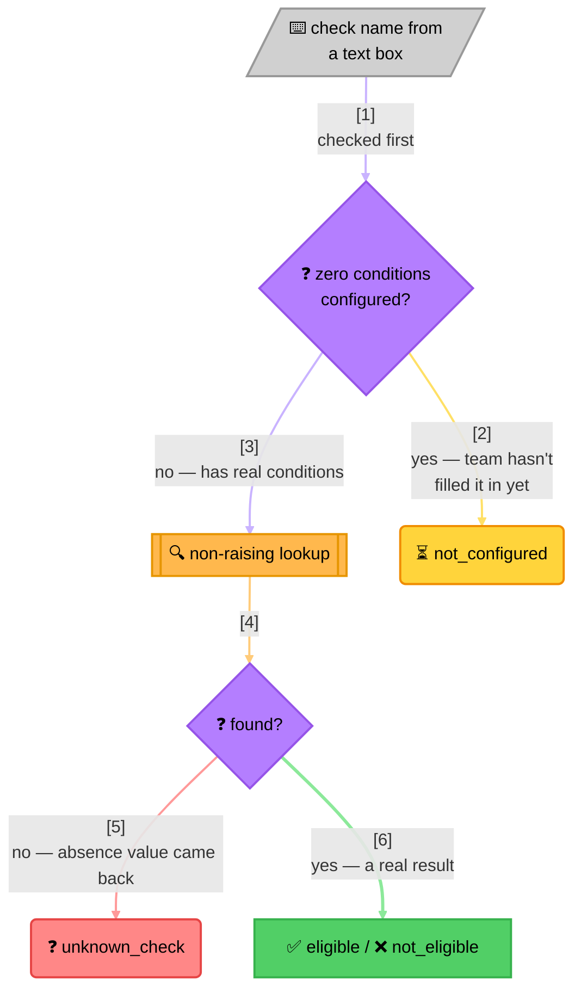

<!-- Title: Sample Spec — Admin Eligibility Lookup -->
# Sample spec: Admin Eligibility Lookup

> What this scenario is, and what any language's worked implementation
> of it must demonstrate — language-agnostic, read once here rather
> than restated per language.

**The question**: a support screen lets an agent type a check name and
run it against one customer, to answer "why didn't this customer
qualify?"

**Why it's a good fit**: a typo in that text box and a check the team
hasn't finished configuring yet are two completely different facts, but
both are "absence-shaped" — neither one is a real verdict about the
customer — and it's easy to accidentally collapse both, and a genuine
rejection, into the same "not eligible" the screen shows. That collapse
is exactly what a non-raising lookup and an explicit vacuous-truth
polarity, used together and *distinguished* from each other, exist to
prevent.

## What the naive approach gets wrong

Before reaching for a rule engine at all, the obvious first
implementation is a plain map of configured checks and a lookup
function — no rule engine in sight yet:

```text
eligibility_checks = {
    "gold_tier": [("spend", 1000)],
    "beta_feature": [],  # not filled in yet
}

function check_eligibility(check_name, customer):
    if check_name not in eligibility_checks:
        return false  # "not eligible" either way
    conditions = eligibility_checks[check_name]
    return all(customer[field] == expected for field, expected in conditions)
```

This looks complete, and it stops the page from crashing on a typo,
which is real progress — but:

- **A typo and a genuine rejection now render identically.** The
  support agent asked "why didn't this customer qualify," and for a
  mistyped check name, the honest answer is "you typed the wrong
  name," not "the customer failed a real condition." Collapsing the
  two into one `false` answers a different question than the one that
  was asked.
- **A check with no conditions configured yet passes silently, and this
  bug is already here, not something a rule engine introduces.** "Every
  condition passes" over an empty set of conditions is `true` in most
  languages' own standard library — the same identity an empty AND will
  turn out to have — so this check returns `true` right now, today,
  before any rule engine enters the picture at all. A check the team is
  still building shows as "eligible," indistinguishable from a real,
  considered pass.
- **Two different problems, one bug report.** The first support ticket
  about either of these looks identical from the outside — "the checker
  said eligible/not eligible and that was wrong" — and nothing about
  the boolean the screen renders points at which absence-shaped
  situation actually happened.

## The `verdict` way

Both bugs above already existed before a rule engine was involved — a
rule engine doesn't introduce the "typo collapses into a rejection" or
"empty means pass" problems, it just gives them names and a documented,
deliberate answer instead of an accidental one. Two decisions, made
once, rather than left to whatever the engine happens to do by default:
an unknown check name uses the non-raising lookup form and gets its own
status, and a check with zero configured conditions is detected and
given a *different* status — neither one ever renders as a real
eligible/not-eligible verdict.



> **Reading the branches**: the top path is checked first and needs no
> engine lookup at all — a check known to have zero conditions is
> caught before the non-raising lookup ever runs. Everything below it
> is a real lookup, and an absence value versus a real result is the
> only distinction that decides "unknown" from "genuinely evaluated."
> Three of these four outcomes are absence-shaped in one way or
> another; only one is an actual verdict about the customer.

**Reaching for the non-raising form directly, rather than catching an
exception from the strict form,** says "absence is expected here and I
have an answer for it" — true on this screen. Catching an exception to
get the same behavior says the same thing by accident, and reads as "I
expect this to raise and I'm suppressing it" to the next person editing
the file. The observable behavior is identical either way; only one of
them tells the truth about why.

**Checking for zero configured conditions before the engine ever runs**
is deliberate, not incidental. An alternative would be to just not
build a rule for an empty check, letting it fall into the same
"unknown" bucket a typo does — one lookup call handles everything. That
was rejected on purpose: "this check exists but isn't ready" and "this
check doesn't exist at all" are different facts a support agent would
act on differently — the first is a product gap to chase the team
about, the second is almost always a spelling mistake — so they earn
their own status rather than being merged for convenience.

Each of the four outcomes is independently testable: proving
`not_configured` fires needs only a check with an empty condition list,
never a customer record or a real engine lookup at all. The naive
version has no such seam — every outcome falls out of the same `if`/
`try` block, so proving one path means constructing inputs that also
exercise the others.

## What a solution must demonstrate

- Four distinguishable outcomes exist: a genuine pass, a genuine
  failure, an unknown check name, and a check with no conditions
  configured yet — never collapsed into fewer than four.
- An unknown check name uses the non-raising lookup form, never a
  caught exception standing in for it.
- A check with zero configured conditions is detected and reported
  *before* it would vacuously pass, not left to fall through to a
  real-looking "eligible."
- The two absence-shaped outcomes (unknown, not-configured) are kept
  distinct from each other, not merged into one generic "can't
  determine."
- Each of the four outcomes is unit-testable on its own, without
  constructing inputs that trigger the other three.
- The naive-way section names concrete, present-day bugs (a typo
  renders as a real rejection; an unfinished check silently passes),
  not hypothetical future ones.

## Related

- [`../../extending/absence-vs-failure/`](../../extending/absence-vs-failure/README.md) —
  the general absence-vs-emptiness guidance this sample is one concrete
  instance of.
- [`data-driven-rule-sets/`](../data-driven-rule-sets/README.md) — building the
  rule objects themselves from stored configuration, the same pattern
  this scenario's lookup uses to turn each check's conditions into a
  rule.
