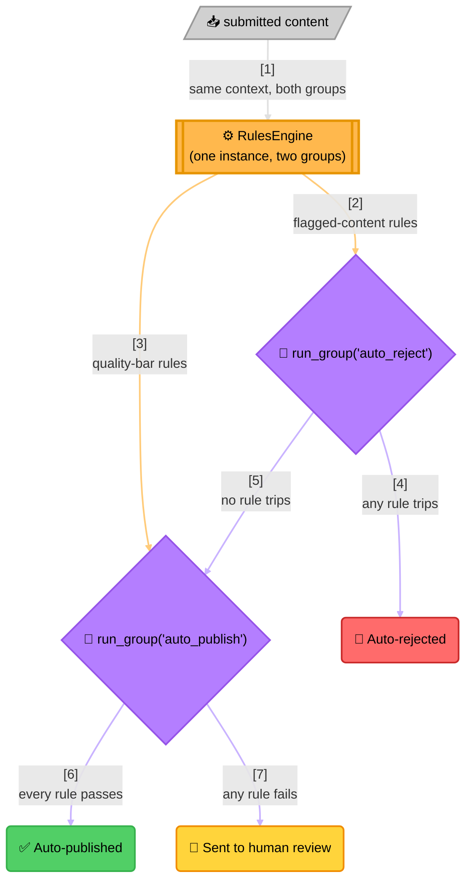

<!-- Title: Sample Spec — Content Moderation Routing -->
# Sample spec: Content Moderation Routing

> What this scenario is, and what any language's worked implementation
> of it must demonstrate — language-agnostic, read once here rather
> than restated per language. Each language's own file in this
> directory — [`python.md`](python.md) today — is the actual code, in that
> language's own idiom, built to satisfy this spec.

**The question**: should this piece of user-submitted content be
auto-published, sent to human review, or auto-rejected?

**Why it's a good fit**: this isn't one yes/no decision, it's two
independent decisions sharing a common set of facts about the same
content — "does it trip any auto-reject rule?" and, separately, "does
it clear every auto-publish rule?" — evaluated against the same context
but drawing from two different named subsets of one rule collection.
That's exactly what running rules by named group is for: partitioning
one engine's rules into named groups without standing up two separate
engines.

## What the naive approach gets wrong

The obvious first implementation is one function with an `if`/`if`
ladder, one line per signal:

```text
function route_submission(content):
    if content.has_banned_terms or content.spam_score >= content.spam_threshold:
        return "auto_rejected"
    if content.length >= content.min_length and content.author_post_count >= 10:
        return "auto_published"
    return "sent_to_review"
```

This is readable at four signals. It stops being readable well before
it stops being *used*:

- **"Reject" and "publish" signals are distinguished only by which side
  of which `if` they're written on.** There's no list anywhere of
  "every currently-active reject rule" for a moderation dashboard or an
  audit — that list only exists by reading this function's source.
- **Every new signal is a code change and a full re-test of the whole
  ladder.** A new spam heuristic added by the trust & safety team means
  editing application code and re-verifying every existing branch still
  behaves the same way, even though only one signal actually changed.
- **There's no partial picture.** Short-circuiting boolean logic means a
  submission that trips the *first* reject condition never reveals
  whether it would have tripped the second one too, which a reviewer
  auditing "why was this rejected" might actually want to know.

## The `verdict` way

Every rule is registered once on **one engine**, tagged with a group of
either "auto_reject" or "auto_publish" — the engine itself doesn't
distinguish the groups beyond that label. Running rules by named group
never short-circuits: it evaluates every rule in the requested group
unconditionally, which is what makes it possible to know "every reject
rule that *would* have tripped," not just the first one — useful for
moderation tooling that shows a reviewer everything flagged, not just
one hit.

Each rule is independently testable regardless of which group it
belongs to: proving `flagged_by_spam_score` fails needs only a spam
score and a threshold, never the banned-terms list or the publish-side
criteria. The naive ladder has no such isolation — every signal lives
inside the same function, gated by the same `if` chain.



> **Reading the Diagram**:
>
> 1. **One engine, two groups** — every rule is registered once, tagged
>    with a group of either "auto_reject" or "auto_publish"; the engine
>    itself doesn't distinguish the groups beyond that label.
> 2. **Running by group never short-circuits** — like running everything
>    the engine holds, it evaluates every rule in the requested group
>    unconditionally, which is what makes it possible to know "every
>    reject rule that *would* have tripped," not just the first one.
> 3. **The reject check gates whether the publish check even runs** —
>    that branching decision is the caller's own logic, sitting outside
>    the engine entirely; the engine only answers "did this named group
>    of rules pass," the caller decides what a pass/fail combination
>    means.

## What a solution must demonstrate

- Rules from two independent decisions live on **one** engine instance,
  distinguished only by a group label.
- Running one named group never short-circuits — every rule in that
  group reports its own outcome.
- The routing decision (which group gates which) is the caller's own
  logic, not something the engine encodes.
- Each rule is unit-testable on its own, regardless of which group it
  belongs to, without needing the other group's inputs.
- The naive-way section names a concrete cost (a full re-test of the
  whole ladder for a one-signal change), not a hypothetical one.

## Related

- [`loyalty-tier-promotion/`](../loyalty-tier-promotion/README.md) — the
  run-everything counterpart, for a single engine's every rule rather
  than a named subset.
