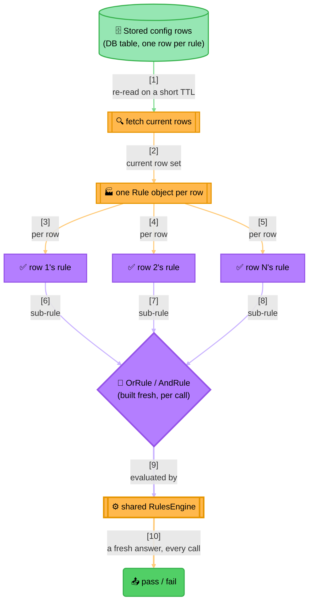

<!-- Title: Sample Spec — Data-Driven Rule Sets -->
# Sample spec: Data-Driven Rule Sets

> What this scenario is, and what any language's worked implementation
> of it must demonstrate — language-agnostic, read once here rather
> than restated per language. Each language's own file in this
> directory — [`python.md`](python.md) today — is the actual code, in that
> language's own idiom, built to satisfy this spec.

**The question**: how do you avoid redeploying every time a business
rule changes?

**Why this is the pattern this package is designed for**: two entirely
unrelated decisions — say rate-limit policy evaluation and
access-control condition evaluation — reduce to the identical shape
here: read whatever rows are currently configured, build a fresh rule
object per row, combine them, evaluate, discard. Nothing about the rule
*set* is hard-coded; only the *shape* each row turns into is.

This scenario is a brief, domain-neutral illustration of that same
pattern — deliberately not a copy of any real implementation, just the
same idea with generic data.

## What the naive approach gets wrong

The obvious first implementation compiles every configured condition
straight into an `if`/`elif` ladder in application code:

```text
function matches_condition_grant(category, groups):
    if category == "Manager" and "Headquarters" in groups:
        return true
    if category == "Analyst" and ("Support" in groups or "Headquarters" in groups):
        return true
    return false
```

This is, functionally, a two-row configuration table — hand-transcribed
into source code. That transcription is exactly the problem:

- **Every new condition an admin wants is a developer task.** "Add a
  rule for Supervisor with any of Field/Headquarters" means someone
  edits this function, opens a PR, and ships a deploy — for a change
  that's conceptually just a new row in a table, not new *logic*.
- **The function only grows.** A real system accumulates dozens of
  these rows over time; the `if`/`elif` ladder becomes an unreadable
  wall that only the person who last touched it (or nobody) fully
  understands, and every edit risks affecting an unrelated earlier
  branch.
- **Nothing can inspect "what are the current rules"** without reading
  source code — no admin screen can list, edit, or audit the active
  condition set, because the condition set doesn't exist as data at
  all.

## The `verdict` way

The rule *set* lives in storage; the rule *shape* lives in code. A
config row never contains code or a DSL expression tree, just plain
columns (a threshold, a category, a list of names) — one factory
function is the only place that knows how a row becomes a rule.

Nothing is built until it's needed, and nothing is kept after. The
engine never retains a result between calls; a data-driven rule set
goes further and rebuilds the rule objects themselves fresh, per call,
from whatever the current row set says *right now*. An edited or
deleted row takes effect the moment it's re-read — no redeploy, often
no restart.

Each row's rule is independently testable in isolation: constructing
one `ConfiguredRow` and evaluating it proves that row's own condition,
with no dependency on how many other rows exist or what they check. The
naive ladder has the opposite property — testing one condition means
exercising the whole function, and a passing test for row three offers
no protection against row three's logic silently absorbing a stray
`elif` meant for row four.



> **Reading the Diagram**:
>
> 1. **The rule *set* lives in storage, the rule *shape* lives in code**
>    — a config row never contains code or a DSL expression tree, just
>    plain columns; the factory function is the only place that knows
>    how a row becomes a rule.
> 2. **Nothing is built until it's needed, and nothing is kept after** —
>    the engine never retains a result between calls; a data-driven rule
>    set goes further and rebuilds the rule objects themselves fresh,
>    per call, from whatever the current row set says *right now*.
> 3. **An empty row set degrades to a well-defined default, not an
>    error** — an empty AND vacuously passes, an empty OR vacuously
>    fails; which default is correct depends entirely on what "nothing
>    configured" should mean for the domain, and that choice is made
>    once, explicitly, not left to accident.
> 4. **A short TTL cache in front of the fetch is a caller-side
>    concern, not the engine's** — reading storage on every single
>    evaluation is often too slow for a hot path; caching the *row set*
>    (never the built rule objects, since those are cheap to rebuild and
>    rebuilding them is what makes an edit visible) is the right layer
>    to add that at.

## What a solution must demonstrate

- Configured rows are plain data (columns), never code or an expression
  tree — one factory function is the only place that interprets them.
- Rule objects are rebuilt fresh from the current row set on every
  evaluation, never cached or built once at startup.
- The empty-configuration default (vacuous pass vs. vacuous fail) is an
  explicit, named choice tied to the domain, not an accident of which
  combinator happened to be used.
- Each row's rule is unit-testable in isolation, independent of how
  many other rows exist.
- The naive-way section names a concrete cost (a developer task and a
  deploy for what is conceptually a data edit), not a hypothetical one.

## Related

- [`../../extending/data-driven-rule-construction/`](../../extending/data-driven-rule-construction/README.md) —
  the general scenario this sample is a fuller version of, including how
  two unrelated domains share one engine without coupling to each
  other.
- [`dynamic-discounts/`](../dynamic-discounts/README.md) — a smaller,
  single-AND instance of the same idea.
