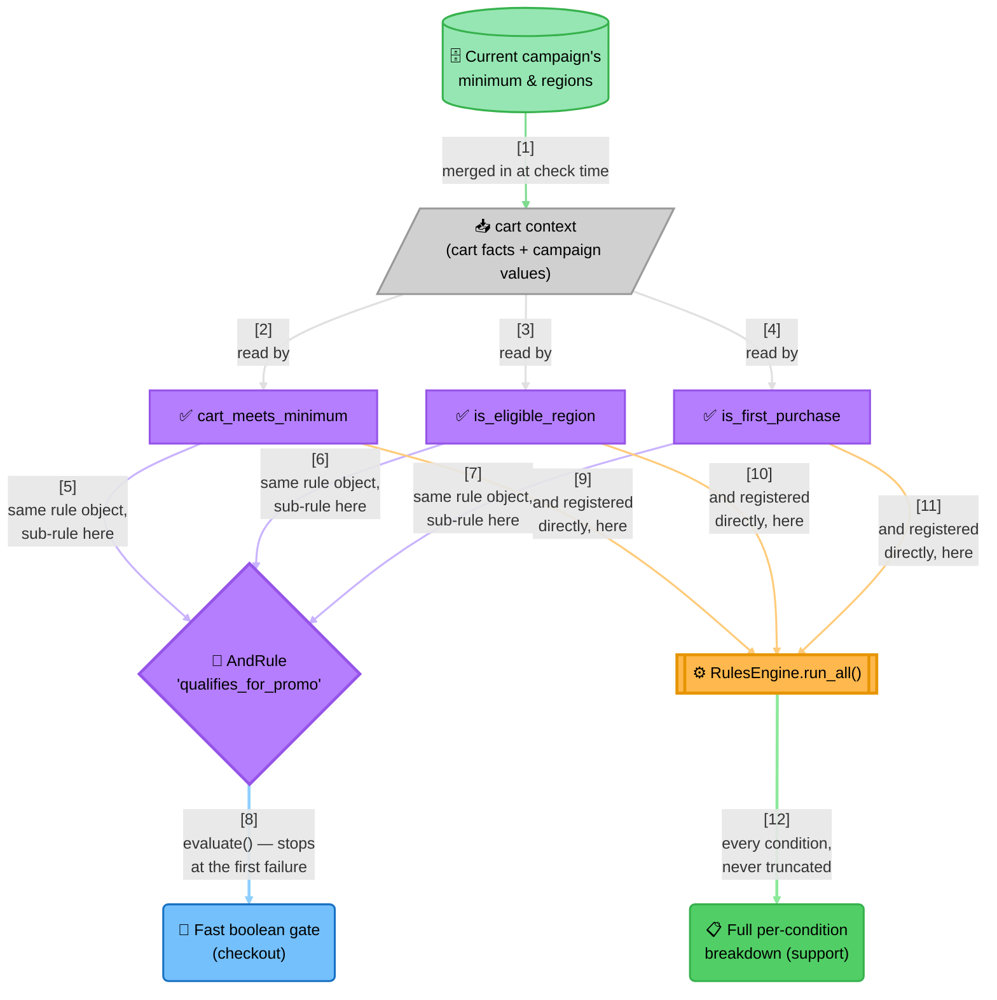

<!-- Title: Sample Spec — Dynamic Discount Eligibility -->
# Sample spec: Dynamic Discount Eligibility

> What this scenario is, and what any language's worked implementation
> of it must demonstrate — language-agnostic, read once here rather
> than restated per language.

**The question**: does this cart qualify for a promotional discount,
under a promo policy that always checks the same three things — a
minimum cart value, an eligible region, and first-purchase status — but
whose *thresholds* (the minimum amount, which regions count) are set by
marketing and change on their own schedule?

**Why it's a good fit for a rule engine**: the checkout code shouldn't
need a deploy every time marketing runs a weekend campaign with a lower
minimum, and a customer asking "why didn't my discount apply?" deserves
a real answer, not just a `false`.

## What the naive approach gets wrong

The obvious first implementation bakes the campaign's current numbers
directly into a nested conditional:

```text
function qualifies_for_promo(cart):
    if cart.total >= 100:
        if cart.region in ["US", "CA"]:
            if cart.is_first_purchase:
                return true
    return false
```

This breaks down in three specific ways:

- **Every marketing adjustment becomes a code change.** Lowering the
  minimum for a weekend campaign, or adding a region, means editing
  this function and shipping a deploy — for a change that has nothing
  to do with how the checkout code itself works.
- **A fourth condition means a fourth nesting level.** The function
  only gets harder to read as conditions accumulate, and nothing stops
  two conditions from silently depending on evaluation order in a way
  nobody intended.
- **"Why didn't my discount apply?" has no good answer.** A single
  boolean can't tell a support agent *which* condition failed without
  re-deriving it by hand from the cart data.

## The `verdict` way

The three *kinds* of check stay fixed in code — a minimum-value
comparison, a region-membership check, a boolean flag — each a
genuine, distinct, independently-named condition rather than one
generic comparison forced to cover all three. What marketing actually
changes (the minimum amount, the eligible-region list) travels in as
plain values on the context, sourced from wherever the current
campaign's config actually lives. Changing a threshold is a data
change; it never touches the rule code.

Each condition is built **once** and reused for two different needs
rather than declared twice: a fast boolean gate for checkout itself,
and a full per-condition breakdown for "why didn't this apply?" — the
same objects feed both.

This also pays off directly in tests: each condition is a standalone
unit, testable on its own without constructing the other two — no
`region="US", is_first_purchase=True` filler just to reach the branch
that checks `total`. The naive nested conditional has no such seam;
testing the region check alone still requires satisfying the total
check first, because they're one function, not three.



> **Why a short-circuiting combinator alone isn't the full answer, and
> registering it with the engine doesn't fix that either**:
>
> 1. **A single `passed=false` isn't useful to a support agent** — "why
>    didn't the discount apply?" needs to know *which* condition
>    failed, not just that one did.
> 2. **A short-circuiting `AndRule`'s own composite result carries the
>    sub-results up to and including the first failure — and stops
>    there.** A cart failing both the minimum *and* the region never
>    reveals the second failure.
> 3. **Handing that same `AndRule` to the engine and calling its
>    run-everything mode does not change this.** That mode evaluates
>    every *registered* rule unconditionally — but if the only
>    registered rule is the `AndRule` itself, there is still only one
>    rule to run, and its own internal short-circuiting is untouched.
>    The truncation moves, it doesn't disappear.
> 4. **The fix is to register the three leaf rules with the engine
>    directly — not the `AndRule`.** Running all three unconditionally
>    evaluates every one of them, because none of them is
>    short-circuiting machinery on its own. The `AndRule` still exists,
>    built from the exact same three rule objects, for whichever call
>    site wants the fast boolean gate instead.

## What a solution must demonstrate

- Each of the three conditions is its own independent, named check —
  not one generic comparison covering all three.
- A per-condition breakdown is available for the "why not" use case,
  not just a single boolean.
- Config values (the minimum, the region list) are data that changes
  without a code edit — never hardcoded literals re-baked per campaign.
- A fast pass/fail path and a full-diagnostic path are both addressed
  as **distinct** needs, built from the same underlying rules, not
  conflated into one code path.
- Each condition is unit-testable on its own, without constructing
  inputs that satisfy the other two first.
- The naive-way section looks wrong on sight — nested conditionals, a
  magic number, a hardcoded region list — not merely code that is
  *explained* to be wrong afterward.

## Related

- [`shipping-fee-waiver/`](../shipping-fee-waiver/README.md) — the OR
  mirror image of this same idea (any one qualifying path, not all).
- [`data-driven-rule-sets/`](../data-driven-rule-sets/README.md) — building
  the rules themselves from stored config, not just their values.
