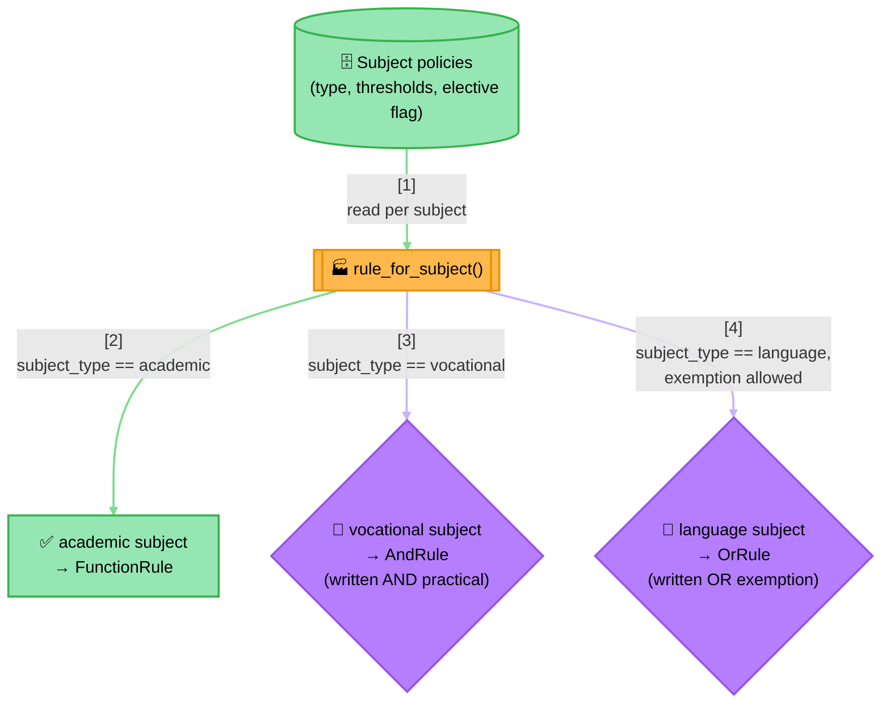
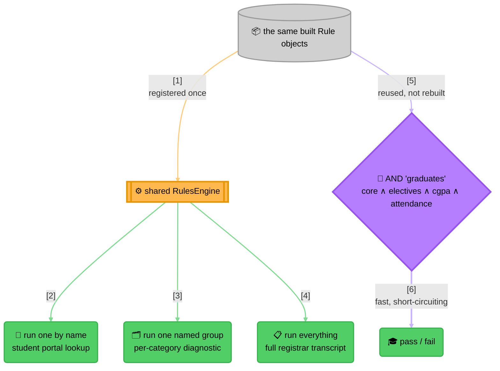

<!-- Title: Sample Spec — Graduation Requirement Verdict -->
# Sample spec: Graduation Requirement Verdict

> What this scenario is, and what any language's worked implementation
> of it must demonstrate — language-agnostic, read once here rather
> than restated per language. Each language's own file in this
> directory — [`python.md`](python.md) today — points at that language's own full,
> tested implementation, built to satisfy this spec.

**The question**: does this student qualify to graduate?

**Why it's a good fit**: a real graduation policy isn't one uniform
check — an academic subject just needs a passing written score, a
vocational subject needs a written score *and* a separate practical
score to both clear their own bars, and a language subject can be
satisfied by either the written paper *or* an approved exemption. On
top of every subject's own shape, the student needs at least a handful
of their elective subjects to pass (not all of them), plus an overall
CGPA and attendance floor. This scenario deliberately pulls in every
primitive this package has — a plain predicate rule, an AND, an OR, a
genuinely new rule shape, and all three run modes each doing a
different real job — because a real policy like this one actually
needs all of them at once, not because the scenario is trying to be
exhaustive for its own sake.

This is the one scenario backed by a full, tested project rather than a
markdown code block — see each language's own worked example
(`python/examples/graduation_verdict/` today) for a complete
implementation, a runnable demo across several varied students, and a
test suite that doubles as an integration/regression net for that
language's SDK itself. The shared inputs and expected outcomes every
port must reproduce — including how many rules should have run, which
is short-circuiting stated as data rather than prose — live in
[`../../../fixtures/graduation_verdict/README.md`](../../../fixtures/graduation_verdict/README.md),
the cross-language parity fixture.

## What the naive approach gets wrong

The obvious first implementation is one large function mixing every
subject's own pass condition, the elective count, and the overall
floors:

```text
function can_graduate(scores, cgpa, attendance_pct):
    if scores["MATH101"].written_pct < 40:
        return false
    if scores["ENG101"].written_pct < 40:
        return false
    if scores["WORKSHOP201"].written_pct < 40 or scores["WORKSHOP201"].practical_pct < 60:
        return false
    if scores["FRENCH101"].written_pct < 40 and not scores["FRENCH101"].has_exemption:
        return false

    elective_ids = ["ELECTIVE_ART", "ELECTIVE_MUSIC", "ELECTIVE_CS"]
    passed_electives = count(e in elective_ids where scores[e].written_pct >= 40)
    if passed_electives < 2:
        return false

    if cgpa < 6.0:
        return false
    if attendance_pct < 75:
        return false

    return true
```

This tracks a real curriculum for exactly as long as the curriculum
never changes shape. In practice:

- **Every subject is a hand-copied `if`, in whichever shape its type
  happens to need.** Adding a new vocational subject means remembering
  to write the two-threshold `or` pattern correctly by hand, in a
  function that also contains a language subject's completely different
  `and`-with-exemption pattern a few lines above it — nothing stops the
  two shapes from getting silently swapped during a future edit.
- **The elective list and its "how many" threshold are both hard-coded,
  separately from which subjects are even electives.** Moving a subject
  from elective to core, or raising the requirement from 2-of-3 to
  3-of-4, means finding and editing this exact function correctly —
  there's no single place that says "these are this year's electives."
- **The function only ever answers yes or no.** A student asking "did I
  pass Physics," or a registrar needing every subject's own pass/fail
  for a transcript, gets nothing from this function — both would need
  their own, separately-maintained re-derivation of the same logic.

## The `verdict` way

Each subject's *policy* — its type, its thresholds, whether it's an
elective — comes from external data; the rule *shape* each policy turns
into is decided once, by type, in one factory function:



> **Reading the Diagram**: three genuinely different rule shapes come
> out of one factory function reading one uniform row shape — nothing
> about the AND/OR/plain-predicate shapes needs to know *why* a
> particular subject picked its shape, and adding a fourth subject
> *type* later (say, a portfolio-reviewed elective) means one more
> branch in that one function, not a new concept anywhere else.

The built rules then serve **two separate purposes from the same
objects** — a diagnostic engine for lookups and reports, and a fast
composite for the actual pass/fail decision:



> **Why Two Structures, Not One**:
>
> 1. **Running by name, by group, or by everything exists to answer
>    questions about individual subjects** — "did I pass X," "how did I
>    do on my core subjects," "give me the full transcript." None of
>    them decide graduation; all of them are read-only lookups a portal
>    or a registrar screen calls directly.
> 2. **The AND composite decides graduation, as cheaply as possible** —
>    a fresh AND (itself holding a nested AND for the core subjects and
>    a custom at-least-N rule for electives, alongside the CGPA/
>    attendance checks) built from the *same* rule objects the engine
>    already holds. Nothing is re-evaluated to build it, and nothing
>    about it is retained between calls — see
>    [`../../architecture/README.md`](../../architecture/README.md#type-structure)
>    for why a rule instance's lifecycle isn't owned by any one
>    structure that references it.
> 3. **The elective requirement is neither AND nor OR** — "at least 2 of
>    3" is exactly
>    [`../../extending/new-rule-shape/`](../../extending/new-rule-shape/README.md)'s
>    scenario, used for something a real curriculum actually needs, not
>    a toy count.

Each subject's rule is independently testable regardless of type: a
vocational subject's rule can be proven to require both scores without
constructing a language subject's exemption data, and vice versa —
every rule built by the factory carries only what its own subject type
needs.

## What a solution must demonstrate

- At least three genuinely different rule shapes (a plain predicate, an
  AND, an OR) come out of one factory function, keyed on data, not
  duplicated per subject.
- A requirement that isn't AND or OR — "at least N of M electives" — is
  a real, new rule shape, not forced into an existing combinator.
- The same built rules serve two distinct needs from the same objects:
  a fast pass/fail decision, and a full diagnostic breakdown.
- All three run modes (run one by name, run one named group, run
  everything) each do a genuinely different, necessary job in the same
  policy, not just for coverage's own sake.
- Each subject's rule is unit-testable in isolation, regardless of its
  type or how many other subjects exist.
- The scenario is backed by a real, runnable, tested implementation —
  not only a markdown code block — since heterogeneous rule shapes at
  this scale are exactly where an untested sketch would hide a bug.
- The implementation reproduces every expectation in the shared
  cross-language fixture (`fixtures/graduation_verdict/`), including
  the rule-evaluation counts that prove short-circuiting survived the
  port.

## Related

- [`dynamic-discounts/`](../dynamic-discounts/README.md) — a smaller
  AND-from-config example without the heterogeneous-shape or
  dual-structure elements this scenario adds.
- [`data-driven-rule-sets/`](../data-driven-rule-sets/README.md) — the
  simpler version of "build rules from stored config," with one uniform
  rule shape per row instead of three.
- [`../../extending/new-rule-shape/`](../../extending/new-rule-shape/README.md) —
  the scenario this sample's elective requirement is a real instance
  of.
- [`../../architecture/README.md`](../../architecture/README.md#three-ways-to-run-rules-and-when-each-is-the-right-one) —
  the general reasoning behind reaching for one run mode over another,
  applied here to three concrete callers at once.
- [`../../../fixtures/graduation_verdict/README.md`](../../../fixtures/graduation_verdict/README.md) —
  the shared, cross-language data contract every port's implementation
  must reproduce.
