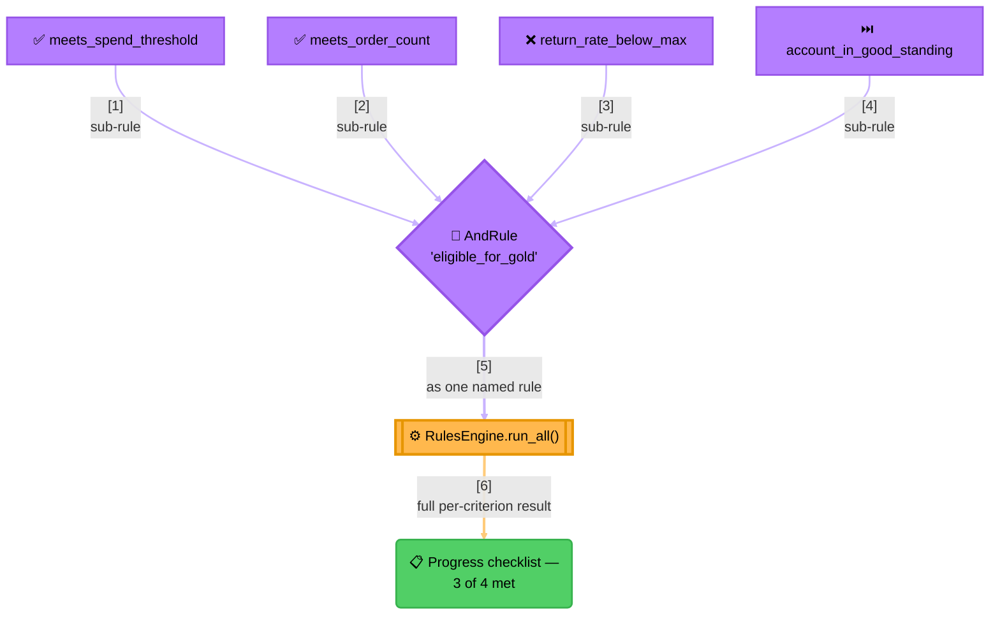

<!-- Title: Sample Spec — Loyalty Tier Promotion -->
# Sample spec: Loyalty Tier Promotion

> What this scenario is, and what any language's worked implementation
> of it must demonstrate — language-agnostic, read once here rather
> than restated per language.

**The question**: should this customer be promoted to the next loyalty
tier?

**Why it's a good fit**: promotion requires *every* one of several
independent criteria (trailing-12-month spend, order count, a low
return rate, an account in good standing) — a natural AND — but the
customer-facing "your progress toward Gold" screen needs to show which
criteria are already met and which aren't, not just a final yes/no.
That need is exactly what running every rule unconditionally is for, as
distinct from a composite's own short-circuiting evaluate.

## What the naive approach gets wrong

The obvious first implementation is *two* functions, one for the
customer-facing checklist and one for the actual yes/no decision, each
with the four criteria's thresholds written inline:

```text
function gold_checklist(customer):
    return {
        "spend": customer.trailing_12mo_spend >= 5000,
        "orders": customer.trailing_12mo_orders >= 15,
        "returns": customer.return_rate <= 0.05,
        "standing": customer.account_status == "active",
    }

function is_eligible_for_gold(customer):
    return (
        customer.trailing_12mo_spend >= 5000
        and customer.trailing_12mo_orders >= 20
        and customer.return_rate <= 0.05
        and customer.account_status == "active"
    )
```

Read the two functions side by side and the bug is visible without
reading a word past the code itself: `gold_checklist` promotes at 15
orders, `is_eligible_for_gold` at 20. Nothing about this is a future
risk — a customer with 17 trailing-12-month orders sees a checklist
showing "orders: met" *right now*, while the actual decision function
says not eligible, because the number that matters lives in two places
and nobody kept them equal:

- **The two functions never agreed in the first place.** This isn't a
  hypothetical drift from a future edit — the values shown are already
  wrong relative to each other, the ordinary result of writing the same
  threshold twice.
- **Nothing catches it.** No compiler error, no test failure by
  default — the checklist and the decision it's supposed to explain
  just silently disagree, and stay disagreeing until someone happens to
  notice a customer's confusing support ticket.
- **The pattern gets worse with every additional consumer.** A third
  place that needs "which criteria are met" (an internal ops dashboard,
  an email template) is a third hardcoded copy of the same four
  numbers, each one more chance to drift from the rest.

## The `verdict` way

The four criteria are registered as **independent named rules on one
engine — not nested inside an AND composite** — so that running every
rule unconditionally reports each criterion's own outcome, with no
short-circuiting hiding a later criterion's result. A short-circuiting
AND built from the same rule objects still exists, for whichever call
site wants the fast boolean gate instead — both read from the same
four rule objects, never two independently maintained implementations.

Each criterion is independently unit-testable this way too: proving
`return_rate_below_max` fails needs only that one rule's own inputs,
never the other three's — the naive version's two hand-written
functions have no such isolation, since both would need every field on
`customer` populated just to exercise one check.



> **Why the checklist needs run-everything, not the composite's own
> evaluate**:
>
> 1. **A short-circuiting evaluate alone would stop at `Returns`** — the
>    diagram shows a customer meeting the first two criteria, failing
>    the third; a plain short-circuiting call would never even reach
>    `Standing`, so its own result would be unknown to the caller.
> 2. **Running every rule the engine holds, unconditionally, evaluates
>    all four** — wrapping the same AND as the engine's one registered
>    rule and calling the run-everything mode instead of the composite's
>    own evaluate gets a result for every sub-rule regardless of where
>    the composite itself would have stopped.
> 3. **A composite's own result is truncated at its own short-circuit
>    point, even under run-everything mode** — short-circuiting is the
>    composite's own behavior, unaffected by how it's invoked — so a
>    checklist that must show *every* criterion regardless of an early
>    failure needs the sub-rules run individually, not nested in one
>    composite.

## What a solution must demonstrate

- All four criteria combine with AND-like (every-one-must-pass)
  semantics for the fast yes/no path.
- The same four criteria, registered individually with the engine,
  produce a full per-criterion breakdown under the run-everything mode
  — never truncated by short-circuiting.
- Both paths (fast gate, full checklist) are built from the same rule
  objects, never two independently maintained implementations.
- Each criterion is unit-testable on its own, without populating every
  other criterion's own inputs first.
- The naive-way section shows a concrete, already-present bug (two
  functions whose hardcoded thresholds have already drifted apart),
  not a hypothetical future risk.
- The context is a typed record with one field per threshold, not a
  dict — each threshold has exactly one definition, read by name from
  every rule that needs it, which is what makes the naive version's
  drift structurally impossible here rather than merely avoided by
  discipline.

## Related

- [`content-moderation-routing/`](../content-moderation-routing/README.md) —
  another run-mode example, for when a single engine needs to serve
  more than one independent decision.
