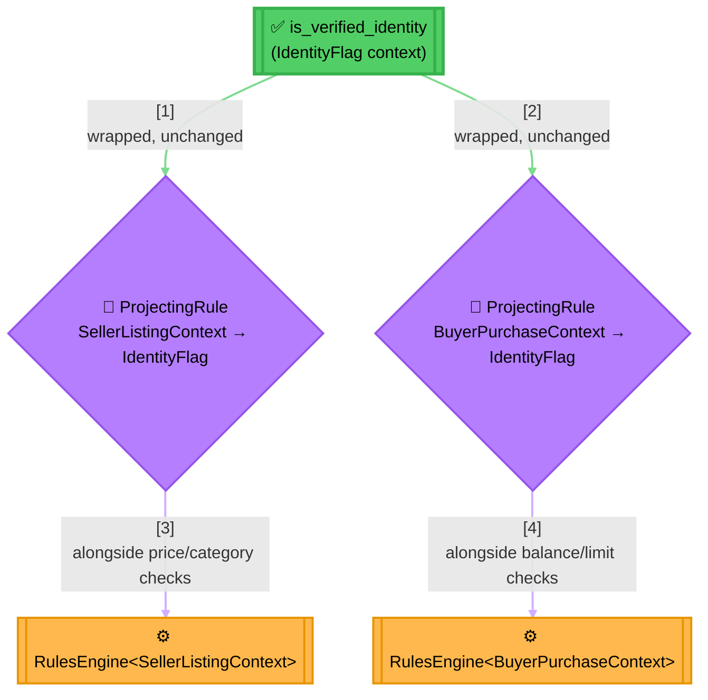
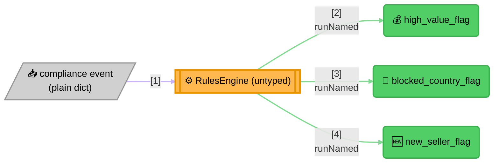

<!-- Title: Sample Spec — Marketplace Eligibility -->
# Sample spec: Marketplace Eligibility

> What this scenario is, and what any language's worked implementation
> of it must demonstrate — language-agnostic, read once here rather
> than restated per language.

**The question**: does this seller's listing, or this buyer's purchase,
clear the marketplace's eligibility bar — and can a compliance rule set
flag either side's activity for review without needing to know either
context's shape?

**Why it's a good fit**: a two-sided marketplace naturally has two
context shapes that share almost nothing — a seller's listing context
carries a price and a category, a buyer's purchase context carries an
amount and a balance — yet both sides need the *same* identity-
verification check. A rule engine with a generic context can express
that check once and reuse it against either shape through a small
adapter; a rule engine without one would either duplicate the check per
side or fall back to an untyped context everywhere, losing the
same-context guarantee a typed composite buys. Layered on top, a
compliance team's own flags read a third, unrelated shape (a raw event)
and get added independently over time — exactly the heterogeneous,
runtime-string-keyed catalog a *typed* context can't serve, and where
an untyped `RulesEngine` stays the right tool. This scenario exists to
prove `Rule<TContext>`'s design decisions hold up together in one
domain, not in isolation.

This is the one scenario built specifically to exercise
`Rule<TContext>` end to end: two typed contexts, a rule reused across
both via a projecting adapter, and a dict-context catalog coexisting in
the same codebase. The shared inputs and expected outcomes every port
must reproduce live in
[`../../../fixtures/marketplace_eligibility/README.md`](../../../fixtures/marketplace_eligibility/README.md),
the cross-language parity fixture.

## What the naive approach gets wrong

The obvious first implementation either duplicates the identity check
per side, or gives up on typing the context at all:

```text
function seller_listing_eligible(seller):
    if not seller.verified: return false
    if seller.price_cents < 100: return false
    if seller.category not in ["books", "electronics", "home"]: return false
    return true

function buyer_purchase_eligible(buyer):
    if not buyer.verified: return false   # <-- same check, copied
    if buyer.balance_cents < buyer.amount_cents: return false
    if buyer.amount_cents > 100000: return false
    return true
```

In practice:

- **The identity check is copied, not shared.** A rule change (a new
  verification tier, say) means finding and editing it correctly in
  every function that happens to have copied it — nothing ties the two
  copies together as "the same rule."
- **Or, the alternative naive fix — making everything read an untyped
  dict — throws away the guarantee a typed context was worth having in
  the first place.** A `seller["blance_cents"]` typo (a buyer field,
  wrong side, misspelled) compiles fine and fails silently at runtime,
  the exact class of bug a typed context exists to catch before it
  ships.
- **Compliance flags get bolted onto whichever side's function happens
  to be closest,** rather than living as their own independently
  extensible set — adding a fourth flag later means finding the "right"
  existing function to wedge it into, instead of adding one line to a
  catalog.

## The `verdict` way

One rule, `is_verified_identity`, is written once against a narrow
context that has nothing to do with either side of the marketplace —
and reused via a small projecting adapter at each reuse site:



> **Reading the Diagram**: `is_verified_identity` is constructed exactly
> once. Each `ProjectingRule` wraps that same instance with a different
> projection function — `SellerListingContext -> IdentityFlag` on one
> side, `BuyerPurchaseContext -> IdentityFlag` on the other — so a
> future change to the identity check's own logic only has one
> definition to change, regardless of how many context shapes end up
> reusing it.

The compliance side is a genuinely different shape — not a composite
deciding one verdict, but an open-ended catalog of independent checks
against one heterogeneous event:



> **Why This Stays Dict-Context, Deliberately**: a compliance team adds
> a fourth flag by adding one more rule to the catalog, not by touching
> a shared typed context every existing flag would otherwise need to
> agree on. This is the same reasoning
> [`../../architecture/README.md`](../../architecture/README.md#generic-context)
> gives for why dict-context stays first-class rather than becoming a
> fallback — a heterogeneous, runtime-string-keyed catalog is exactly
> the shape a typed context doesn't fit.

## What a solution must demonstrate

- A typed `Rule<TContext>` for at least two genuinely different
  contexts (`SellerListingContext`, `BuyerPurchaseContext`) that share
  no fields.
- One rule written once, reused across both typed contexts via an
  explicit `ProjectingRule` adapter — not duplicated, not weakened to
  dict-context to make reuse easier.
- A dict-context `Rule` catalog coexisting in the same codebase as the
  typed rules, for a scenario (compliance flags) that genuinely needs
  runtime-string-keyed, independently-added checks rather than one
  composite verdict.
- Both `RulesEngine` forms in use for a real reason each: `RulesEngine<TContext>`
  for each side's cohesive rule family, a plain `RulesEngine` for the
  heterogeneous compliance catalog.
- Each rule is independently unit-testable regardless of which context
  or catalog it belongs to.
- The implementation reproduces every expectation in the shared
  cross-language fixture (`fixtures/marketplace_eligibility/`).

## Related

- [`../graduation-requirement-verdict/README.md`](../graduation-requirement-verdict/README.md) —
  the flagship dict-context sample this one deliberately doesn't
  replace; that one proves the engine survives a port, this one proves
  the generic-context design does.
- [`../../architecture/README.md`](../../architecture/README.md#generic-context) —
  the language-agnostic reasoning behind `Rule<TContext>`, dict-context
  staying first-class, and the registry-boundary limit this scenario's
  compliance catalog is a concrete instance of.
- [`../../extending/reusing-a-rule-across-contexts/README.md`](../../extending/reusing-a-rule-across-contexts/README.md) —
  the `ProjectingRule` pattern this scenario's identity check is a real,
  full-scale instance of.
- [`../../../fixtures/marketplace_eligibility/README.md`](../../../fixtures/marketplace_eligibility/README.md) —
  the shared, cross-language data contract every port's implementation
  must reproduce.
