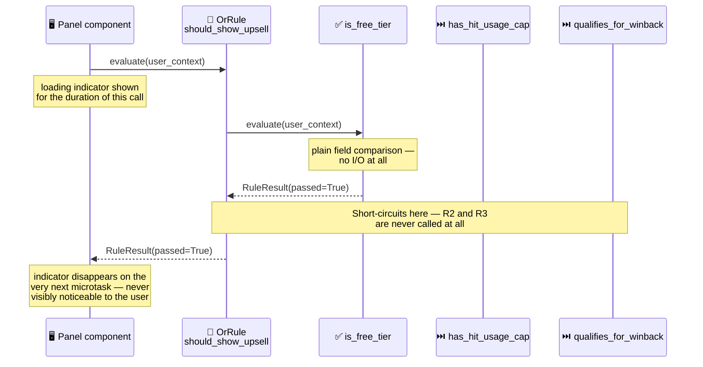

<!-- Title: Sample Spec — Premium Upsell Panel -->
# Sample spec: Premium Upsell Panel

> What this scenario is, and what any language's worked implementation
> of it must demonstrate — language-agnostic, read once here rather
> than restated per language.

**The question**: should we show the "Upgrade to Premium" panel to this
user right now, without a real-time billing check running on every
render?

**Why it's a good fit**: there are several independent, unrelated
signals that each justify showing the panel on their own — the user is
on the free tier, the user has hit their monthly usage cap, or a
real-time billing check says they qualify for a win-back offer — and
only one needs to be true. That's an OR combinator's exact shape, the
same one a backend fee-waiver decision uses, but here the expensive
check's cost is something the *user watching the screen* can actually
see: a loading indicator that should appear only when the slow check is
genuinely the one being waited on, never before.

## What the naive approach gets wrong

The obvious first implementation is a conditional ladder checked
straight in the render path, with the slow network call wherever it
happened to be added:

```text
function shouldShowUpsellPanel(user):
    if check_winback_offer(user.id):   # network call
        return true
    if user.planTier == "free":
        return true
    if user.usageThisMonth >= user.usageCap:
        return true
    return false
```

- **The panel's render always waits on the network call, even for
  users who never needed it.** A free-tier user qualifies from data
  already sitting in memory, but the ladder puts the expensive check
  first, so every single page load pays for a round trip an in-memory
  comparison could have answered instead.
- **There is no seam to show a loading state correctly.** The render
  path either blocks on the whole ladder before showing anything (the
  panel visibly stalls even for the common, cheap case), or shows a
  spinner unconditionally regardless of whether the slow branch will
  ever run — both are wrong, and neither is a decision anyone made on
  purpose.
- **Nothing records *why* the panel appeared for a given user.** A
  product manager asking "how many of this week's upsell impressions
  came from the win-back offer versus the free-tier segment" has no
  answer without re-deriving it from the same ladder by hand.

## The `verdict` way

An OR combinator stops at the first passing sub-rule — ordering the two
cheap, local checks before the one expensive, network-bound check means
the common case never pays for the round trip at all, and the ordering
is now a visible, deliberate line of code rather than an accident of
edit history. Because evaluation is sequential and the whole decision
is one `await`, the UI's own loading state can wrap that single call:
the wait is only ever noticeable to a user when the slow branch is
actually the one being evaluated, and stays effectively instant for
every user a cheap check already answered.



> **Reading the Sequence**:
>
> 1. **The panel's loading indicator wraps exactly one `await`** — the
>    whole `OrRule.evaluate()` call, never a second, separately-managed
>    flag the render code has to keep in sync with the check itself.
> 2. **`R1` passes on a plain in-memory comparison, and the combinator
>    stops immediately** — `R2` and `R3` (an in-memory counter check and
>    a real network call) are never evaluated at all for this user.
> 3. **The indicator's own visible duration *is* the proof of the
>    saving** — for any user a cheap check already answers, the awaited
>    call resolves in the same tick it started, so nothing renders long
>    enough to notice. Only a user who fails both cheap checks ever
>    experiences a visible wait, and only then does it reflect a call
>    that had to happen.

Each check is independently testable in isolation: proving the
network check gets skipped needs only the two cheap conditions and a
call-counting fake, never a real or mocked billing service — the same
seam a backend-only version of this shape already has, carried through
into a UI context where the *visible* consequence of skipping it is
now part of what's being proven, not just a number in a test assertion.

## What a solution must demonstrate

- The three checks are combined with OR-like (any-one-passes)
  semantics, with the network-bound check explicitly ordered last.
- The skip is **proven**, not just asserted — a call-counter or
  equivalent showing the expensive check genuinely did not run when an
  earlier check already passed.
- The UI's loading state wraps the single `evaluate()` call directly,
  rather than a second flag maintained by hand alongside it.
- The explanation names *why* evaluation order matters here specifically
  because the cost is now user-visible, not just measurable in a test.
- Each check is unit-testable in isolation, independent of any
  DOM/widget rendering.

## Related

- [`shipping-fee-waiver/`](../shipping-fee-waiver/README.md) — the same
  OR-with-expensive-last shape in a backend checkout decision, where the
  short-circuit saving is provable but not itself visible to a user.
- [`signup-form-readiness/`](../signup-form-readiness/README.md) — the
  AND mirror image in the same UI-capability pairing (every condition
  must hold, not just one), with no async branch.
