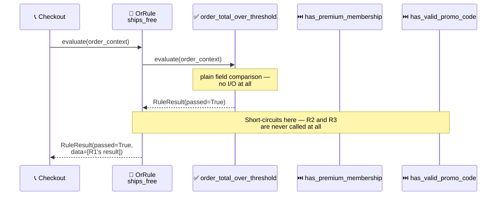

<!-- Title: Sample Spec — Shipping Fee Waiver -->
# Sample spec: Shipping Fee Waiver

> What this scenario is, and what any language's worked implementation
> of it must demonstrate — language-agnostic, read once here rather
> than restated per language. Each language's own file in this
> directory — [`python.md`](python.md) today — is the actual code, in that
> language's own idiom, built to satisfy this spec.

**The question**: does this order ship free?

**Why it's a good fit**: there are several independent, unrelated paths
to "yes" — a large-enough order, an active premium membership, or a
valid promo code — and only one needs to be true. That's an OR
combinator's exact shape, and the paths have very different costs to
check, which makes evaluation *order* a real design decision, not an
afterthought.

## What the naive approach gets wrong

The obvious first implementation is a conditional ladder, one `if` per
qualifying path:

```text
function ships_free(order):
    if validate_promo_code(order.promo_code):
        return true
    if order.is_premium_member:
        return true
    if order.total >= order.free_shipping_threshold:
        return true
    return false
```

Adding a fourth path means opening this function and inserting another
`if` among the ones already there — never a separate, isolated
addition. That is the actual defect, and it holds regardless of which
check happens to sit first:

- **Every new path is an edit to shipped code, not an addition next to
  it.** Inserting a branch risks the branches already there — a
  misplaced `return`, an off-by-one in the surrounding condition, or a
  reordering that changes which check runs first, all inside code that
  was already correct and already in production.
- **The person making that edit is rarely the person who wrote the
  function.** Whoever added the promo-code check first did so without
  weighing its cost against the other two — it is simply another `if`
  gate, no different in kind from the others. Cost-awareness, if it
  ever existed, was never recorded anywhere a later editor could find
  it, so the next person to touch this function inherits the ordering
  as-is and has no way to tell whether it was deliberate.
- **There's no way to list "every path that could waive this fee"**
  without reading the function's source top to bottom — useful for a
  support agent, an audit, or a settings page describing the current
  policy in plain language.

The concrete, present-day cost of that shape is that the promo-code
check — an external service call — happens to run first here, so it
runs on **every order**, including one that already qualifies on total
alone and never needed the network round trip at all.

## The `verdict` way

An OR combinator stops at the first passing sub-rule — ordering the
cheapest, most-likely-to-pass check first (a plain field comparison)
before the most expensive one (an external promo-code service call)
means the common case never pays for the expensive check at all, and
the ordering itself is now a visible, deliberate line of code rather
than an accident of edit history.

Each check is also independently testable: proving the promo-code call
gets skipped needs only the two cheap conditions and a call-counting
fake, never a real or mocked promo service. The naive ladder has no
such isolation — every test exercises the same nested function, whether
it's the threshold, the membership flag, or the promo call being
proven.



> **Reading the Sequence**:
>
> 1. **`R1` is checked first because it's free** — comparing a number
>    already on the order context costs nothing.
> 2. **`R1` passes, the combinator stops immediately** — `R2` (a
>    membership flag lookup) and `R3` (an external promo-code
>    validation call) are never evaluated at all for this order.
> 3. **The expensive path only runs when it has to** — an order that
>    fails `R1` moves on to `R2` (still cheap: an in-memory flag), and
>    only an order failing both pays for `R3`'s external call. This
>    ordering is a real part of the contract, not an implementation
>    detail — sequential, never-concurrent evaluation is what makes it
>    reliable rather than a best-effort optimization.

## What a solution must demonstrate

- The three checks are combined with OR-like (any-one-passes)
  semantics.
- The expensive/slow promo-code check is explicitly ordered last,
  after the two cheap checks, with the ordering stated as deliberate
  rather than left implicit.
- The skip is **proven**, not just asserted — a call-counter or
  equivalent showing the expensive check genuinely did not run when an
  earlier check already passed.
- The explanation names *why* evaluation order matters
  (short-circuiting, and that evaluation is sequential rather than
  concurrent), not just that the code happens to work.
- Each check is unit-testable in isolation — proving the promo-code
  call gets skipped needs only a call-counting fake, never a real or
  mocked promo service.
- The naive-way section names a concrete, present-day cost (the
  external call running on every order), not a hypothetical one a
  future edit might introduce.

## Related

- [`dynamic-discounts/`](../dynamic-discounts/README.md) — the AND mirror
  image of this same idea (every condition must pass, not just one).
