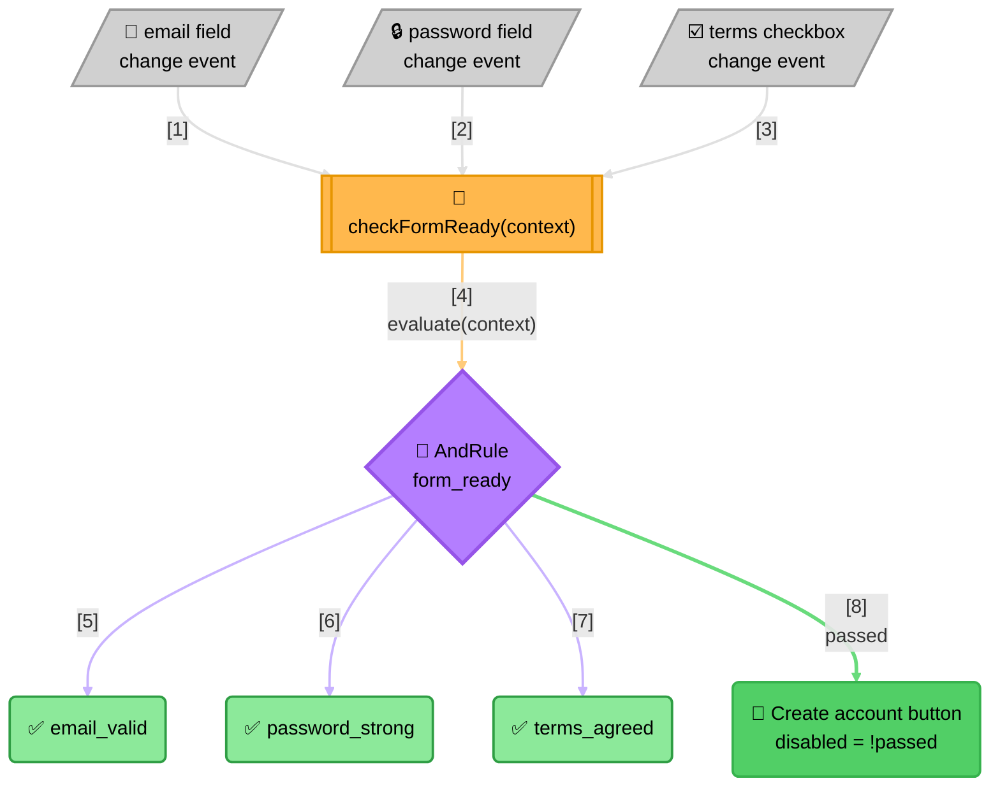

<!-- Title: Sample Spec — Signup Form Readiness -->
# Sample spec: Signup Form Readiness

> What this scenario is, and what any language's worked implementation
> of it must demonstrate — language-agnostic, read once here rather
> than restated per language.

**The question**: should the "Create account" button be enabled right
now?

**Why it's a good fit**: three independent, unrelated conditions must
all hold at once — a validly formatted email, a password meeting
strength requirements, and terms agreed — which is an AND combinator's
exact shape. What makes it different from a one-time validation is that
the answer has to be recomputed live, on every field the user touches,
and every field's own change handler needs to ask the *same* question
rather than each independently deciding what "ready" means.

## What the naive approach gets wrong

The obvious first implementation keeps one boolean per field and
recomputes the combined check inline, inside every field's own change
handler:

```text
function onEmailChange(form):
    form.emailValid = is_valid_email(form.email)
    form.submitButton.disabled = not (form.emailValid and form.passwordValid and form.termsAgreed)

function onPasswordChange(form):
    form.passwordValid = is_strong_password(form.password)
    form.submitButton.disabled = not (form.emailValid and form.passwordValid and form.termsAgreed)

function onTermsChange(form):
    form.termsAgreed = form.termsCheckbox.checked
    form.submitButton.disabled = not (form.emailValid and form.passwordValid and form.termsAgreed)
```

This tracks the form for exactly as long as nobody has to touch it
again:

- **The combined condition is copy-pasted into every handler.** Three
  fields means three separately-written copies of the same `and`
  expression, each one a place the next edit can diverge from the
  other two.
- **Adding a fourth field means editing all three existing handlers,
  not just adding a fourth.** Miss updating one of the three copies and
  the button silently enables when it shouldn't — that handler's own
  stale expression never learned the new field exists, and nothing
  fails loudly to say so.
- **There's no way to ask "is the form ready?" without a rendered
  form.** The decision only exists as a side effect of a DOM change
  event — proving it correct means simulating input events against real
  elements and reading `.disabled` back off the button, never asking
  the question directly.

## The `verdict` way

One `AndRule` ("form_ready"), built once, is the single source of truth
every field's change handler calls into — never re-derived per handler.
Each handler updates only its own field's value, then calls the same
evaluation function with the form's current values and sets the
button's disabled state from its one `passed` result.



> **Reading the Diagram**:
>
> 1. **Every field's own change event reaches the same handler function**
>    — there is only one place in the code that turns "something
>    changed" into "is the form ready," not three.
> 2. **The handler asks the rule, it never answers the question
>    itself** — no `&&` expression lives in the handler; it builds a
>    context from the form's current values and hands the whole
>    question to `AndRule`.
> 3. **The button reads exactly one field, `passed`** — nothing about
>    the button's own code knows what a valid email or a strong
>    password looks like.

Because the decision is a plain function of a context object, it's
testable without a DOM at all: constructing `{ email: "...", password:
"...", termsAgreed: true }` by hand and evaluating the rule directly
proves the logic correct, with no simulated `input` event, no rendered
button, and no `.disabled` attribute to read back. The naive shape has
no equivalent seam — proving "is the form ready" always means
exercising real DOM nodes.

## What a solution must demonstrate

- Each of the three conditions (email validity, password strength,
  terms agreed) is its own independently-named rule.
- One shared evaluation function is the only place the combined
  question is answered — no field's own change handler re-derives or
  duplicates the combined check itself.
- Adding a fourth condition is adding one more rule to the list passed
  to `AndRule`, never an edit repeated across every existing handler.
- The decision is unit-tested with a plain context object, independent
  of any DOM/widget rendering.
- The UI-facing code (reading field values, wiring change listeners,
  toggling the button's disabled state) is kept as a separate concern
  from the rule-evaluation code, not interleaved inside it.

## Related

- [`dynamic-discounts/`](../dynamic-discounts/README.md) — the same
  AND-of-independent-conditions shape, in a backend eligibility check
  rather than a live UI control.
- [`premium-upsell-panel/`](../premium-upsell-panel/README.md) — the OR
  mirror image in the same UI-capability pairing (any one qualifying
  signal, not all), including a genuinely async branch.
