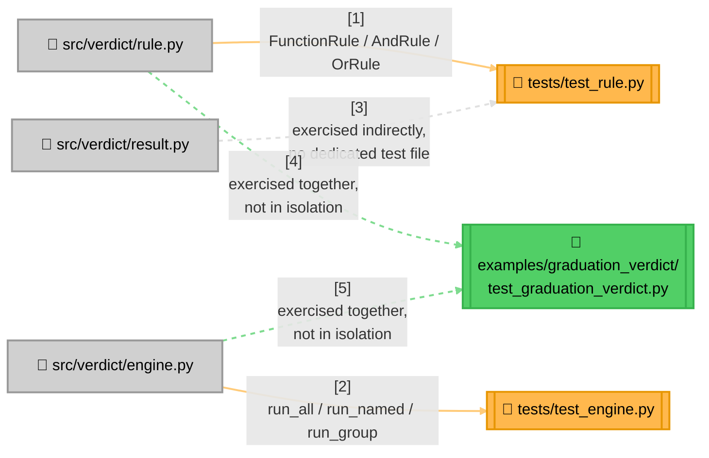

<!-- Title: Verdict Testing Guide -->
# Verdict — Testing Guide

> The canonical reference for how this package is tested, and what a
> change must add to its own test suite before it's done. If you're
> looking for *what to change where* for a given kind of change, see
> [`maintenance.md`](maintenance.md) — this doc is specifically about
> proving that change correct. The contracts and checklist below apply
> to every language this package ever ships for; only Python ships
> today, so every command and path below is Python's (`python/`).

## Current state, as of this writing

```bash
$ cd python/
$ uv run pytest --cov=verdict --cov-report=term-missing -q
........................                                             [100%]
24 passed in 0.04s

Name                      Stmts   Miss  Cover
-------------------------------------------------------
src/verdict/__init__.py       4      0   100%
src/verdict/engine.py        24      0   100%
src/verdict/result.py        12      0   100%
src/verdict/rule.py          41      0   100%
-------------------------------------------------------
TOTAL                        81      0   100%
```

24 tests, 100% line coverage, sub-tenth-of-a-second runtime. Line
coverage alone doesn't prove the short-circuit/vacuous-truth contracts
below are actually enforced (a test can execute every line and still
assert the wrong thing) — see "What actually needs proving" for what
the number above doesn't tell you.

**No CI pipeline runs this suite today.** This suite is run manually,
by whoever is making a change, before it's merged — not automatically
gated anywhere. That's a real gap, not a deliberate design choice; see
[`future_plan.md`](future_plan.md) if it's ever picked up.

**A second, complementary layer exists**: `examples/graduation_verdict/`
adds 523 more tests (547 total with the numbers above — 23 curated
scenarios plus a 500-case chaos suite checked against an independent
oracle), auto-discovered by the same bare `uv run pytest` with no
configuration — but they're not more of the same coverage. The core
suite above proves narrow, unit-level contracts in isolation; that
example project proves the primitives compose correctly *together*, the
way a real consumer actually uses them, across a far wider space of
inputs than anyone would hand-curate, and its own
[`testing.md`](../python/examples/graduation_verdict/docs/testing.md)
explains why that makes it a regression net for `verdict` itself, not
just a sample.

## Test layout



> **Why `result.py` has no dedicated test file**: `RuleResult`/`RunResult`
> are plain `@dataclass(frozen=True)` containers with no methods and no
> invariants beyond what the type system already enforces — there's
> nothing to prove about them that isn't already proven by every test in
> `test_rule.py`/`test_engine.py` constructing and reading one. Add a
> dedicated `test_result.py` only if a future change gives either
> dataclass real behavior (a computed property, a validator) worth
> testing in isolation.

## What actually needs proving, not just executed

Line coverage is necessary but not sufficient here — `verdict`'s whole
value proposition is a handful of contracts that are easy to satisfy by
accident while getting subtly wrong, and a test that only checks the
final `passed` boolean can pass while missing exactly the thing that
matters:

- **Short-circuiting is a behavioral contract, not an optimization.**
  `AndRule`/`OrRule` must not just *return* the right answer, they must
  *never evaluate* the rule that comes after the deciding one. Prove
  this with a call-counter or a mutable list a later rule's predicate
  would append to — `tests/test_rule.py`'s
  `test_short_circuits_after_first_failure`/
  `test_short_circuits_after_first_pass` are the canonical pattern:
  assert the tracking list is still empty, not just that `passed`
  came out right. A bug that evaluates every sub-rule but still
  computes the correct `passed` value would pass a weaker,
  boolean-only test and silently defeat the entire reason these two
  classes exist (see
  [`architecture.md`](architecture.md#execution-model-sequential-not-concurrent)).
- **Vacuous truth has a polarity, and it's easy to get backwards.**
  `AndRule([])` passes, `OrRule([])` fails. Both have a dedicated test
  today (`test_empty_rule_list_vacuously_passes`,
  `test_empty_rule_list_vacuously_fails`) precisely because "empty means
  pass" and "empty means fail" are both defensible in isolation and only
  one is correct per class — a new composite or run mode needs the same
  explicit test, not an assumption.
- **Absence is not emptiness, and gets the opposite treatment.** An
  unknown rule name or group label is a *lookup that matched nothing*,
  not an empty set: a group exists only because some rule declared it,
  so nothing matching can only be a typo or a stale name.
  `run_named`/`run_group` raise (`test_unknown_group_raises`,
  `test_unknown_group_throws`), while `try_run_named`/`try_run_group`
  return `None` for the same lookup (`TestTryLookups`). **Both halves
  need testing**: an unknown lookup returning a *pass* is the failure
  this distinction prevents, and a `try_` form that raised would defeat
  its only purpose. So does the distinction between `None` and
  `passed=False` — collapsing them makes a typo indistinguishable from
  a legitimate rejection.
- **A fallback must be proven not to fire when it shouldn't.** Testing
  `try_run_group` only against an *absent* group looks complete and
  isn't: the dangerous direction is a *present* group wrongly returning
  `None`, because a caller writing `or True` would then approve
  something that actually failed. Test the whole matrix —

  | group state | `or True` | `or False` | strict |
  | :-- | :-- | :-- | :-- |
  | present, passing | `True` | `True` | `passed=True` |
  | **present, failing** | **`False`** | **`False`** | `passed=False` |
  | absent | `True` | `False` | raises |

  — because the middle row is the one that matters and the one a
  single-case test omits. `test_fallback_matrix` covers it. The general
  lesson generalises past this API: an assertion written against only
  the branch you're thinking about often reduces to a tautology, and a
  green test proves nothing until you've watched it fail for the right
  reason.
- **`run_all`/`run_group` never short-circuit — prove the opposite of
  the point above.** `test_does_not_short_circuit_unlike_and_rule`
  asserts every rule's name shows up in `results`, even after an
  earlier one already failed. This is the direct mirror-image
  regression guard: a future refactor that accidentally makes the
  engine's own run methods stop early would be just as wrong as
  `AndRule` failing to stop early is.
- **`RunResult`/`RuleResult.data` never flattens a composite's own
  sub-results.** `test_data_carries_sub_results_up_to_failure` proves
  `AndRule.data` holds exactly the sub-results that actually ran (not
  padded to the full list, not flattened into the caller's own
  `RunResult.results`) — the invariant
  [`architecture.md`](architecture.md#type-structure) documents as
  "one entry per *top-level* rule, regardless of internal composition
  depth."
- **Construction-time behavior that mirrors a plain dict.**
  `test_duplicate_names_last_one_wins_in_by_name_lookup` exists because
  `RulesEngine.__init__` builds `_by_name` the same way a dict literal
  with a repeated key would — last one wins, silently. Worth a named
  test specifically so a future change to that behavior (e.g. raising
  on a duplicate name instead) is a deliberate, visible decision, not
  an accidental regression nobody notices.
- **A predicate's own exception is never caught, anywhere.** Easy to
  break with good intentions — a well-meaning `try`/`except` added to
  make the engine "more robust" would silently turn a real bug into a
  wrong, quiet `RunResult` instead of a stack trace. Every entry point
  has its own dedicated test:
  `test_run_all_does_not_catch_a_predicate_s_exception` and
  `test_run_group_does_not_catch_a_predicate_s_exception` in
  `test_engine.py`, `test_and_rule_does_not_catch_a_sub_rule_s_exception`
  and `test_or_rule_does_not_catch_a_sub_rule_s_exception` in
  `test_rule.py`. Confirmed to actually bite: wrapping `run_all`'s loop
  in a `try`/`except Exception: pass` makes the first of these fail with
  "DID NOT RAISE," not a pass that happens to look right.

## Checklist for a new contribution

| You added... | Your test must also prove |
|---|---|
| A new concrete `Rule` shape (composite or otherwise) | Plain delegation to whatever it wraps, **plus**, if it's a composite: short-circuit behavior in both directions it can short-circuit on (if any), and its vacuous-input behavior (empty list, or whatever "nothing configured" means for this shape) |
| A new `RulesEngine` run mode | That it evaluates the right subset, its own vacuous case (nothing matches the selector), and whether it short-circuits or not — state which, explicitly, the way `test_does_not_short_circuit_unlike_and_rule` does for `run_all` |
| A change to `RuleResult`/`RunResult`'s shape | Every existing test in both files still passes unmodified (a required-field addition breaks every construction site — see [`maintenance.md`](maintenance.md#consumer-impact-checklist-for-a-shape-change)) plus a new assertion covering whatever the new field is for |
| A change to `Rule`'s required attributes/signature | Re-run every real consumer's own test suite, not just this package's — see the consumer-impact checklist linked above |

New tests live in whichever of `tests/test_rule.py`/`tests/test_engine.py`
matches where the new code lives (per
[`maintenance.md`](maintenance.md#where-to-make-a-change)), or a new
file named the same way if the new code lives in a new module.

## Running tests

```bash
cd python/            # this package's own root
uv sync              # once, or after pyproject.toml changes
uv run pytest        # the whole suite
uv run pytest --cov=verdict --cov-report=term-missing   # with the coverage report above
```

No external project context or environment variables are needed — this
package's test suite is as standalone as the package itself.

## Related docs

- [`maintenance.md`](maintenance.md) — where a given kind of change
  actually lives, and the consumer-impact checklist a shape change
  needs before merging.
- [`architecture.md`](architecture.md) — the execution-model reasoning
  the short-circuit tests above are proving.
- [`extension.md`](extension.md) — testing guidance for code you write
  *using* verdict lives with your own project's conventions, not here;
  this doc is specifically about testing verdict itself.
- [`../python/examples/graduation_verdict/docs/testing.md`](../python/examples/graduation_verdict/docs/testing.md) —
  the second testing layer described above, and why it plays a
  regression-net role this doc's own suite doesn't.
