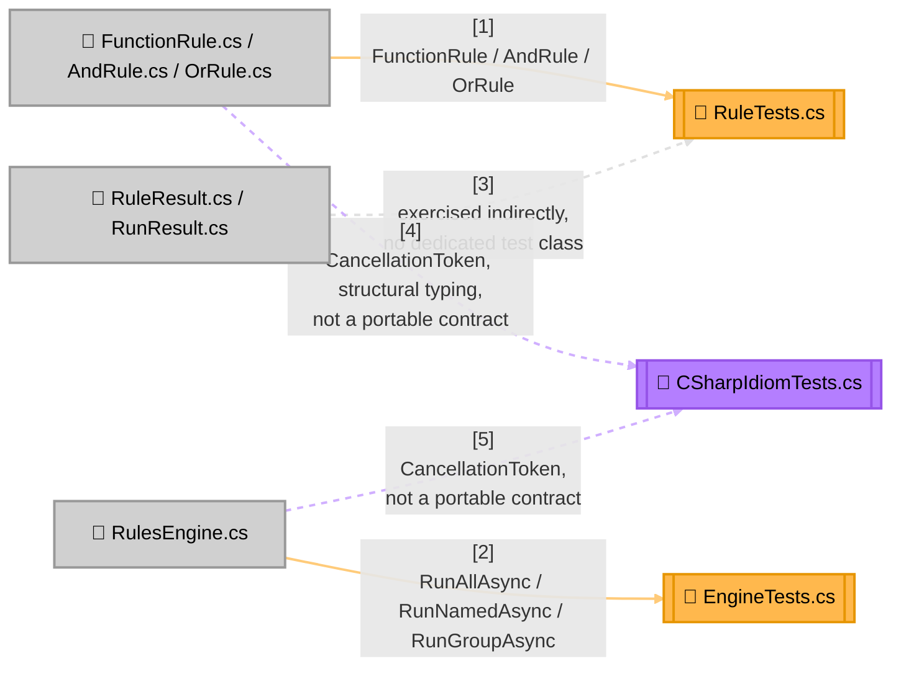

<!-- Title: Verdict Testing Guide (C#) -->
# Testing verdict: C# SDK

> The contracts and checklist are language-agnostic and live in
> [`README.md`](README.md) — read that first. This page is C#'s
> concrete realization: current state, file layout, and which test
> proves which contract.

## Current state, as of this writing

```text
$ cd csharp/
$ dotnet test tests/VerdictRules.Tests/VerdictRules.Tests.csproj
Passed!  - Failed: 0, Passed: 48, Skipped: 0, Total: 48, Duration: 7 ms
```

Three files, not one. `RuleTests.cs` and `EngineTests.cs` are a strict,
1:1 port of Python's own `test_rule.py`/`test_engine.py` — same test
classes, same tests, same assertions, in C# idiom — and are the two files
to check when auditing this package against Python's own suite.
`CSharpIdiomTests.cs` holds exactly the coverage with no Python
counterpart on purpose (`CancellationToken` propagation, structural typing
for delegates only, an explicit `IRule` implementation) and is deliberately
not part of that mirror.

This SDK also has the second testing layer — a full, tested example
project checked against the shared graduation fixture (see
[`../../fixtures/graduation_verdict/README.md`](../../fixtures/graduation_verdict/README.md)),
at [`../../csharp/examples/GraduationVerdict/`](../../csharp/examples/GraduationVerdict/README.md).
That satisfies Stage 4 ("Prove") of
[`../maintenance/adding-a-language.md`](../maintenance/adding-a-language.md),
including an oracle/differential suite in this language's own idiom
(500 generated cases, checked against an independent, verdict-rules-free
re-implementation — see that project's own
[`docs/testing.md`](../../csharp/examples/GraduationVerdict/docs/testing.md)).

## Test layout



## Which test proves which contract

| Contract ([`README.md`](README.md)) | Proven by |
| --- | --- |
| Short-circuiting, both directions | `AndRuleTests.ShortCircuitsAfterFirstFailure`, `OrRuleTests.ShortCircuitsAfterFirstPass` (`RuleTests.cs`) |
| Vacuous-truth polarity, both directions | `AndRuleTests.EmptyRuleListVacuouslyPasses`, `OrRuleTests.EmptyRuleListVacuouslyFails` (`RuleTests.cs`) |
| Absence throws (strict lookup) | `RunNamedTests.UnknownNameRaisesKeyNotFound`, `RunGroupTests.UnknownGroupRaises` (`EngineTests.cs`) |
| Absence returns `null` (try-prefixed lookup) | `TryLookupTests` (`EngineTests.cs`) |
| Fallback matrix — the present-failing row specifically | `TryLookupTests.FallbackMatrix` (`[Theory]`, one case per present/absent × pass/fail combination) |
| `RunAllAsync`/`RunGroupAsync` never short-circuit | `RunAllTests.DoesNotShortCircuitUnlikeAndRule` (`EngineTests.cs`) |
| No flattening of a composite's own sub-results | `AndRuleTests.DataCarriesSubResultsUpToFailure` (`RuleTests.cs`) |
| Duplicate name, last one wins | `ConstructionTests.DuplicateNamesLastOneWinsInByNameLookup` (`EngineTests.cs`) |
| A predicate's exception is never caught | `EngineExceptionPropagationTests.RunAllDoesNotCatchAPredicatesException`, `RunGroupDoesNotCatchAPredicatesException` (`EngineTests.cs`); `RuleExceptionPropagationTests.AndRuleDoesNotCatchASubRulesException`, `OrRuleDoesNotCatchASubRulesException` (`RuleTests.cs`) |

Not part of this table on purpose — `CSharpIdiomTests.cs` proves
`CancellationToken` propagation (checked between sub-rules, not just once
at entry), C#'s structural typing for delegates only, and an explicit
`IRule` implementation composing like any other. None of these are
universal contracts; none get ported to another language's own suite.

## Running tests

```bash
cd csharp
dotnet build src/VerdictRules/VerdictRules.csproj -warnaserror
dotnet test tests/VerdictRules.Tests/VerdictRules.Tests.csproj
```

There is no solution file, so a bare `dotnet build`/`dotnet test` from
`csharp/` fails with "Specify a project or solution file" — always name
the project explicitly. No external project context or environment
variables are needed — this package's test suite is as standalone as
the package itself.

## Related

- [`README.md`](README.md) — the language-agnostic contracts this page
  proves concretely.
