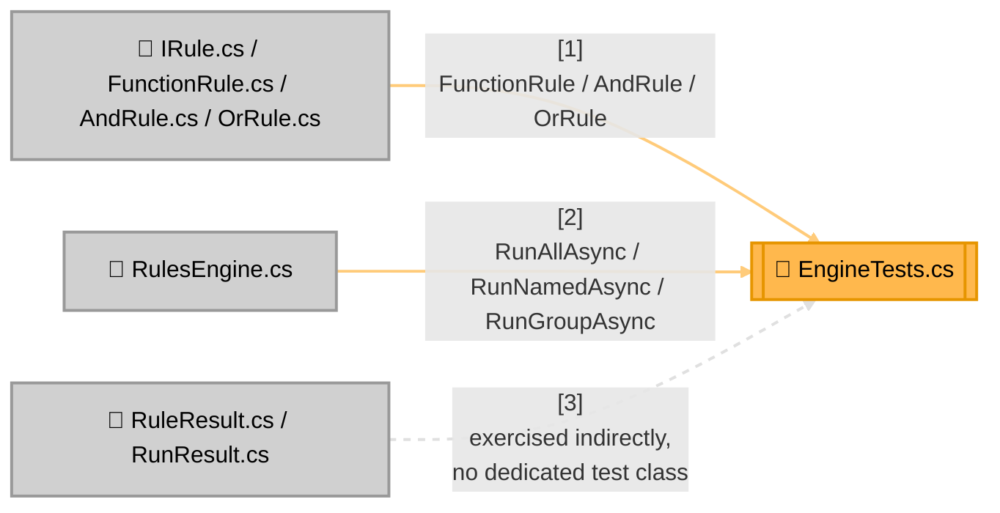

<!-- Title: Verdict Testing Guide (C#) -->
# Testing verdict: C# SDK

> The contracts and checklist are language-agnostic and live in
> [`README.md`](README.md) — read that first. This page is C#'s
> concrete realization: current state, file layout, and which test
> proves which contract.

## Current state, as of this writing

```text
$ cd csharp/
$ dotnet test tests/VerdictRules.Tests/VerdictRules.Tests.csproj
Passed!  - Failed: 0, Passed: 26, Skipped: 0, Total: 26, Duration: 14 ms
```

26 tests, one file (`EngineTests.cs`, despite the name — it covers
`FunctionRule`, `AndRule`, `OrRule`, and `RulesEngine` together, one
`[Fact]`/`[Theory]`-decorated class per type), sub-millisecond-per-test
runtime.

**Not yet covered**: a duplicate-rule-name registration (which name
wins the by-name lookup) and a predicate's own thrown exception
propagating uncaught through `RunAllAsync`/`RunGroupAsync`/`AndRule`/
`OrRule` — both real contracts, both covered in JS's and (once ported)
Dart's own suites. Worth porting before this package leaves `0.0.x`.

## Test layout



## Which test proves which contract

| Contract ([`README.md`](README.md)) | Proven by |
| --- | --- |
| Short-circuiting, both directions | `AndRuleTests.ShortCircuitsSoLaterSubRulesNeverRun`, `OrRuleTests.ShortCircuitsOnTheFirstPass` |
| Vacuous-truth polarity, both directions | `AndRuleTests.EmptyPassesVacuously`, `OrRuleTests.EmptyFailsVacuouslyTheOppositePolarityToAndRule` |
| Absence throws (strict lookup) | `EmptinessIsNotAbsenceTests.UnknownRuleNameThrows`, `UnknownGroupThrowsRatherThanPassingVacuously` |
| Absence returns `null` (try-prefixed lookup) | `TryLookupTests.ReturnsNullWhenAbsent`, `NullMeansAbsentNeverFailed` |
| Fallback matrix — the present-failing row specifically | `TryLookupTests.FallbackMatrix` (`[Theory]`, one row per present/absent × pass/fail combination) |
| `RunAllAsync`/`RunGroupAsync` never short-circuit | `RunModeTests.RunAllNeverShortCircuits` |
| No flattening of a composite's own sub-results | `AndRuleTests.DataHoldsOnlyWhatRanNeverPaddedNeverFlattened` |
| A custom `IRule` implementation composes like any other | `CustomRuleTests.AnExplicitImplementationComposesLikeAnyOther` |
| Introspection (`RuleNames`/`GroupNames`) | `IntrospectionTests.ReportsExactlyWhatTheLookupsAccept`, `AnEmptyEngineReportsNothing` |
| Empty composites still fold to their identity, even with an empty group | `EmptinessIsNotAbsenceTests.ButEmptyCompositesStillFoldToTheirIdentity` |

## Running tests

```bash
cd csharp
dotnet build src/VerdictRules/VerdictRules.csproj -warnaserror
dotnet test tests/VerdictRules.Tests/VerdictRules.Tests.csproj
```

There is no solution file, so a bare `dotnet build`/`dotnet test` from
`csharp/` fails with "Specify a project or solution file" — always name
the project explicitly. No external project context or environment
variables are needed — this package's test suite is as standalone as
the package itself.

## Related

- [`README.md`](README.md) — the language-agnostic contracts this page
  proves concretely.
