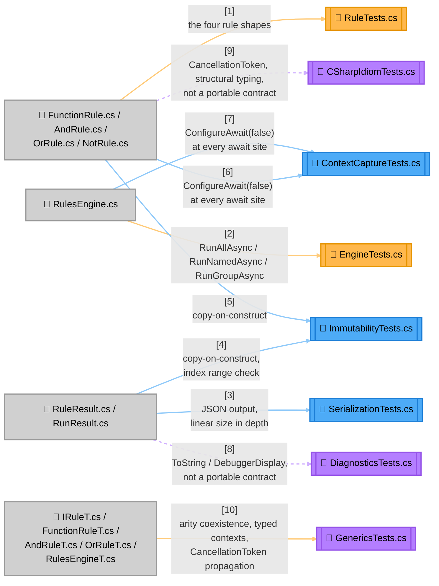

<!-- Title: Verdict Testing Guide (C#) -->
# Testing verdict: C# SDK

> The contracts and checklist are language-agnostic and live in
> [`README.md`](README.md) — read that first. This page is C#'s concrete
> realization: the file layout, and which test proves which contract.

## The suite

```bash
cd csharp
dotnet build src/VerdictRules/VerdictRules.csproj -warnaserror
dotnet test tests/VerdictRules.Tests/VerdictRules.Tests.csproj
```

183 tests, around 30 ms. There is no solution file, so a bare
`dotnet build`/`dotnet test` from `csharp/` fails with "Specify a project or
solution file" — always name the project. No external context or environment
variables are needed; this suite is as standalone as the package.

The stronger measure than any count is the survivor list in
[`../maintenance/mutation-survivors-csharp.md`](../maintenance/mutation-survivors-csharp.md):
174/176 mutants killed, both survivors accounted for.

| File | Tests | Proves |
| :-- | --: | :-- |
| `CompositeRuleTests.cs` | 9 | `ICompositeRule<TContext>`, `SubRules`, and that one walk reaches a consumer-defined composite |
| `RuleTests.cs` | 39 | `FunctionRule`/`AndRule`/`OrRule`/`NotRule` — part of the portable contract suite |
| `DiagnosticsTests.cs` | 33 | `ToString` and `DebuggerDisplay` on every public type |
| `EngineTests.cs` | 25 | `RunAllAsync`/`RunNamedAsync`/`RunGroupAsync` and the try-prefixed forms — part of the portable contract suite |
| `CSharpIdiomTests.cs` | 23 | `CancellationToken` propagation, structural typing for delegates, an explicit `IRule` implementation |
| `GenericsTests.cs` | 21 | `IRule<TContext>`'s arity coexistence and typed contexts end to end |
| `ImmutabilityTests.cs` | 13 | Copy-on-construct, and the index range check on `DecidedByIndices` |
| `ContextCaptureTests.cs` | 8 | That no `await` resumes on the caller's synchronization context |
| `SerializationTests.cs` | 7 | `System.Text.Json` output, and that size stays linear in depth |

**`RuleTests.cs` and `EngineTests.cs` are the portable contract suite** — the
two files to check when auditing this package against Python's own
`test_rule.py`/`test_engine.py`. The rest are deliberately outside that
mirror: each covers something true only of C#, or surface each language
realizes differently.

`GenericsTests.cs` reads correctly only with the direction of the
relationship in mind: the generic form is the implementation and the
non-generic one is a closed specialization of it by composition, so a test on
each arity pins that the delegation is in place rather than checking two
independent implementations agree.

[`../../.github/workflows/test-csharp.yml`](../../.github/workflows/test-csharp.yml)
runs the suite on every pull request. The gate job is the one to mark
required in branch protection.

**The second, complementary layer**:
[`../../csharp/examples/GraduationVerdict/`](../../csharp/examples/GraduationVerdict/README.md)
adds 1,744 tests and
[`MarketplaceEligibility`](../../csharp/examples/MarketplaceEligibility/README.md)
another 32 — curated scenarios plus a generated suite checked against an
independent, `VerdictRules`-free re-implementation of the same policy. See
that project's own
[`docs/testing.md`](../../csharp/examples/GraduationVerdict/docs/testing.md).
That differential suite is what actually guards the derived result views at
scale, and this page's own
[`../maintenance/mutation-survivors-dart.md`](../maintenance/mutation-survivors-dart.md)
sibling explains why that matters more in some languages than others.

## Test layout


```mermaid
graph LR
    RuleSrc["📄 FunctionRule.cs / AndRule.cs /<br/>OrRule.cs / NotRule.cs"]
    EngineSrc["📄 RulesEngine.cs"]
    ResultSrc["📄 RuleResult.cs / RunResult.cs"]
    GenericSrc["📄 IRuleT.cs / FunctionRuleT.cs /<br/>AndRuleT.cs / OrRuleT.cs /<br/>RulesEngineT.cs"]
    RuleTest[["🧪 RuleTests.cs"]]
    EngineTest[["🧪 EngineTests.cs"]]
    ResultTest[["🧪 SerializationTests.cs"]]
    ImmutTest[["🧪 ImmutabilityTests.cs"]]
    ContextTest[["🧪 ContextCaptureTests.cs"]]
    DiagTest[["🧪 DiagnosticsTests.cs"]]
    IdiomTest[["🧪 CSharpIdiomTests.cs"]]
    GenericsTest[["🧪 GenericsTests.cs"]]

    %% Link 0: RuleSrc -> RuleTest
    RuleSrc -->|"[1]<br/>the four rule shapes"| RuleTest
    %% Link 1: EngineSrc -> EngineTest
    EngineSrc -->|"[2]<br/>RunAllAsync / RunNamedAsync / RunGroupAsync"| EngineTest
    %% Link 2: ResultSrc -> ResultTest
    ResultSrc -->|"[3]<br/>JSON output,<br/>linear size in depth"| ResultTest
    %% Link 3: ResultSrc -> ImmutTest
    ResultSrc -->|"[4]<br/>copy-on-construct,<br/>index range check"| ImmutTest
    %% Link 4: RuleSrc -> ImmutTest
    RuleSrc -->|"[5]<br/>copy-on-construct"| ImmutTest
    %% Link 5: RuleSrc -> ContextTest
    RuleSrc -->|"[6]<br/>ConfigureAwait(false)<br/>at every await site"| ContextTest
    %% Link 6: EngineSrc -> ContextTest
    EngineSrc -->|"[7]<br/>ConfigureAwait(false)<br/>at every await site"| ContextTest
    %% Link 7: ResultSrc -> DiagTest
    ResultSrc -.->|"[8]<br/>ToString / DebuggerDisplay,<br/>not a portable contract"| DiagTest
    %% Link 8: RuleSrc -> IdiomTest
    RuleSrc -.->|"[9]<br/>CancellationToken, structural typing,<br/>not a portable contract"| IdiomTest
    %% Link 9: GenericSrc -> GenericsTest
    GenericSrc -->|"[10]<br/>arity coexistence, typed contexts,<br/>CancellationToken propagation"| GenericsTest

    style RuleSrc fill:#D0D0D0,stroke:#999999,stroke-width:2px,color:#000
    style EngineSrc fill:#D0D0D0,stroke:#999999,stroke-width:2px,color:#000
    style ResultSrc fill:#D0D0D0,stroke:#999999,stroke-width:2px,color:#000
    style GenericSrc fill:#D0D0D0,stroke:#999999,stroke-width:2px,color:#000
    style RuleTest fill:#FFB84D,stroke:#E69500,stroke-width:2px,color:#000
    style EngineTest fill:#FFB84D,stroke:#E69500,stroke-width:2px,color:#000
    style ResultTest fill:#4DABF7,stroke:#1C7ED6,stroke-width:2px,color:#000
    style ImmutTest fill:#4DABF7,stroke:#1C7ED6,stroke-width:2px,color:#000
    style ContextTest fill:#4DABF7,stroke:#1C7ED6,stroke-width:2px,color:#000
    style DiagTest fill:#B47EFF,stroke:#9654E8,stroke-width:2px,color:#000
    style IdiomTest fill:#B47EFF,stroke:#9654E8,stroke-width:2px,color:#000
    style GenericsTest fill:#B47EFF,stroke:#9654E8,stroke-width:2px,color:#000

    %% Link Index:
    %% 0: the four rule types are covered directly, one test class each
    %% 1: the engine's run modes are covered directly
    %% 2: the result types can leave the process, and the stored graph is a tree rather than a DAG
    %% 3-4: every constructor taking a collection, proven to copy rather than alias it
    %% 5-6: no await resumes on the caller's context -- invisible to every assertion on a result, so it needs its own harness
    %% 7: ToString/DebuggerDisplay are per-language presentation, not a portable contract
    %% 8: CancellationToken propagation and structural typing for delegates only are C#-specific, outside the Python-parity mirror
    %% 9: the generic siblings hold the implementation; each arity is tested directly so the non-generic specialization's delegation is pinned, not assumed
    linkStyle 0 stroke:#FFCB7A,stroke-width:2px
    linkStyle 1 stroke:#FFCB7A,stroke-width:2px
    linkStyle 2 stroke:#8FC9F9,stroke-width:2px
    linkStyle 3 stroke:#8FC9F9,stroke-width:2px
    linkStyle 4 stroke:#8FC9F9,stroke-width:2px
    linkStyle 5 stroke:#8FC9F9,stroke-width:2px
    linkStyle 6 stroke:#8FC9F9,stroke-width:2px
    linkStyle 7 stroke:#D0AFFF,stroke-width:2px,stroke-dasharray:5 5
    linkStyle 8 stroke:#D0AFFF,stroke-width:2px,stroke-dasharray:5 5
    linkStyle 9 stroke:#FFCB7A,stroke-width:2px
```

## Which test proves which contract

| Contract ([`README.md`](README.md)) | Proven by |
| --- | --- |
| Short-circuiting, both directions | `AndRuleTests.ShortCircuitsAfterFirstFailure`, `OrRuleTests.ShortCircuitsAfterFirstPass` (`RuleTests.cs`) |
| Vacuous-truth polarity, both directions | `AndRuleTests.EmptyRuleListVacuouslyPasses`, `OrRuleTests.EmptyRuleListVacuouslyFails` (`RuleTests.cs`) |
| Absence throws (strict lookup) | `RunNamedTests.UnknownNameRaisesKeyNotFound`, `RunGroupTests.UnknownGroupRaises` (`EngineTests.cs`) |
| Absence returns `null` (try-prefixed lookup) | `TryLookupTests` (`EngineTests.cs`) |
| Fallback matrix — the present-failing row specifically | `TryLookupTests.FallbackMatrix` (`[Theory]`, one case per present/absent × pass/fail combination) |
| `RunAllAsync`/`RunGroupAsync` never short-circuit | `RunAllTests.DoesNotShortCircuitUnlikeAndRule` (`EngineTests.cs`) |
| No flattening of a composite's own sub-results | `AndRuleTests.SubResultsCarriesSubResultsUpToFailure`, `NotRuleTests.SubResultsTruthfullyCarriesTheOneInnerResult` (`RuleTests.cs`) |
| Duplicate name, last one wins | `ConstructionTests.DuplicateNamesLastOneWinsInByNameLookup` (`EngineTests.cs`) |
| A predicate's exception is never caught | `EngineExceptionPropagationTests.RunAllDoesNotCatchAPredicatesException`, `RunGroupDoesNotCatchAPredicatesException` (`EngineTests.cs`); `RuleExceptionPropagationTests.AndRuleDoesNotCatchASubRulesException`, `OrRuleDoesNotCatchASubRulesException` (`RuleTests.cs`) |
| `GetFailingLeaves()` is an independent recursion | `MixedCompositeTreeTests` (`RuleTests.cs`) |
| `GetDecidedBy()` is one level, non-recursive | `ImmutabilityTests.DecidedByCannotDisagreeWithSubResults`; the nested cases in `MixedCompositeTreeTests` |
| Copy-on-construct, every collection parameter | `ImmutabilityTests.cs` |
| A result serializes, and size is linear in depth | `SerializationTests.cs` |
| No `await` resumes on the caller's context | `ContextCaptureTests.cs` |

Confirmed to actually bite, not just present: flipping a single
`ConfigureAwait(false)` to `true` fails seven of the eight
`ContextCaptureTests`, and inverting `ShortCircuitEvaluator`'s
`vacuousResult` fails four tests across `RuleTests.cs` and `EngineTests.cs`.

Deliberately outside the contract table: `CSharpIdiomTests.cs` proves
`CancellationToken` propagation (checked once before any rule runs *and*
again between sub-rules, so an already-cancelled token evaluates nothing
while a token cancelled mid-run still stops at the next boundary —
`CancellationContractTests` and
`AndRuleIdiomTests.CancellationStopsBeforeTheNextSubRuleEvenMidRun`
respectively), structural typing for delegates only, and an explicit `IRule`
implementation composing like any other. None of these are universal
contracts, and none get ported to another language's suite.

## Related

- [`README.md`](README.md) — the language-agnostic contracts this page proves
  concretely.
- [`../maintenance/mutation-survivors-csharp.md`](../maintenance/mutation-survivors-csharp.md) —
  what the suite provably catches, beyond what it executes.
- [`../../csharp/examples/GraduationVerdict/docs/testing.md`](../../csharp/examples/GraduationVerdict/docs/testing.md) —
  the second testing layer's own doc.
