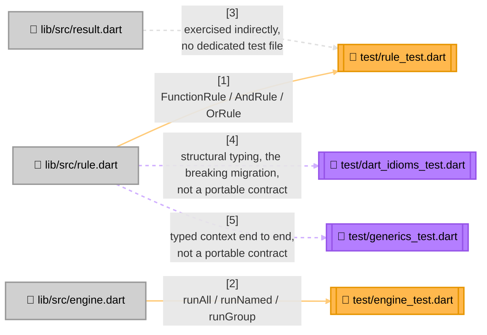

<!-- Title: Verdict Testing Guide (Dart) -->
# Testing verdict: Dart

> The contracts and checklist are language-agnostic and live in
> [`README.md`](README.md) — read that first. This page is Dart's
> concrete realization: current state, file layout, and which test
> proves which contract.

## Current state, as of this writing

```bash
$ cd dart/packages/verdict_rules
$ dart test
00:00 +54: All tests passed!
```

Four files, not one. `rule_test.dart` and `engine_test.dart` are a
strict, 1:1 port of Python's own `test_rule.py`/`test_engine.py` — same
`group` groupings, same tests, same assertions, in Dart idiom — and are
the two files to check when auditing this package against Python's own
suite. `dart_idioms_test.dart` holds the coverage with no Python
counterpart on purpose (structural typing for function types, an
explicit `Rule<TContext>` implementation, and the fact that an
`implements Rule` declaration from before generics existed no longer
compiles on its own). `generics_test.dart` proves a typed, non-dict
context runs through every generic primitive end to end.

No coverage tool is wired in yet.

This SDK also has the second testing layer — a full, tested example
project checked against the shared graduation fixture (see
[`../../fixtures/graduation_verdict/README.md`](../../fixtures/graduation_verdict/README.md)),
at [`../../dart/examples/graduation_verdict/`](../../dart/examples/graduation_verdict/README.md).
That satisfies Stage 4 ("Prove") of
[`../maintenance/adding-a-language.md`](../maintenance/adding-a-language.md),
including an oracle/differential suite in this language's own idiom
(500 generated cases, checked against an independent, verdict_rules-free
re-implementation — see that project's own
[`docs/testing.md`](../../dart/examples/graduation_verdict/docs/testing.md)).

**No CI pipeline runs this suite today.** This suite is run manually,
by whoever is making a change, before it's merged — not automatically
gated anywhere. That's a real gap shared with every language SDK here,
not a Dart-specific decision; see
[`../future_plan.md`](../future_plan.md) if it's ever picked up.

## Test layout



> **Why `result.dart` has no dedicated test file**: `RuleResult`/`RunResult`
> are plain immutable classes with no methods beyond `toString()` and
> no invariants beyond what the constructor's required parameters
> already enforce — there's nothing to prove about them that isn't
> already proven by every test in `rule_test.dart` and `engine_test.dart`
> constructing and reading one. Add a dedicated test file only if a
> future change gives either type real behavior worth testing in
> isolation.

## Which test proves which contract

| Contract ([`README.md`](README.md)) | Proven by |
| --- | --- |
| Short-circuiting, both directions | `AndRule` › `short-circuits after first failure`, `OrRule` › `short-circuits after first pass` (`rule_test.dart`) |
| Vacuous-truth polarity, both directions | `AndRule` › `empty rule list vacuously passes`, `OrRule` › `empty rule list vacuously fails` (`rule_test.dart`) |
| Absence throws (strict lookup) | `RunNamed` › `unknown name raises ArgumentError`, `RunGroup` › `unknown group raises ArgumentError` (`engine_test.dart`) |
| Absence returns `null` (try-prefixed lookup) | `try lookups` (whole `group` block, `engine_test.dart`) |
| Fallback matrix — the present-failing row specifically | `try lookups` › `fallback matrix: failing` (`engine_test.dart`) |
| `runAll`/`runGroup` never short-circuit | `RunAll` › `does not short-circuit unlike AndRule` (`engine_test.dart`) |
| No flattening of a composite's own sub-results | `AndRule` › `data carries sub-results up to failure` (`rule_test.dart`) |
| Duplicate name, last one wins | `construction` › `duplicate names -- last one wins in by-name lookup` (`engine_test.dart`) |
| A predicate's exception is never caught | `rule-level exception propagation` (`rule_test.dart`); `engine exception propagation` (`engine_test.dart`) |

Not part of this table on purpose — `dart_idioms_test.dart` proves
structural typing for function types (a plain top-level function,
passed as a tear-off, is a `Rule` through `FunctionRule` with nothing
declared), that a plain class satisfying `Rule`'s multi-member interface
needs an explicit `implements Rule<TContext>`, and the breaking-migration
fact itself (an `implements Rule` declaration from before generics
existed no longer compiles on its own). `generics_test.dart` proves a
typed, non-dict context runs through `FunctionRule`, `AndRule`, `OrRule`,
and all three `RulesEngine` run modes end to end, including
short-circuiting surviving a typed context. None of these are universal
contracts; none get ported to another language's own suite.

Confirmed to actually bite, not just present: the fallback-matrix test
is parametrized over the exact three-state table verdict's own design
exists to keep straight (present-and-passing, present-and-failing,
absent) — commented directly above the test with the reasoning, not
left implicit. Reversing the vacuous-truth polarity of either composite
makes its own `empty rule list vacuously ...` test fail immediately,
not silently pass.

## Running tests

```bash
cd dart/packages/verdict_rules   # this package's own root -- there is
                                  # deliberately no root pubspec.yaml yet,
                                  # see ../../dart/AGENTS.md
dart pub get                     # once, or after pubspec.yaml changes
dart analyze                     # must report no issues -- analysis_options.yaml
                                  # enables strict casts, inference, and raw types
dart test                        # the whole suite
```

`dart test` imports `lib/verdict_rules.dart` straight from source, the
same as Python — unlike JS, which imports from a built `dist/` and so
needs a build step before its own suite runs.

## Related

- [`README.md`](README.md) — the language-agnostic contracts this page
  proves concretely.
