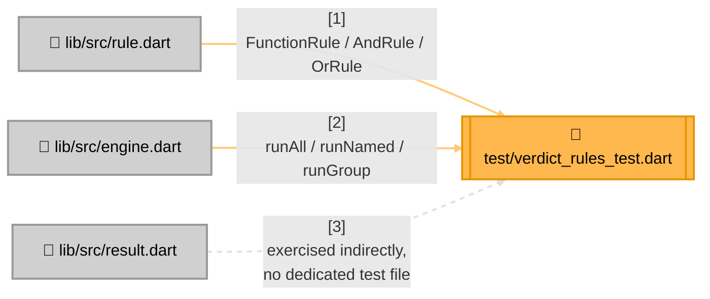

<!-- Title: Verdict Testing Guide (Dart) -->
# Testing verdict: Dart

> The contracts and checklist are language-agnostic and live in
> [`README.md`](README.md) — read that first. This page is Dart's
> concrete realization: current state, file layout, and which test
> proves which contract.

## Current state, as of this writing

```bash
$ cd dart/packages/verdict_rules
$ dart test
00:00 +27: All tests passed!
```

27 tests, all in a single file. No coverage tool is wired in yet — see
[`../maintenance/adding-a-language.md`](../maintenance/adding-a-language.md)'s
Stage 4 for what arrives alongside the shared graduation fixture and an
oracle/differential suite in Dart's own idiom, neither of which exist
here yet.

**No CI pipeline runs this suite today.** This suite is run manually,
by whoever is making a change, before it's merged — not automatically
gated anywhere. That's a real gap shared with every language SDK here,
not a Dart-specific decision; see
[`../future_plan.md`](../future_plan.md) if it's ever picked up.

## Test layout



> **Why `result.dart` has no dedicated test file**: `RuleResult`/`RunResult`
> are plain immutable classes with no methods beyond `toString()` and
> no invariants beyond what the constructor's required parameters
> already enforce — there's nothing to prove about them that isn't
> already proven by every test in `verdict_rules_test.dart`
> constructing and reading one. Add a dedicated test file only if a
> future change gives either type real behavior worth testing in
> isolation.

## Which test proves which contract

| Contract ([`README.md`](README.md)) | Proven by |
| --- | --- |
| Short-circuiting, both directions | `AndRule` › `short-circuits: later sub-rules never run`, `OrRule` › `short-circuits on the first pass` |
| Vacuous-truth polarity, both directions | `AndRule` › `empty passes vacuously`, `OrRule` › `empty fails vacuously` |
| Absence throws (strict lookup) | `Emptiness is not absence` › `an unknown rule name throws`, `an unknown group throws rather than passing vacuously` |
| Absence returns `null` (try-prefixed lookup) | `Try lookups` (whole `group` block) |
| Fallback matrix — the present-failing row specifically | `Try lookups` › `fallback matrix: failing` |
| `runAll`/`runGroup` never short-circuit | `RulesEngine run modes` › `runAll never short-circuits`, `runGroup evaluates only its own group, and never short-circuits` |
| No flattening of a composite's own sub-results | `AndRule` › `data holds only what ran, never padded, never flattened` |
| A rule shape needs no import from this package | `a top-level function is a rule with nothing declared`, `a plain class satisfying the contract works without subclassing` |

Confirmed to actually bite, not just present: the fallback-matrix test
is parametrized over the exact three-state table verdict's own design
exists to keep straight (present-and-passing, present-and-failing,
absent) — commented directly above the test with the reasoning, not
left implicit. Reversing the vacuous-truth polarity of either composite
makes its own `empty ...` test fail immediately, not silently pass.

## Running tests

```bash
cd dart/packages/verdict_rules   # this package's own root -- there is
                                  # deliberately no root pubspec.yaml yet,
                                  # see ../../dart/AGENTS.md
dart pub get                     # once, or after pubspec.yaml changes
dart analyze                     # must report no issues -- analysis_options.yaml
                                  # enables strict casts, inference, and raw types
dart test                        # the whole suite
```

`dart test` imports `lib/verdict_rules.dart` straight from source, the
same as Python — unlike JS, which imports from a built `dist/` and so
needs a build step before its own suite runs.

## Related

- [`README.md`](README.md) — the language-agnostic contracts this page
  proves concretely.
