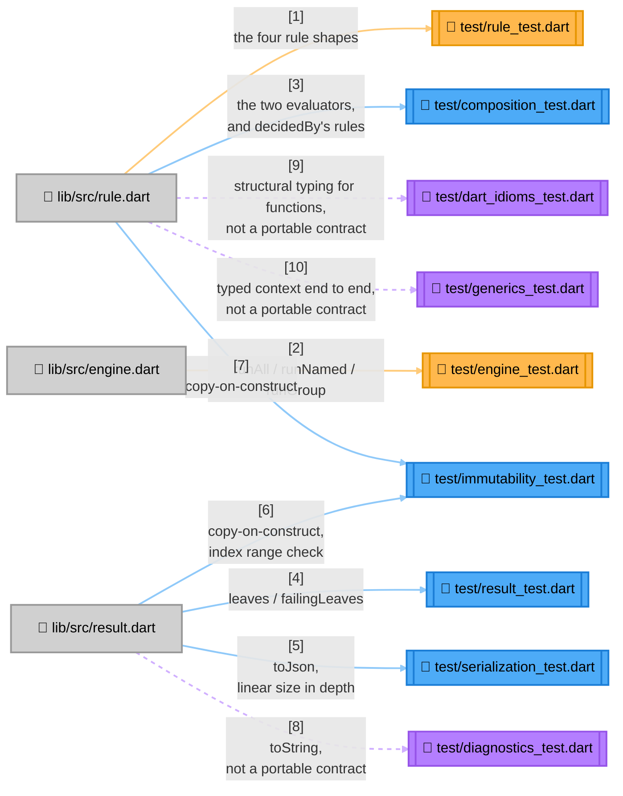

<!-- Title: Verdict Testing Guide (Dart) -->
# Testing verdict: Dart

> The contracts and checklist are language-agnostic and live in
> [`README.md`](README.md) — read that first. This page is Dart's concrete
> realization: the file layout, and which test proves which contract.

## The suite

```bash
cd dart/packages/verdict_rules   # this package's own root -- there is
                                 # deliberately no root pubspec.yaml yet,
                                 # see ../../dart/AGENTS.md
dart pub get                     # once, or after pubspec.yaml changes
dart analyze                     # must report no issues
dart test
```

153 tests. `analysis_options.yaml` enables strict casts, inference and raw
types, so `dart analyze` reporting clean is part of the suite rather than a
separate nicety. `dart test` imports `lib/verdict_rules.dart` straight from
source, the same as Python — unlike JS, which needs a build first.

No coverage tool is wired in. The measure that exists instead is the
survivor list in
[`../maintenance/mutation-survivors-dart.md`](../maintenance/mutation-survivors-dart.md),
and **it needs reading before trusting its own headline**: 57/57 mutants
detected, but the tool generates 57 mutations where mutmut generates 242
against comparable source. It has no ternary rule at all, so every derived
accessor in this language is unverified by mutation testing. The oracle
suite in the example project below is what actually guards them.

| File | Tests | Proves |
| :-- | --: | :-- |
| `composite_rule_test.dart` | 13 | `CompositeRule`, `subRules`, and that one walk reaches a consumer-defined composite |
| `engine_test.dart` | 28 | `runAll`/`runNamed`/`runGroup` and the try-prefixed forms — part of the portable contract suite |
| `composition_test.dart` | 26 | `SequentialEvaluator`/`ShortCircuitEvaluator`, and `decidedBy`'s two computation rules |
| `result_test.dart` | 20 | `leaves`/`failingLeaves` on both result types |
| `rule_test.dart` | 18 | `FunctionRule`/`AndRule`/`OrRule`/`NotRule` — part of the portable contract suite |
| `immutability_test.dart` | 13 | Copy-on-construct, unmodifiable stored lists, and the index range check |
| `diagnostics_test.dart` | 9 | `toString()` on every public type |
| `generics_test.dart` | 9 | A typed, non-dict context through every primitive |
| `serialization_test.dart` | 7 | `toJson()`/`jsonEncode`, and that size stays linear in depth |
| `dart_idioms_test.dart` | 3 | Structural typing for function types, and explicit `implements` for a class |

**`rule_test.dart` and `engine_test.dart` are the portable contract suite** —
the two files to check when auditing this package against Python's own
`test_rule.py`/`test_engine.py`. The rest sit outside that mirror
deliberately.

`immutability_test.dart` draws a distinction the other three languages do
not have to: the **stored** lists are built with `List.unmodifiable`, so
`subResults.add(...)` and `decidedByIndices.add(...)` both throw, while the
three derived getters build a fresh growable list per call — so writing to
one of those is writing to a copy, and a test asserts that changes nothing.

[`../../.github/workflows/test-dart.yml`](../../.github/workflows/test-dart.yml)
runs the suite on every pull request. The gate job is the one to mark
required in branch protection.

**The second, complementary layer**:
[`../../dart/examples/graduation_verdict/`](../../dart/examples/graduation_verdict/README.md)
adds 1,271 tests and
[`marketplace_eligibility`](../../dart/examples/marketplace_eligibility/README.md)
another 32, checked against the shared fixture at
[`../../fixtures/graduation_verdict/README.md`](../../fixtures/graduation_verdict/README.md).
That includes an oracle/differential suite — generated cases checked against
an independent, `verdict_rules`-free re-implementation — and satisfies Stage
4 ("Prove") of
[`../maintenance/adding-a-language.md`](../maintenance/adding-a-language.md).
See that project's own
[`docs/testing.md`](../../dart/examples/graduation_verdict/docs/testing.md).
Given this language's mutation-tool limits, that differential suite carries
more of the load here than in any other SDK.

## Test layout


```mermaid
graph LR
    RuleSrc["📄 lib/src/rule.dart"]
    EngineSrc["📄 lib/src/engine.dart"]
    ResultSrc["📄 lib/src/result.dart"]
    RuleTest[["🧪 test/rule_test.dart"]]
    EngineTest[["🧪 test/engine_test.dart"]]
    CompTest[["🧪 test/composition_test.dart"]]
    ResultTest[["🧪 test/result_test.dart"]]
    SerialTest[["🧪 test/serialization_test.dart"]]
    ImmutTest[["🧪 test/immutability_test.dart"]]
    DiagTest[["🧪 test/diagnostics_test.dart"]]
    IdiomTest[["🧪 test/dart_idioms_test.dart"]]
    GenericsTest[["🧪 test/generics_test.dart"]]

    %% Link 0: RuleSrc -> RuleTest
    RuleSrc -->|"[1]<br/>the four rule shapes"| RuleTest
    %% Link 1: EngineSrc -> EngineTest
    EngineSrc -->|"[2]<br/>runAll / runNamed / runGroup"| EngineTest
    %% Link 2: RuleSrc -> CompTest
    RuleSrc -->|"[3]<br/>the two evaluators,<br/>and decidedBy's rules"| CompTest
    %% Link 3: ResultSrc -> ResultTest
    ResultSrc -->|"[4]<br/>leaves / failingLeaves"| ResultTest
    %% Link 4: ResultSrc -> SerialTest
    ResultSrc -->|"[5]<br/>toJson,<br/>linear size in depth"| SerialTest
    %% Link 5: ResultSrc -> ImmutTest
    ResultSrc -->|"[6]<br/>copy-on-construct,<br/>index range check"| ImmutTest
    %% Link 6: RuleSrc -> ImmutTest
    RuleSrc -->|"[7]<br/>copy-on-construct"| ImmutTest
    %% Link 7: ResultSrc -> DiagTest
    ResultSrc -.->|"[8]<br/>toString,<br/>not a portable contract"| DiagTest
    %% Link 8: RuleSrc -> IdiomTest
    RuleSrc -.->|"[9]<br/>structural typing for functions,<br/>not a portable contract"| IdiomTest
    %% Link 9: RuleSrc -> GenericsTest
    RuleSrc -.->|"[10]<br/>typed context end to end,<br/>not a portable contract"| GenericsTest

    style RuleSrc fill:#D0D0D0,stroke:#999999,stroke-width:2px,color:#000
    style EngineSrc fill:#D0D0D0,stroke:#999999,stroke-width:2px,color:#000
    style ResultSrc fill:#D0D0D0,stroke:#999999,stroke-width:2px,color:#000
    style RuleTest fill:#FFB84D,stroke:#E69500,stroke-width:2px,color:#000
    style EngineTest fill:#FFB84D,stroke:#E69500,stroke-width:2px,color:#000
    style CompTest fill:#4DABF7,stroke:#1C7ED6,stroke-width:2px,color:#000
    style ResultTest fill:#4DABF7,stroke:#1C7ED6,stroke-width:2px,color:#000
    style SerialTest fill:#4DABF7,stroke:#1C7ED6,stroke-width:2px,color:#000
    style ImmutTest fill:#4DABF7,stroke:#1C7ED6,stroke-width:2px,color:#000
    style DiagTest fill:#B47EFF,stroke:#9654E8,stroke-width:2px,color:#000
    style IdiomTest fill:#B47EFF,stroke:#9654E8,stroke-width:2px,color:#000
    style GenericsTest fill:#B47EFF,stroke:#9654E8,stroke-width:2px,color:#000

    %% Link Index:
    %% 0: rule.dart's four concrete shapes are covered directly
    %% 1: engine.dart's five run modes are covered directly
    %% 2: the evaluators AndRule/OrRule compose, public so a custom composite can too
    %% 3: the two derived recursions, which diverge on purpose
    %% 4: a result can leave the process at all -- jsonEncode needs toJson, which no other SDK has to declare
    %% 5-6: every constructor taking a list, proven to copy rather than alias it
    %% 7: toString is per-language presentation, not a portable contract
    %% 8: structural typing for function types and explicit implements for a class are Dart-specific, outside the Python-parity mirror
    %% 9: generics_test.dart proves a typed context through every primitive, short-circuiting included
    linkStyle 0 stroke:#FFCB7A,stroke-width:2px
    linkStyle 1 stroke:#FFCB7A,stroke-width:2px
    linkStyle 2 stroke:#8FC9F9,stroke-width:2px
    linkStyle 3 stroke:#8FC9F9,stroke-width:2px
    linkStyle 4 stroke:#8FC9F9,stroke-width:2px
    linkStyle 5 stroke:#8FC9F9,stroke-width:2px
    linkStyle 6 stroke:#8FC9F9,stroke-width:2px
    linkStyle 7 stroke:#D0AFFF,stroke-width:2px,stroke-dasharray:5 5
    linkStyle 8 stroke:#D0AFFF,stroke-width:2px,stroke-dasharray:5 5
    linkStyle 9 stroke:#D0AFFF,stroke-width:2px,stroke-dasharray:5 5
```

## Which test proves which contract

| Contract ([`README.md`](README.md)) | Proven by |
| --- | --- |
| Short-circuiting, both directions | `AndRule` › `short-circuits after first failure`, `OrRule` › `short-circuits after first pass` (`rule_test.dart`) |
| Vacuous-truth polarity, both directions | `AndRule` › `empty rule list vacuously passes`, `OrRule` › `empty rule list vacuously fails` (`rule_test.dart`) |
| Absence throws (strict lookup) | `RunNamed` › `unknown name raises ArgumentError`, `RunGroup` › `unknown group raises ArgumentError` (`engine_test.dart`) |
| Absence returns `null` (try-prefixed lookup) | `try lookups` (whole `group` block, `engine_test.dart`) |
| Fallback matrix — the present-failing row specifically | `try lookups` › `fallback matrix: failing` (`engine_test.dart`) |
| `runAll`/`runGroup` never short-circuit | `RunAll` › `does not short-circuit unlike AndRule` (`engine_test.dart`) |
| No flattening of a composite's own sub-results | `AndRule` › `subResults carries sub-results up to failure` (`rule_test.dart`) |
| Duplicate name, last one wins | `construction` › `duplicate names -- last one wins in by-name lookup` (`engine_test.dart`) |
| A predicate's exception is never caught | `rule-level exception propagation` (`rule_test.dart`); `engine exception propagation` (`engine_test.dart`) |
| `failingLeaves` is an independent recursion | `failingLeaves`, `mixed composite tree` (`result_test.dart`) |
| `decidedBy` is one level, non-recursive | `RuleResult.decidedBy` (`composition_test.dart`) |
| Copy-on-construct, and unmodifiable stored lists | `immutability_test.dart` |
| A result encodes, and size is linear in depth | `serialization_test.dart` |

Confirmed to actually bite, not just present: the fallback-matrix test is
parametrized over the exact three-state table this API exists to keep
straight (present-and-passing, present-and-failing, absent), with the
reasoning commented directly above it rather than left implicit. Reversing
either composite's vacuous-truth polarity fails its own
`empty rule list vacuously ...` test immediately.

Deliberately outside the table: `dart_idioms_test.dart` proves structural
typing for function types (a plain top-level function, passed as a tear-off,
is a `Rule` through `FunctionRule` with nothing declared) and that a class
satisfying `Rule`'s multi-member interface needs an explicit
`implements Rule<TContext>`. `generics_test.dart` proves a typed context
through `FunctionRule`, `AndRule`, `OrRule` and all three run modes,
short-circuiting included. Neither is a universal contract, and neither gets
ported.

## Related

- [`README.md`](README.md) — the language-agnostic contracts this page proves
  concretely.
- [`../maintenance/mutation-survivors-dart.md`](../maintenance/mutation-survivors-dart.md) —
  what mutation testing does and, importantly here, does not verify.
- [`../../dart/examples/graduation_verdict/docs/testing.md`](../../dart/examples/graduation_verdict/docs/testing.md) —
  the second testing layer's own doc.
