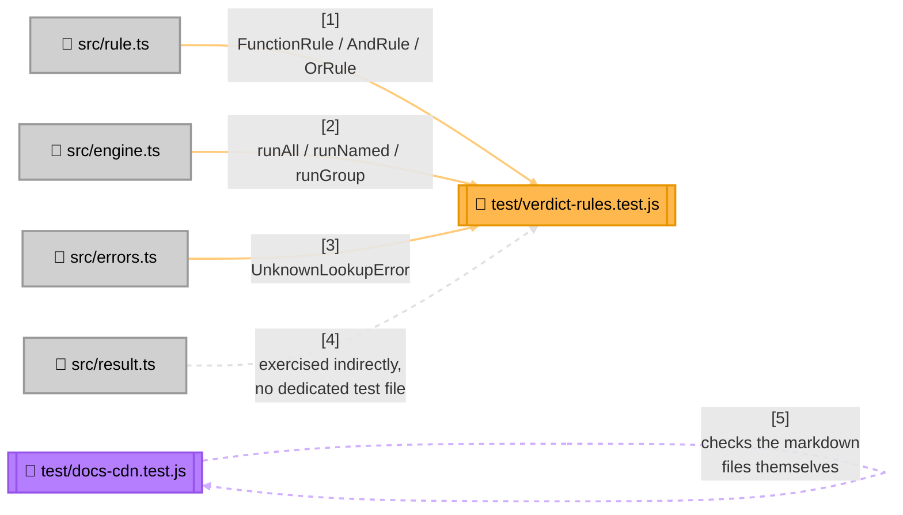

<!-- Title: Verdict Testing Guide (JS/TS) -->
# Testing verdict: JS/TS

> The contracts and checklist are language-agnostic and live in
> [`README.md`](README.md) — read that first. This page is JS/TS's
> concrete realization: current state, file layout, and which test
> proves which contract.

## Current state, as of this writing

```bash
$ cd js/packages/verdict-rules
$ npm run test:coverage
ℹ tests 32
ℹ suites 11
ℹ pass 32
ℹ fail 0
ℹ cancelled 0
ℹ skipped 0
ℹ todo 0
ℹ start of coverage report
ℹ ----------------------------------------------------------
ℹ file      | line % | branch % | funcs % | uncovered lines
ℹ ----------------------------------------------------------
ℹ dist      |        |          |         |
ℹ  index.js | 100.00 |   100.00 |  100.00 |
ℹ ----------------------------------------------------------
ℹ all files | 100.00 |   100.00 |  100.00 |
ℹ ----------------------------------------------------------
ℹ end of coverage report
```

32 tests (30 covering the engine itself, 2 covering the CDN
documentation — see below), 100% line/branch/function coverage via
Node's own built-in test runner and `--experimental-test-coverage`, no
external coverage tool needed. Line coverage alone doesn't prove the
contracts in [`README.md`](README.md) are actually enforced (a test can
execute every line and still assert the wrong thing) — see that doc for
what the number above doesn't tell you.

**No CI pipeline runs this suite today.** This suite is run manually,
by whoever is making a change, before it's merged — not automatically
gated anywhere. That's a real gap shared with every language SDK here,
not a JS/TS-specific decision; see [`../future_plan.md`](../future_plan.md)
if it's ever picked up.

This SDK does not yet have the second testing layer only Python has so
far — a full, tested example project checked against the shared
graduation fixture (see
[`../../fixtures/graduation_verdict/README.md`](../../fixtures/graduation_verdict/README.md)).
That arrives at Stage 4 ("Prove") of
[`../maintenance/adding-a-language.md`](../maintenance/adding-a-language.md),
along with an oracle/differential suite in this language's own idiom.

## Test layout



> **Why `result.ts` has no dedicated test file**: `RuleResult`/`RunResult`
> are plain readonly interfaces with no methods and no invariants beyond
> what the type checker already enforces — there's nothing to prove
> about them that isn't already proven by every test in
> `verdict-rules.test.js` constructing and reading one. Add a dedicated
> test file only if a future change gives either type real behavior (a
> computed property, a validator) worth testing in isolation.
>
> **Why `docs-cdn.test.js` exists at all**: the risk it guards against —
> an unpinned CDN URL silently upgrading a consumer, or a `<script>` tag
> with no `integrity` hash executing whatever the CDN returns — lives in
> what the documentation tells people to paste, not in this package's
> own runtime code. See [`../samples/`](../samples/README.md) once a
> JS/TS sample references a CDN snippet directly.

## Which test proves which contract

| Contract ([`README.md`](README.md)) | Proven by |
| --- | --- |
| Short-circuiting, both directions | `AndRule` › `short-circuits: later sub-rules never run`, `OrRule` › `short-circuits on the first pass` |
| Vacuous-truth polarity, both directions | `AndRule` › `empty passes vacuously`, `OrRule` › `empty fails vacuously` |
| Absence throws (strict lookup) | `emptiness is not absence` › `an unknown rule name throws a typed error`, `an unknown group throws rather than passing vacuously` |
| Absence returns `undefined` (try-prefixed lookup) | `try lookups` (whole `describe` block) |
| Fallback matrix — the present-failing row specifically | `try lookups` › `fallback matrix: failing` |
| `runAll`/`runGroup` never short-circuit | `RulesEngine run modes` › `runAll never short-circuits` |
| No flattening of a composite's own sub-results | `AndRule` › `data holds only what ran, never padded, never flattened` |
| Duplicate name, last one wins | `duplicate rule names` › `the last registered rule wins the by-name lookup` |
| A predicate's exception is never caught | `a predicate's own exception is never caught` (whole `describe` block — `AndRule`, `OrRule`, `runAll`, `runGroup` each get their own case) |

Confirmed to actually bite, not just present: wrapping any of the four
exception-propagation paths above in a `try`/`catch` that swallows the
error makes that path's own test fail with "did not reject," not a pass
that happens to look right.

## Running tests

```bash
cd js/packages/verdict-rules   # this package's own root
npm install                    # once, or after package.json changes
npm run build                  # tests import from dist/, not src/
npm test                       # the whole suite
npm run test:coverage          # with the coverage report above
```

`npm test` imports from `dist/`, not `src/` directly, so a build is a
prerequisite — unlike Python and Dart, where the test suite imports the
source tree straight.

## Related

- [`README.md`](README.md) — the language-agnostic contracts this page
  proves concretely.
