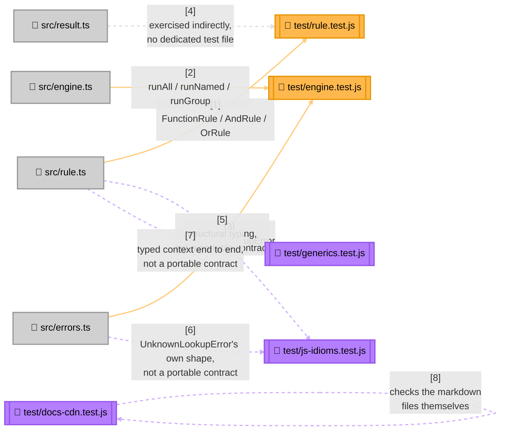

<!-- Title: Verdict Testing Guide (JS/TS) -->
# Testing verdict: JS/TS

> The contracts and checklist are language-agnostic and live in
> [`README.md`](README.md) — read that first. This page is JS/TS's
> concrete realization: current state, file layout, and which test
> proves which contract.

## Current state, as of this writing

```bash
$ cd js/packages/verdict-rules
$ npm run test:coverage
ℹ tests 54
ℹ suites 15
ℹ pass 54
ℹ fail 0
ℹ cancelled 0
ℹ skipped 0
ℹ todo 0
ℹ start of coverage report
ℹ ----------------------------------------------------------
ℹ file      | line % | branch % | funcs % | uncovered lines
ℹ ----------------------------------------------------------
ℹ dist      |        |          |         |
ℹ  index.js | 100.00 |   100.00 |  100.00 |
ℹ ----------------------------------------------------------
ℹ all files | 100.00 |   100.00 |  100.00 |
ℹ ----------------------------------------------------------
ℹ end of coverage report
```

Four files, not one. `rule.test.js` and `engine.test.js` are a strict,
1:1 port of Python's own `test_rule.py`/`test_engine.py` — same
`describe` groupings, same tests, same assertions, in JS/TS idiom — and
are the two files to check when auditing this package against Python's
own suite. `js-idioms.test.js` holds exactly the coverage with no
Python counterpart on purpose (structural typing on a bare object
literal, `UnknownLookupError`'s own shape) and is deliberately not part
of that mirror. `generics.test.js` proves a typed, non-dict context
runs through every primitive end to end. `docs-cdn.test.js` is
unrelated to any of these — a documentation-integrity check, not an
engine test — see below.

54 tests total (52 covering the engine itself across the four files
above, 2 covering the CDN documentation), 100% line/branch/function
coverage via Node's own built-in test runner and
`--experimental-test-coverage`, no external coverage tool needed. Line
coverage alone doesn't prove the contracts in [`README.md`](README.md)
are actually enforced (a test can execute every line and still assert
the wrong thing) — see that doc for what the number above doesn't tell
you.

**`test/generics.test.js` proves the runtime half of the generics
contract only** — that a typed, non-dict context runs through every
primitive exactly as a dict-context one always has. The type-level half
(no default type parameter, `AndRule`/`OrRule` requiring a shared
`TContext`) is enforced by `tsc` against `src/*.ts` on every build and
isn't something a `.js` test can exercise directly. Has no counterpart
to port to another language's own suite.

**No CI pipeline runs this suite today.** This suite is run manually,
by whoever is making a change, before it's merged — not automatically
gated anywhere. That's a real gap shared with every language SDK here,
not a JS/TS-specific decision; see [`../future_plan.md`](../future_plan.md)
if it's ever picked up.

This SDK also has the second testing layer — a full, tested example
project checked against the shared graduation fixture (see
[`../../fixtures/graduation_verdict/README.md`](../../fixtures/graduation_verdict/README.md)),
at [`../../js/examples/graduation_verdict/`](../../js/examples/graduation_verdict/README.md).
That satisfies Stage 4 ("Prove") of
[`../maintenance/adding-a-language.md`](../maintenance/adding-a-language.md),
including an oracle/differential suite in this language's own idiom
(500 generated cases, checked against an independent, verdict-rules-free
re-implementation — see that project's own
[`docs/testing.md`](../../js/examples/graduation_verdict/docs/testing.md)).

## Test layout



> **Why `result.ts` has no dedicated test file**: `RuleResult`/`RunResult`
> are plain readonly interfaces with no methods and no invariants beyond
> what the type checker already enforces — there's nothing to prove
> about them that isn't already proven by every test in `rule.test.js`
> and `engine.test.js` constructing and reading one. Add a dedicated
> test file only if a future change gives either type real behavior (a
> computed property, a validator) worth testing in isolation.
>
> **Why `docs-cdn.test.js` exists at all**: the risk it guards against —
> an unpinned CDN URL silently upgrading a consumer, or a `<script>` tag
> with no `integrity` hash executing whatever the CDN returns — lives in
> what the documentation tells people to paste, not in this package's
> own runtime code. See [`../samples/`](../samples/README.md) once a
> JS/TS sample references a CDN snippet directly.

## Which test proves which contract

| Contract ([`README.md`](README.md)) | Proven by |
| --- | --- |
| Short-circuiting, both directions | `AndRule` › `short-circuits after first failure`, `OrRule` › `short-circuits after first pass` (`rule.test.js`) |
| Vacuous-truth polarity, both directions | `AndRule` › `empty rule list vacuously passes`, `OrRule` › `empty rule list vacuously fails` (`rule.test.js`) |
| Absence throws (strict lookup) | `RunNamed` › `unknown name raises UnknownLookupError`, `RunGroup` › `unknown group raises UnknownLookupError` (`engine.test.js`) |
| Absence returns `undefined` (try-prefixed lookup) | `try lookups` (whole `describe` block, `engine.test.js`) |
| Fallback matrix — the present-failing row specifically | `try lookups` › `fallback matrix: failing` (`engine.test.js`) |
| `runAll`/`runGroup` never short-circuit | `RunAll` › `does not short-circuit unlike AndRule` (`engine.test.js`) |
| No flattening of a composite's own sub-results | `AndRule` › `data carries sub-results up to failure` (`rule.test.js`) |
| Duplicate name, last one wins | `construction` › `duplicate names -- last one wins in by-name lookup` (`engine.test.js`) |
| A predicate's exception is never caught | `rule-level exception propagation` (`rule.test.js`); `engine exception propagation` (`engine.test.js`) |

Not part of this table on purpose — `js-idioms.test.js` proves
structural typing on a bare object literal (no class, no `implements`,
shape alone is enough) and `UnknownLookupError`'s own field shape
(`kind`/`key`/`name`, the type JavaScript exports because it has no
built-in equivalent to Python's `KeyError` or C#'s
`KeyNotFoundException`). `generics.test.js` proves the runtime half of
`Rule<TContext>`'s generic mechanics — that a typed, non-dict context
runs through every primitive exactly as a dict-context one always has;
the type-level half (no default type parameter, `AndRule`/`OrRule`
requiring a shared `TContext`) is enforced by `tsc` on every build.
None of these are universal contracts; none get ported to another
language's own suite.

Confirmed to actually bite, not just present: wrapping any of the four
exception-propagation paths above in a `try`/`catch` that swallows the
error makes that path's own test fail with "did not reject," not a pass
that happens to look right.

## Running tests

```bash
cd js/packages/verdict-rules   # this package's own root
npm install                    # once, or after package.json changes
npm run build                  # tests import from dist/, not src/
npm test                       # the whole suite
npm run test:coverage          # with the coverage report above
```

`npm test` imports from `dist/`, not `src/` directly, so a build is a
prerequisite — unlike Python and Dart, where the test suite imports the
source tree straight.

## Related

- [`README.md`](README.md) — the language-agnostic contracts this page
  proves concretely.
