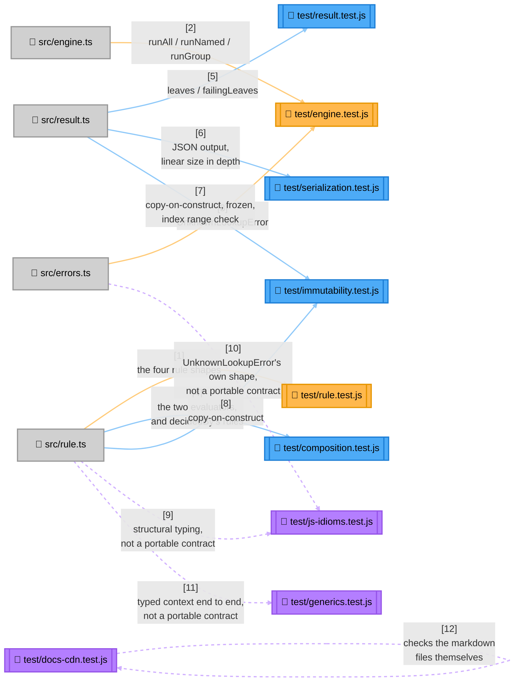

<!-- Title: Verdict Testing Guide (JS/TS) -->
# Testing verdict: JS/TS

> The contracts and checklist are language-agnostic and live in
> [`README.md`](README.md) — read that first. This page is JS/TS's concrete
> realization: the file layout, and which test proves which contract.

## The suite

```bash
cd js/packages/verdict-rules   # this package's own root
npm install                    # once, or after package.json changes
npm run build                  # tests import from dist/, not src/
npm run test:coverage
```

144 tests across 29 suites, 100% line/branch/function coverage via Node's
own test runner and `--experimental-test-coverage` — no external coverage
tool. `npm test` imports from `dist/`, so a build is a prerequisite, unlike
Python and Dart where the suite imports the source tree directly.

Line coverage does not prove the contracts in [`README.md`](README.md) are
enforced. The stronger measure is the survivor list in
[`../maintenance/mutation-survivors-js.md`](../maintenance/mutation-survivors-js.md):
238/243 mutants killed, every survivor proven equivalent.

| File | Tests | Proves |
| :-- | --: | :-- |
| `composition.test.js` | 27 | `SequentialEvaluator`/`ShortCircuitEvaluator`, and `decidedBy`'s two computation rules |
| `engine.test.js` | 27 | `runAll`/`runNamed`/`runGroup` and the try-prefixed forms — part of the portable contract suite |
| `rule.test.js` | 25 | `FunctionRule`/`AndRule`/`OrRule`/`NotRule` — part of the portable contract suite |
| `result.test.js` | 20 | `leaves`/`failingLeaves` on both result types |
| `immutability.test.js` | 17 | Copy-on-construct, the index range check, and that instances are genuinely frozen |
| `js-idioms.test.js` | 11 | Structural typing on a bare object literal, and `UnknownLookupError`'s own shape |
| `generics.test.js` | 8 | A typed, non-dict context through every primitive |
| `serialization.test.js` | 7 | `JSON.stringify` output, and that size stays linear in depth |
| `docs-cdn.test.js` | 2 | The CDN snippets in the documentation — not an engine test |

**`rule.test.js` and `engine.test.js` are the portable contract suite** — the
two files to check when auditing this package against Python's own
`test_rule.py`/`test_engine.py`. The rest sit outside that mirror
deliberately.

Two of them warrant explanation:

- **`generics.test.js` proves the runtime half of the generics contract
  only** — that a typed context runs through every primitive exactly as a
  dict-context one does. The type-level half (no default type parameter,
  `AndRule`/`OrRule` requiring a shared `TContext`) is enforced by `tsc`
  against `src/*.ts` on every build, which a `.js` test cannot exercise.
- **`docs-cdn.test.js` checks documentation, not code.** The risk it guards
  — an unpinned CDN URL silently upgrading a consumer, or a `<script>` tag
  with no `integrity` hash executing whatever the CDN returns — lives in
  what the docs tell people to paste, not in this package's runtime.

`immutability.test.js` carries one assertion worth singling out: that a
result instance is actually `Object.freeze`d. A `readonly` field is a
compile-time claim that is erased at runtime, so without it nothing proved a
result a consumer already holds cannot be changed under them — and removing
`Object.freeze` was invisible to the whole suite until that test existed.

[`../../.github/workflows/test-js.yml`](../../.github/workflows/test-js.yml)
runs the suite on every pull request. The gate job is the one to mark
required in branch protection.

**The second, complementary layer**:
[`../../js/examples/graduation_verdict/`](../../js/examples/graduation_verdict/README.md)
checks the primitives composed together against the shared fixture at
[`../../fixtures/graduation_verdict/README.md`](../../fixtures/graduation_verdict/README.md),
including an oracle/differential suite — generated cases checked against an
independent, `verdict-rules`-free re-implementation. That satisfies Stage 4
("Prove") of
[`../maintenance/adding-a-language.md`](../maintenance/adding-a-language.md);
see that project's own
[`docs/testing.md`](../../js/examples/graduation_verdict/docs/testing.md).

## Test layout


```mermaid
graph LR
    RuleSrc["📄 src/rule.ts"]
    EngineSrc["📄 src/engine.ts"]
    ResultSrc["📄 src/result.ts"]
    ErrorsSrc["📄 src/errors.ts"]
    RuleTest[["🧪 test/rule.test.js"]]
    EngineTest[["🧪 test/engine.test.js"]]
    CompTest[["🧪 test/composition.test.js"]]
    ResultTest[["🧪 test/result.test.js"]]
    SerialTest[["🧪 test/serialization.test.js"]]
    ImmutTest[["🧪 test/immutability.test.js"]]
    IdiomTest[["🧪 test/js-idioms.test.js"]]
    GenericsTest[["🧪 test/generics.test.js"]]
    CdnTest[["🧪 test/docs-cdn.test.js"]]

    %% Link 0: RuleSrc -> RuleTest
    RuleSrc -->|"[1]<br/>the four rule shapes"| RuleTest
    %% Link 1: EngineSrc -> EngineTest
    EngineSrc -->|"[2]<br/>runAll / runNamed / runGroup"| EngineTest
    %% Link 2: ErrorsSrc -> EngineTest
    ErrorsSrc -->|"[3]<br/>UnknownLookupError"| EngineTest
    %% Link 3: RuleSrc -> CompTest
    RuleSrc -->|"[4]<br/>the two evaluators,<br/>and decidedBy's rules"| CompTest
    %% Link 4: ResultSrc -> ResultTest
    ResultSrc -->|"[5]<br/>leaves / failingLeaves"| ResultTest
    %% Link 5: ResultSrc -> SerialTest
    ResultSrc -->|"[6]<br/>JSON output,<br/>linear size in depth"| SerialTest
    %% Link 6: ResultSrc -> ImmutTest
    ResultSrc -->|"[7]<br/>copy-on-construct, frozen,<br/>index range check"| ImmutTest
    %% Link 7: RuleSrc -> ImmutTest
    RuleSrc -->|"[8]<br/>copy-on-construct"| ImmutTest
    %% Link 8: RuleSrc -> IdiomTest
    RuleSrc -.->|"[9]<br/>structural typing,<br/>not a portable contract"| IdiomTest
    %% Link 9: ErrorsSrc -> IdiomTest
    ErrorsSrc -.->|"[10]<br/>UnknownLookupError's own shape,<br/>not a portable contract"| IdiomTest
    %% Link 10: RuleSrc -> GenericsTest
    RuleSrc -.->|"[11]<br/>typed context end to end,<br/>not a portable contract"| GenericsTest
    %% Link 11: CdnTest -> CdnTest (documentation, not source)
    CdnTest -.->|"[12]<br/>checks the markdown<br/>files themselves"| CdnTest

    style RuleSrc fill:#D0D0D0,stroke:#999999,stroke-width:2px,color:#000
    style EngineSrc fill:#D0D0D0,stroke:#999999,stroke-width:2px,color:#000
    style ResultSrc fill:#D0D0D0,stroke:#999999,stroke-width:2px,color:#000
    style ErrorsSrc fill:#D0D0D0,stroke:#999999,stroke-width:2px,color:#000
    style RuleTest fill:#FFB84D,stroke:#E69500,stroke-width:2px,color:#000
    style EngineTest fill:#FFB84D,stroke:#E69500,stroke-width:2px,color:#000
    style CompTest fill:#4DABF7,stroke:#1C7ED6,stroke-width:2px,color:#000
    style ResultTest fill:#4DABF7,stroke:#1C7ED6,stroke-width:2px,color:#000
    style SerialTest fill:#4DABF7,stroke:#1C7ED6,stroke-width:2px,color:#000
    style ImmutTest fill:#4DABF7,stroke:#1C7ED6,stroke-width:2px,color:#000
    style IdiomTest fill:#B47EFF,stroke:#9654E8,stroke-width:2px,color:#000
    style GenericsTest fill:#B47EFF,stroke:#9654E8,stroke-width:2px,color:#000
    style CdnTest fill:#B47EFF,stroke:#9654E8,stroke-width:2px,color:#000

    %% Link Index:
    %% 0: rule.ts's four concrete shapes are covered directly
    %% 1: engine.ts's three run modes are covered directly
    %% 2: errors.ts's one exported type is covered directly
    %% 3: the evaluators AndRule/OrRule compose, public so a custom composite can too
    %% 4: the two derived recursions, which diverge on purpose
    %% 5: a result can leave the process, and the stored graph is a tree rather than a DAG
    %% 6-7: every constructor taking an array, proven to copy rather than alias it -- plus Object.freeze, which `readonly` alone does not give at runtime
    %% 8-9: structural typing and UnknownLookupError's own field shape are JS/TS-specific, outside the Python-parity mirror
    %% 10: generics.test.js proves the runtime half of TContext's mechanics; tsc proves the rest
    %% 11: docs-cdn.test.js is a documentation-integrity check, not an engine test
    linkStyle 0 stroke:#FFCB7A,stroke-width:2px
    linkStyle 1 stroke:#FFCB7A,stroke-width:2px
    linkStyle 2 stroke:#FFCB7A,stroke-width:2px
    linkStyle 3 stroke:#8FC9F9,stroke-width:2px
    linkStyle 4 stroke:#8FC9F9,stroke-width:2px
    linkStyle 5 stroke:#8FC9F9,stroke-width:2px
    linkStyle 6 stroke:#8FC9F9,stroke-width:2px
    linkStyle 7 stroke:#8FC9F9,stroke-width:2px
    linkStyle 8 stroke:#D0AFFF,stroke-width:2px,stroke-dasharray:5 5
    linkStyle 9 stroke:#D0AFFF,stroke-width:2px,stroke-dasharray:5 5
    linkStyle 10 stroke:#D0AFFF,stroke-width:2px,stroke-dasharray:5 5
    linkStyle 11 stroke:#D0AFFF,stroke-width:2px,stroke-dasharray:5 5
```

## Which test proves which contract

| Contract ([`README.md`](README.md)) | Proven by |
| --- | --- |
| Short-circuiting, both directions | `AndRule` › `short-circuits after first failure`, `OrRule` › `short-circuits after first pass` (`rule.test.js`) |
| Vacuous-truth polarity, both directions | `AndRule` › `empty rule list vacuously passes`, `OrRule` › `empty rule list vacuously fails` (`rule.test.js`) |
| Absence throws (strict lookup) | `RunNamed` › `unknown name raises UnknownLookupError`, `RunGroup` › `unknown group raises UnknownLookupError` (`engine.test.js`) |
| Absence returns `undefined` (try-prefixed lookup) | `try lookups` (whole `describe` block, `engine.test.js`) |
| Fallback matrix — the present-failing row specifically | `try lookups` › `fallback matrix: failing` (`engine.test.js`) |
| `runAll`/`runGroup` never short-circuit | `RunAll` › `does not short-circuit unlike AndRule` (`engine.test.js`) |
| No flattening of a composite's own sub-results | `AndRule` › `subResults carries sub-results up to failure` (`rule.test.js`) |
| Duplicate name, last one wins | `construction` › `duplicate names -- last one wins in by-name lookup` (`engine.test.js`) |
| A predicate's exception is never caught | `rule-level exception propagation` (`rule.test.js`); `engine exception propagation` (`engine.test.js`) |
| `failingLeaves` is an independent recursion | `RuleResult.failingLeaves` (`result.test.js`) |
| `decidedBy` is one level, non-recursive | `decidedBy` (`composition.test.js`) |
| Copy-on-construct, and a frozen instance | `immutability.test.js` |
| A result serializes, and size is linear in depth | `serialization.test.js` |

Confirmed to actually bite, not just present: wrapping any of the four
exception-propagation paths in a `try`/`catch` that swallows the error makes
that path's own test fail with "did not reject," not a pass that happens to
look right. Deleting `Object.freeze` from either result constructor fails
`a result instance is frozen, not merely typed readonly`.

Deliberately outside the table: `js-idioms.test.js` proves structural typing
on a bare object literal (no class, no `implements`, shape alone is enough)
and `UnknownLookupError`'s field shape — `kind`/`key`/`name`, the type
JavaScript exports because it has no built-in equivalent to Python's
`KeyError` or C#'s `KeyNotFoundException`. Neither is a universal contract,
and neither gets ported.

## Related

- [`README.md`](README.md) — the language-agnostic contracts this page proves
  concretely.
- [`../maintenance/mutation-survivors-js.md`](../maintenance/mutation-survivors-js.md) —
  what the suite provably catches, beyond what it executes.
- [`../../js/examples/graduation_verdict/docs/testing.md`](../../js/examples/graduation_verdict/docs/testing.md) —
  the second testing layer's own doc.
