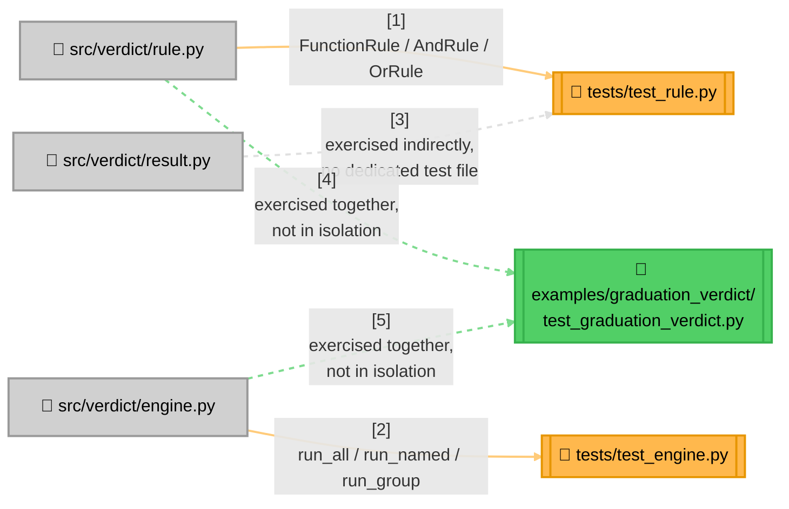

<!-- Title: Verdict Testing Guide (Python) -->
# Testing verdict: Python

> The contracts and checklist are language-agnostic and live in
> [`README.md`](README.md) — read that first. This page is Python's
> concrete realization: current state, file layout, and which test
> proves which contract.

## Current state, as of this writing

```bash
$ cd python/
$ uv run pytest --cov=verdict --cov-report=term-missing -q
........................                                             [100%]
24 passed in 0.04s

Name                      Stmts   Miss  Cover
-------------------------------------------------------
src/verdict/__init__.py       4      0   100%
src/verdict/engine.py        24      0   100%
src/verdict/result.py        12      0   100%
src/verdict/rule.py          41      0   100%
-------------------------------------------------------
TOTAL                        81      0   100%
```

24 tests, 100% line coverage, sub-tenth-of-a-second runtime. Line
coverage alone doesn't prove the contracts in [`README.md`](README.md)
are actually enforced (a test can execute every line and still assert
the wrong thing) — see that doc for what the number above doesn't tell
you.

**No CI pipeline runs this suite today.** This suite is run manually,
by whoever is making a change, before it's merged — not automatically
gated anywhere. That's a real gap, not a deliberate design choice; see
[`../future_plan.md`](../future_plan.md) if it's ever picked up.

**The second, complementary layer**: `python/examples/graduation_verdict/`
adds 523 more tests (547 total with the numbers above — 23 curated
scenarios plus a 500-case chaos suite checked against an independent
oracle), auto-discovered by the same bare `uv run pytest` with no
configuration. Its own
[`testing.md`](../../python/examples/graduation_verdict/docs/testing.md)
explains why that makes it a regression net for `verdict` itself, not
just a sample.

## Test layout



> **Why `result.py` has no dedicated test file**: `RuleResult`/`RunResult`
> are plain `@dataclass(frozen=True)` containers with no methods and no
> invariants beyond what the type system already enforces — there's
> nothing to prove about them that isn't already proven by every test in
> `test_rule.py`/`test_engine.py` constructing and reading one. Add a
> dedicated `test_result.py` only if a future change gives either
> dataclass real behavior (a computed property, a validator) worth
> testing in isolation.

## Which test proves which contract

| Contract ([`README.md`](README.md)) | Proven by |
| --- | --- |
| Short-circuiting, both directions | `test_short_circuits_after_first_failure`, `test_short_circuits_after_first_pass` (`test_rule.py`) |
| Vacuous-truth polarity, both directions | `test_empty_rule_list_vacuously_passes`, `test_empty_rule_list_vacuously_fails` (`test_rule.py`) |
| Absence raises (strict lookup) | `test_unknown_group_raises`, `test_unknown_group_throws` (`test_engine.py`) |
| Absence returns `None` (try-prefixed lookup) | `TestTryLookups` (`test_engine.py`) |
| Fallback matrix — the present-failing row specifically | `test_fallback_matrix` (`test_engine.py`) |
| `run_all`/`run_group` never short-circuit | `test_does_not_short_circuit_unlike_and_rule` (`test_engine.py`) |
| No flattening of a composite's own sub-results | `test_data_carries_sub_results_up_to_failure` (`test_rule.py`) |
| Duplicate name, last one wins | `test_duplicate_names_last_one_wins_in_by_name_lookup` (`test_engine.py`) |
| A predicate's exception is never caught | `test_run_all_does_not_catch_a_predicate_s_exception`, `test_run_group_does_not_catch_a_predicate_s_exception` (`test_engine.py`); `test_and_rule_does_not_catch_a_sub_rule_s_exception`, `test_or_rule_does_not_catch_a_sub_rule_s_exception` (`test_rule.py`) |

Confirmed to actually bite, not just present: wrapping `run_all`'s loop
in a `try`/`except Exception: pass` makes the first exception test fail
with "DID NOT RAISE," not a pass that happens to look right.

## Running tests

```bash
cd python/            # this package's own root
uv sync              # once, or after pyproject.toml changes
uv run pytest        # the whole suite
uv run pytest --cov=verdict --cov-report=term-missing   # with the coverage report above
```

No external project context or environment variables are needed — this
package's test suite is as standalone as the package itself.

## Related

- [`README.md`](README.md) — the language-agnostic contracts this page
  proves concretely.
- [`../../python/examples/graduation_verdict/docs/testing.md`](../../python/examples/graduation_verdict/docs/testing.md) —
  the second testing layer's own doc.
