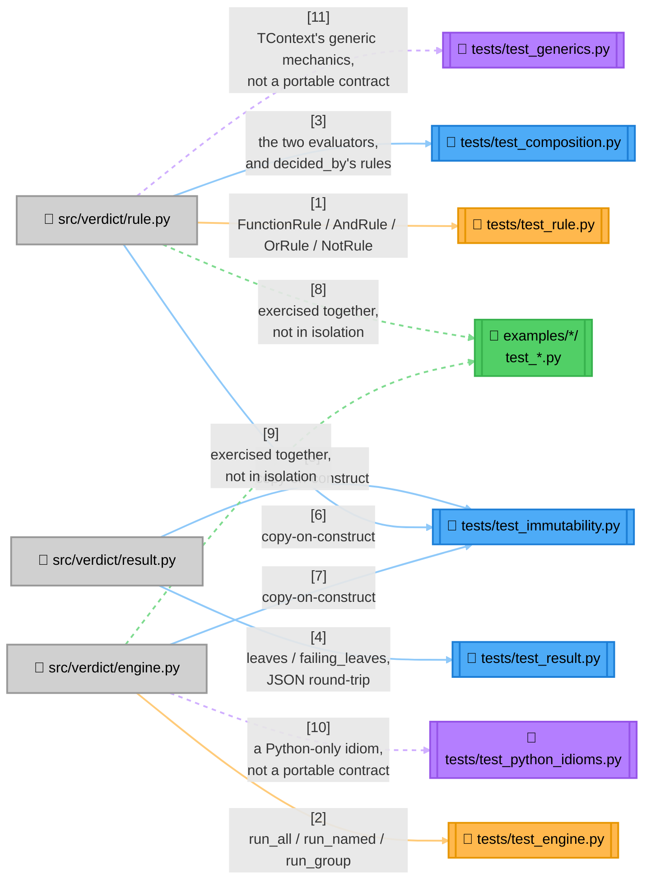

<!-- Title: Verdict Testing Guide (Python) -->
# Testing verdict: Python

> The contracts and checklist are language-agnostic and live in
> [`README.md`](README.md) — read that first. This page is Python's
> concrete realization: the file layout, and which test proves which
> contract.

## The suite

```bash
cd python/packages/verdict-rules
uv run pytest --cov=verdict --cov-report=term-missing
```

158 tests, 100% line coverage of all four modules (`rule.py`,
`engine.py`, `result.py`, `__init__.py`), around a tenth of a second.
Line coverage does not prove the contracts in [`README.md`](README.md)
are enforced — a test can execute every line and assert the wrong
thing — so the survivor list in
[`../maintenance/mutation-survivors-python.md`](../maintenance/mutation-survivors-python.md)
is the stronger measure: 224/225 mutants killed, the one survivor proven
equivalent.

| File | Tests | Proves |
| :-- | --: | :-- |
| `test_composite_rule.py` | 12 | `CompositeRule`, `sub_rules`, and that one walk reaches a consumer-defined composite |
| `test_composition.py` | 31 | `SequentialEvaluator`/`ShortCircuitEvaluator`, and `decided_by`'s generic and short-circuit-aware rules |
| `test_rule.py` | 27 | `FunctionRule`/`AndRule`/`OrRule`/`NotRule` — part of the portable contract suite |
| `test_engine.py` | 27 | `run_all`/`run_named`/`run_group` and their try-prefixed forms — part of the portable contract suite |
| `test_result.py` | 26 | `leaves`/`failing_leaves` on both result types, and JSON round-tripping |
| `test_generics.py` | 17 | `TContext`'s Python-specific mechanics (erasure, subscription) |
| `test_immutability.py` | 11 | Copy-on-construct for rules, results, and the engine |
| `test_python_idioms.py` | 1 | Implicit truthiness against the result types |

**`test_rule.py` and `test_engine.py` are the portable contract suite —
the reference every other language's own suite ports against 1:1.**
The rest sit beside them, not inside them: `test_generics.py` and
`test_python_idioms.py` each prove something true only because of how
Python itself works, and `test_composition.py`/`test_result.py`/
`test_immutability.py` cover surface that each language realizes
differently (C# exposes `GetLeaves()` as a method, Dart has no
`@dataclass` to copy around). Auditing this package's suite against
another language's means comparing the first two files.

[`../../.github/workflows/test-python.yml`](../../.github/workflows/test-python.yml)
runs it on every pull request across CPython 3.10 through 3.14, and
checks the committed API snapshot on the newest leg. The gate job is the
one to mark required in branch protection.

**The second, complementary layer**: `python/examples/graduation_verdict/`
and `python/examples/marketplace_eligibility/` add 1,277 more tests
(1,417 total from `python/`, auto-discovered by a bare `uv run pytest`
with no configuration) — curated scenarios plus a generated chaos suite
checked against an independent oracle. Its own
[`testing.md`](../../python/examples/graduation_verdict/docs/testing.md)
explains why that makes it a regression net for `verdict` itself rather
than only a sample.

## Test layout


```mermaid
graph LR
    RuleSrc["📄 src/verdict/rule.py"]
    EngineSrc["📄 src/verdict/engine.py"]
    ResultSrc["📄 src/verdict/result.py"]
    RuleTest[["🧪 tests/test_rule.py"]]
    EngineTest[["🧪 tests/test_engine.py"]]
    CompTest[["🧪 tests/test_composition.py"]]
    ResultTest[["🧪 tests/test_result.py"]]
    ImmutTest[["🧪 tests/test_immutability.py"]]
    IdiomTest[["🧪 tests/test_python_idioms.py"]]
    GenericsTest[["🧪 tests/test_generics.py"]]
    ExampleTest[["🧪 examples/*/<br/>test_*.py"]]

    %% Link 0: RuleSrc -> RuleTest
    RuleSrc -->|"[1]<br/>FunctionRule / AndRule / OrRule / NotRule"| RuleTest
    %% Link 1: EngineSrc -> EngineTest
    EngineSrc -->|"[2]<br/>run_all / run_named / run_group"| EngineTest
    %% Link 2: RuleSrc -> CompTest
    RuleSrc -->|"[3]<br/>the two evaluators,<br/>and decided_by's rules"| CompTest
    %% Link 3: ResultSrc -> ResultTest
    ResultSrc -->|"[4]<br/>leaves / failing_leaves,<br/>JSON round-trip"| ResultTest
    %% Link 4: ResultSrc -> ImmutTest
    ResultSrc -->|"[5]<br/>copy-on-construct"| ImmutTest
    %% Link 5: RuleSrc -> ImmutTest
    RuleSrc -->|"[6]<br/>copy-on-construct"| ImmutTest
    %% Link 6: EngineSrc -> ImmutTest
    EngineSrc -->|"[7]<br/>copy-on-construct"| ImmutTest
    %% Link 7: RuleSrc -> ExampleTest
    RuleSrc -.->|"[8]<br/>exercised together,<br/>not in isolation"| ExampleTest
    %% Link 8: EngineSrc -> ExampleTest
    EngineSrc -.->|"[9]<br/>exercised together,<br/>not in isolation"| ExampleTest
    %% Link 9: EngineSrc -> IdiomTest
    EngineSrc -.->|"[10]<br/>a Python-only idiom,<br/>not a portable contract"| IdiomTest
    %% Link 10: RuleSrc -> GenericsTest
    RuleSrc -.->|"[11]<br/>TContext's generic mechanics,<br/>not a portable contract"| GenericsTest

    style RuleSrc fill:#D0D0D0,stroke:#999999,stroke-width:2px,color:#000
    style EngineSrc fill:#D0D0D0,stroke:#999999,stroke-width:2px,color:#000
    style ResultSrc fill:#D0D0D0,stroke:#999999,stroke-width:2px,color:#000
    style RuleTest fill:#FFB84D,stroke:#E69500,stroke-width:2px,color:#000
    style EngineTest fill:#FFB84D,stroke:#E69500,stroke-width:2px,color:#000
    style CompTest fill:#4DABF7,stroke:#1C7ED6,stroke-width:2px,color:#000
    style ResultTest fill:#4DABF7,stroke:#1C7ED6,stroke-width:2px,color:#000
    style ImmutTest fill:#4DABF7,stroke:#1C7ED6,stroke-width:2px,color:#000
    style IdiomTest fill:#B47EFF,stroke:#9654E8,stroke-width:2px,color:#000
    style GenericsTest fill:#B47EFF,stroke:#9654E8,stroke-width:2px,color:#000
    style ExampleTest fill:#51CF66,stroke:#37B24D,stroke-width:2px,color:#000

    %% Link Index:
    %% 0: rule.py's four concrete shapes are covered directly
    %% 1: engine.py's three run modes are covered directly
    %% 2: the evaluators AndRule/OrRule compose, public so a custom composite can too
    %% 3: result.py's two derived accessors, and the serializability its acyclic graph buys
    %% 4-6: every constructor that takes a collection, proven to copy rather than alias it
    %% 7-8: the example projects exercise both modules together, as a real consumer would
    %% 9: test_python_idioms.py proves a Python-specific idiom against the result types -- not part of the portable contract suite
    %% 10: test_generics.py proves TContext's Python-specific generic mechanics (erasure, subscription) -- not part of the portable contract suite
    linkStyle 0 stroke:#FFCB7A,stroke-width:2px
    linkStyle 1 stroke:#FFCB7A,stroke-width:2px
    linkStyle 2 stroke:#8FC9F9,stroke-width:2px
    linkStyle 3 stroke:#8FC9F9,stroke-width:2px
    linkStyle 4 stroke:#8FC9F9,stroke-width:2px
    linkStyle 5 stroke:#8FC9F9,stroke-width:2px
    linkStyle 6 stroke:#8FC9F9,stroke-width:2px
    linkStyle 7 stroke:#7EDB8F,stroke-width:2px,stroke-dasharray:5 5
    linkStyle 8 stroke:#7EDB8F,stroke-width:2px,stroke-dasharray:5 5
    linkStyle 9 stroke:#D0AFFF,stroke-width:2px,stroke-dasharray:5 5
    linkStyle 10 stroke:#D0AFFF,stroke-width:2px,stroke-dasharray:5 5
```

## Which test proves which contract

| Contract ([`README.md`](README.md)) | Proven by |
| --- | --- |
| Short-circuiting, both directions | `test_short_circuits_after_first_failure`, `test_short_circuits_after_first_pass` (`test_rule.py`) |
| Vacuous-truth polarity, both directions | `test_empty_rule_list_vacuously_passes`, `test_empty_rule_list_vacuously_fails` (`test_rule.py`) |
| Absence raises (strict lookup) | `test_unknown_name_raises_key_error`, `test_unknown_group_raises` (`test_engine.py`) |
| Absence returns `None` (try-prefixed lookup) | `TestTryLookups` (`test_engine.py`) |
| Fallback matrix — the present-failing row specifically | `test_fallback_matrix` (`test_engine.py`) |
| `run_all`/`run_group` never short-circuit | `test_does_not_short_circuit_unlike_and_rule` (`test_engine.py`) |
| No flattening of a composite's own sub-results | `test_sub_results_carries_sub_results_up_to_failure` (`test_rule.py`); `test_sub_results_always_carries_every_rule_actually_evaluated` (`test_composition.py`) |
| Duplicate name, last one wins | `test_duplicate_names_last_one_wins_in_by_name_lookup` (`test_engine.py`) |
| A predicate's exception is never caught | `test_run_all_does_not_catch_a_predicate_s_exception`, `test_run_group_does_not_catch_a_predicate_s_exception` (`test_engine.py`); `test_and_rule_does_not_catch_a_sub_rule_s_exception`, `test_or_rule_does_not_catch_a_sub_rule_s_exception` (`test_rule.py`) |
| `failing_leaves` is an independent recursion | `TestFailingLeaves` (`test_result.py`) |
| `decided_by` is one level, non-recursive | `TestDecidedBy` (`test_composition.py`) |
| A predicate returning a result-shaped object raises | `test_predicate_returning_a_rule_result_directly_raises_type_error`, `test_predicate_returning_the_wrong_type_raises_type_error` (`test_rule.py`) |
| Copy-on-construct, every collection parameter | `test_immutability.py` |
| A result round-trips through `json.dumps` | `TestSerialization` (`test_result.py`) |

Confirmed to actually bite, not just present: wrapping `run_all`'s loop
in a `try`/`except Exception: pass` makes the first exception test fail
with "DID NOT RAISE," not a pass that happens to look right. Replacing
either `object.__setattr__` call in `RuleResult.__post_init__` with
`pass` fails exactly two `test_immutability.py` tests, one of them by
building a result that contains itself.

## Related

- [`README.md`](README.md) — the language-agnostic contracts this page
  proves concretely.
- [`../maintenance/mutation-survivors-python.md`](../maintenance/mutation-survivors-python.md) —
  what the suite provably catches, beyond what it executes.
- [`../../python/examples/graduation_verdict/docs/testing.md`](../../python/examples/graduation_verdict/docs/testing.md) —
  the second testing layer's own doc.
