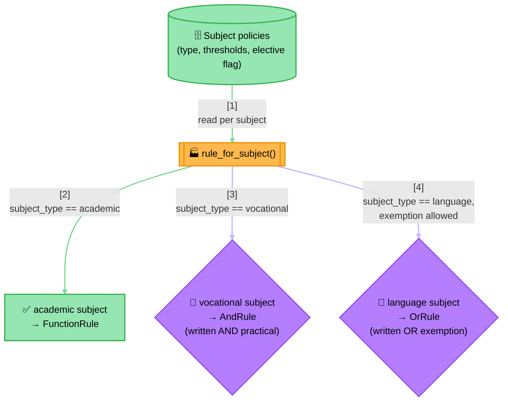
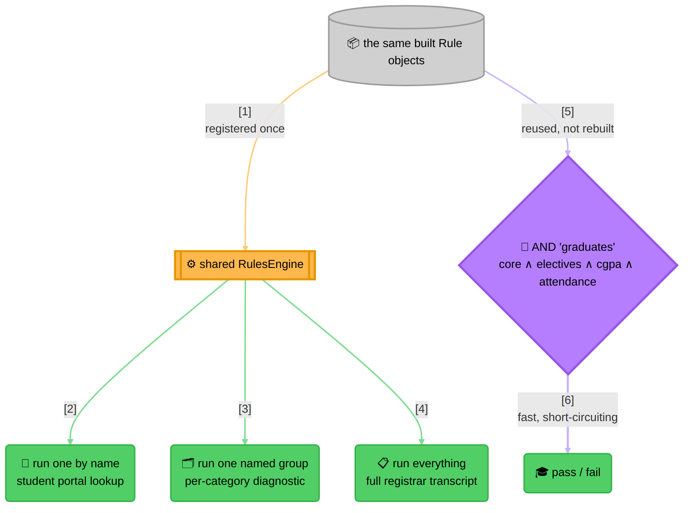

<!-- Title: Graduation Verdict Scenario And Fixture Contract -->
# Graduation verdict — the scenario and its shared contract

> The single home for this scenario: the problem it models, the design a
> correct implementation demonstrates, and the one set of inputs and
> expected outcomes that **every** language port of verdict must
> reproduce. The contract is the evidence behind the claim that this is
> the same engine in another language rather than something that merely
> resembles it — a port is not at `0.1.0` until it passes. See
> [`../../docs/maintenance/adding-a-language.md`](../../docs/maintenance/adding-a-language.md).

**The question**: does this student qualify to graduate?

**Why it's a good fit**: a real graduation policy isn't one uniform
check — an academic subject just needs a passing written score, a
vocational subject needs a written score *and* a separate practical
score to both clear their own bars, and a language subject can be
satisfied by either the written paper *or* an approved exemption. On
top of every subject's own shape, the student needs at least a handful
of their elective subjects to pass (not all of them), plus an overall
CGPA and attendance floor. This scenario pulls in every primitive this
package has — a plain predicate rule, an AND, an OR, a genuinely new
rule shape, and all three run modes each doing a different real job —
because a real policy like this one needs all of them at once.

It is backed by a full, tested project in each language rather than a
markdown code block: a complete implementation, a runnable demo across
several varied students, and a test suite that doubles as an
integration/regression net for that language's SDK itself.

## What the naive approach gets wrong

The obvious first implementation is one large function mixing every
subject's own pass condition, the elective count, and the overall
floors:

```text
function can_graduate(scores, cgpa, attendance_pct):
    if scores["MATH101"].written_pct < 40:
        return false
    if scores["ENG101"].written_pct < 40:
        return false
    if scores["WORKSHOP201"].written_pct < 40 or scores["WORKSHOP201"].practical_pct < 60:
        return false
    if scores["FRENCH101"].written_pct < 40 and not scores["FRENCH101"].has_exemption:
        return false

    elective_ids = ["ELECTIVE_ART", "ELECTIVE_MUSIC", "ELECTIVE_CS"]
    passed_electives = count(e in elective_ids where scores[e].written_pct >= 40)
    if passed_electives < 2:
        return false

    if cgpa < 6.0:
        return false
    if attendance_pct < 75:
        return false

    return true
```

This tracks a real curriculum for exactly as long as the curriculum
never changes shape. In practice:

- **Every subject is a hand-copied `if`, in whichever shape its type
  happens to need.** Adding a new vocational subject means remembering
  to write the two-threshold `or` pattern correctly by hand, in a
  function that also contains a language subject's completely different
  `and`-with-exemption pattern a few lines above it — nothing stops the
  two shapes from getting silently swapped during a future edit.
- **The elective list and its "how many" threshold are both hard-coded,
  separately from which subjects are even electives.** Moving a subject
  from elective to core, or raising the requirement from 2-of-3 to
  3-of-4, means finding and editing this exact function correctly —
  there's no single place that says "these are this year's electives."
- **The function only ever answers yes or no.** A student asking "did I
  pass Physics," or a registrar needing every subject's own pass/fail
  for a transcript, gets nothing from this function — both would need
  their own, separately-maintained re-derivation of the same logic.

## The `verdict` way

Each subject's *policy* — its type, its thresholds, whether it's an
elective — comes from external data; the rule *shape* each policy turns
into is decided once, by type, in one factory function:



> **Reading the Diagram**: three genuinely different rule shapes come
> out of one factory function reading one uniform row shape — nothing
> about the AND/OR/plain-predicate shapes needs to know *why* a
> particular subject picked its shape, and adding a fourth subject
> *type* later (say, a portfolio-reviewed elective) means one more
> branch in that one function, not a new concept anywhere else.

The built rules then serve **two separate purposes from the same
objects** — a diagnostic engine for lookups and reports, and a fast
composite for the actual pass/fail decision:



> **Why Two Structures, Not One**:
>
> 1. **Running by name, by group, or by everything exists to answer
>    questions about individual subjects** — "did I pass X," "how did I
>    do on my core subjects," "give me the full transcript." None of
>    them decide graduation; all of them are read-only lookups a portal
>    or a registrar screen calls directly.
> 2. **The AND composite decides graduation, as cheaply as possible** —
>    a fresh AND (itself holding a nested AND for the core subjects and
>    a custom at-least-N rule for electives, alongside the CGPA/
>    attendance checks) built from the *same* rule objects the engine
>    already holds. Nothing is re-evaluated to build it, and nothing
>    about it is retained between calls — see
>    [`../../docs/architecture/README.md`](../../docs/architecture/README.md#type-structure)
>    for why a rule instance's lifecycle isn't owned by any one
>    structure that references it.
> 3. **The elective requirement is neither AND nor OR** — "at least 2 of
>    3" is exactly
>    [`../../docs/extending/new-rule-shape/`](../../docs/extending/new-rule-shape/README.md)'s
>    scenario, used for something a real curriculum actually needs, not
>    a toy count.

Each subject's rule is independently testable regardless of type: a
vocational subject's rule can be proven to require both scores without
constructing a language subject's exemption data, and vice versa —
every rule built by the factory carries only what its own subject type
needs.

## Why this is shared and pinned

A rule engine can return the **right verdict for every student while
having destroyed short-circuiting** — the boolean is identical whether
sub-rules are evaluated one at a time or all at once. That is the single
easiest guarantee in this package to break silently, and it is exactly
what a language's "run these concurrently" primitive does
(`Promise.all`, `Task.WhenAll`, `Future.wait`).

So the fixture pins more than the verdict. It records **how many rules
actually ran**, which makes that failure visible.

## Files

| File | Contents |
| :-- | :-- |
| `policies.json` | The curriculum: subjects, their thresholds, which are electives, and how many electives are required |
| `students.json` | Eight students, their scores, and the expected outcome for each |
| `edge_cases.json` | Degenerate curricula proving vacuous-truth polarity |

## What each expectation proves

Every student carries an `expected` block:

| Field | Proves |
| :-- | :-- |
| `passed` | The verdict itself |
| `rules_evaluated` | **Short-circuiting is real.** Counts only the top-level sub-rules that actually ran |
| `failing_rule` | The correct rule is blamed, not merely *a* failure |
| `failing_chain` | `RuleResult.data` is **never flattened** — the path is preserved through nesting |
| `leaves` | Every actual leaf-level rule the composite evaluated, in evaluation order, regardless of pass/fail — `RuleResult.SubResults` recursion stops at the real terminal checks, not at wherever a composite's own name sits |
| `failing_leaves` | A passing result has none, ever — even one that short-circuited past an earlier failure on the way to passing (`elena`). A failing result is never empty either, falling back to itself when no leaf underneath actually failed (negation's own case, not exercised by this curriculum but proven separately in each language's own unit tests) |
| `decided_by` | The one-level, non-recursive explanation for the top-level composite's own verdict — every top-level member when it fully passed (`alice`, `elena`, `harish`), exactly the one that decided it otherwise, **regardless of position** — `gita` fails on `attendance_met`, the *last* of the four top-level members, and `decided_by` is still just `["attendance_met"]`, not all four, proving the distinction holds even when a single-cause failure happens to land on the last item evaluated |
| `run_all` | `run_all` never short-circuits: it reports every registered rule regardless of failure |
| `groups` | Group registration and dispatch work, including that a group's verdict is an "all passed" over its members |

### The contrasts worth understanding

**`bob` and `gita` both fail.** Identical booleans. `bob` evaluated
**1** rule, `gita` evaluated **4** — because bob fails the first
requirement and gita fails the last. A port that lost short-circuiting
would report 4 for both and still "pass" a boolean-only fixture.

**`run_all` is always 7.** Every student, regardless of outcome, while
the composite evaluates between 1 and 4. That constant against that
variation *is* the documented difference between the two run modes.

**`harish` graduates but his elective group fails.** Not a
contradiction: `run_group("elective")` reports whether *all* electives
passed, while the composite's requirement is *at least two of three*.
A port that conflated "group verdict" with "at-least-N verdict" would
disagree here and nowhere else.

**`farhan` and `gita` fail while `run_all` passes.** Also correct: the
engine holds only the per-subject rules, and the cgpa and attendance
requirements live on the composite. The two structures are built from
the same rule objects but answer different questions.

## Rule names are part of the contract

`failing_rule` and `failing_chain` pin these names, so every port must
build the same composite structure:

- `all_core_subjects_pass` — an all-must-pass composite over core subjects
- `elective_requirement` — an at-least-N composite over electives
- `cgpa_met`, `attendance_met` — single predicate rules
- Per-subject rules named by `subject_id`, with compound subjects
  nesting a `<subject_id>:practical` sub-rule

That structure is the thing being proven portable, so pinning it is
deliberate.

## Emptiness is not absence

`edge_cases.json` pins both halves of a deliberate asymmetry:

- **Empty composites fold to their identity.** `AndRule([])` passes,
  `OrRule([])` fails. A port that raises here breaks the
  build-rules-from-configuration pattern, where "no rules configured"
  legitimately means "nothing to enforce".
- **Unknown lookups signal absence — two ways, both required.** With no
  subjects there is no `core` group, so `run_group("core")` must raise
  rather than report zero results and a vacuous pass. `try_run_group`
  must return null for the same lookup. Both are pinned, for rules as
  well as groups, so a port cannot ship the strict form without the
  lenient one or the reverse:

  ```json
  "lookups": {
    "unknown_group": { "run_group_raises": true, "try_run_group_returns_null": true },
    "unknown_rule":  { "run_named_raises": true, "try_run_named_returns_null": true }
  }
  ```

  Null means *absent*, never *vacuously passed* — a group exists only
  because a rule declared it, so a lookup matching nothing can only be a
  typo or a stale name.

A port that treats these the same — permissive for both, or strict for
both — is wrong in one direction or the other.

## What is deliberately *not* pinned

- **The `detail` string.** `'ENG101' failed: 30 vs 40` is idiomatic
  phrasing; each language should word it naturally.
- **The example program's output.** Its *shape* follows the established
  pattern — a detailed lookup, then a batch verdict from one engine
  built once — but the printing is each language's own.
- **The oracle and chaos generators.** No two languages produce
  identical pseudo-random sequences from one seed, so each port writes
  its own, seeded and independently reproducible.

## Extending the curriculum

| You want to... | Touch this |
| --- | --- |
| Change a passing threshold | One field in `policies.json`. No implementation code touched, in any language. |
| Add a subject of an existing type | One new object in `policies.json`. No implementation code touched. |
| Add a student scenario | One new entry in `students.json`, with its own `expected` block (verdict, how many rules should run, the failing chain, run-mode and group counts). Observe the numbers from a passing implementation rather than hand-writing them — see "Regenerating" below. |
| Change the elective requirement (e.g. 2-of-3 → 3-of-4) | `policies.json`'s top-level `elective_minimum` field. No implementation code touched. |

**Adding a subject of a genuinely new *type*** — not just a new row of
an existing type — is the one change that isn't data-only: it needs a
new builder plus a new entry in whatever each language's own port calls
its subject-type-to-builder table, since a new *kind* of pass condition
is a new concept, not new data — additive, though: nothing existing
moves, and the factory function's own dispatch code never changes. See
this document
for where each language's own factory function and dispatch table live.

## Regenerating

The expectations were **observed from a passing implementation**, never
hand-written. If a deliberate behavioural change makes them stale,
regenerate them from the reference implementation rather than editing
by hand — and treat any unexplained diff as a regression, not a fixture
problem.

## Related

- [`../../docs/extending/new-rule-shape/`](../../docs/extending/new-rule-shape/README.md) —
  the scenario this curriculum's elective requirement is a real instance
  of.
- [`../../docs/architecture/README.md`](../../docs/architecture/README.md#three-ways-to-run-rules-and-when-each-is-the-right-one) —
  the general reasoning behind reaching for one run mode over another,
  applied here to three concrete callers at once.
