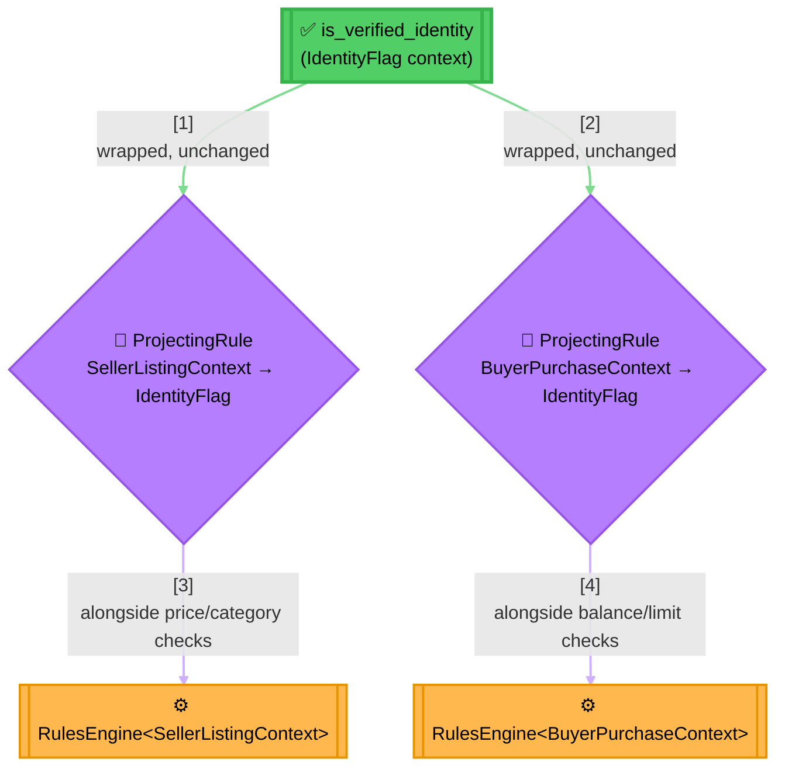
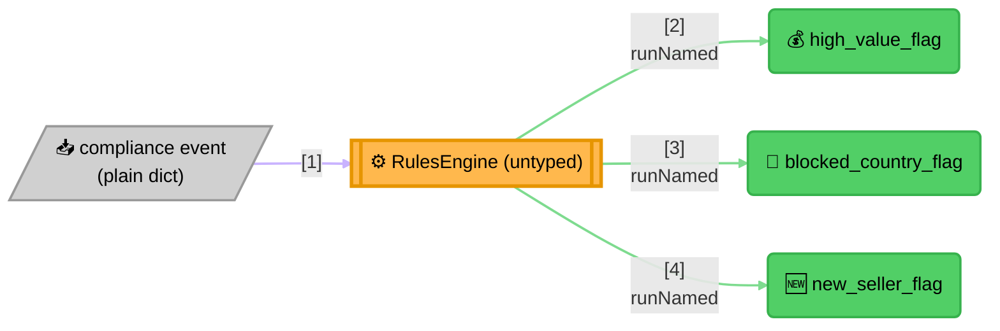

<!-- Title: Marketplace Eligibility Scenario And Fixture Contract -->
# Marketplace eligibility — the scenario and its shared contract

> The single home for the generic-context showcase: the problem, the
> design, and the inputs and expected outcomes every language port must
> reproduce. Where [`graduation_verdict/`](../graduation_verdict/README.md)
> proves the engine survives a port at all, this proves the **generic
> context** design does — a typed `Rule<TContext>`, a dict-context
> `Rule` in the same domain, a `ProjectingRule` adapter reusing one rule
> across two differently-shaped contexts, and both `RulesEngine` forms,
> in one place.

**The question**: does this seller's listing, or this buyer's purchase,
clear the marketplace's eligibility bar — and can a compliance rule set
flag either side's activity without knowing either context's shape?

**The domain**: a generalized two-sided marketplace, structurally
similar to real systems but naming none. Sellers list items, buyers
purchase them, a compliance team flags events for review.

**Why it's a good fit**: the two sides share almost no fields — a
seller's listing carries a price and a category, a buyer's purchase an
amount and a balance — yet both need the *same* identity-verification
check. A generic context expresses that check once and reuses it
against either shape through a small adapter; without one, the check is
duplicated per side or the whole domain falls back to an untyped
context, losing the same-context guarantee a typed composite buys. The
compliance flags then read a third, unrelated shape (a raw event) and
get added independently over time — the heterogeneous,
runtime-string-keyed catalog a *typed* context cannot serve, and where
an untyped `RulesEngine` stays the right tool.

## What the naive approach gets wrong

The obvious first implementation either duplicates the identity check
per side, or gives up on typing the context at all:

```text
function seller_listing_eligible(seller):
    if not seller.verified: return false
    if seller.price_cents < 100: return false
    if seller.category not in ["books", "electronics", "home"]: return false
    return true

function buyer_purchase_eligible(buyer):
    if not buyer.verified: return false   # <-- same check, copied
    if buyer.balance_cents < buyer.amount_cents: return false
    if buyer.amount_cents > 100000: return false
    return true
```

In practice:

- **The identity check is copied, not shared.** A rule change (a new
  verification tier, say) means finding and editing it correctly in
  every function that happens to have copied it — nothing ties the two
  copies together as "the same rule."
- **Or, the alternative naive fix — making everything read an untyped
  dict — throws away the guarantee a typed context was worth having in
  the first place.** A `seller["blance_cents"]` typo (a buyer field,
  wrong side, misspelled) compiles fine and fails silently at runtime,
  the exact class of bug a typed context exists to catch before it
  ships.
- **Compliance flags get bolted onto whichever side's function happens
  to be closest,** rather than living as their own independently
  extensible set — adding a fourth flag later means finding the "right"
  existing function to wedge it into, instead of adding one line to a
  catalog.

## The `verdict` way

One rule, `is_verified_identity`, is written once against a narrow
context that has nothing to do with either side of the marketplace —
and reused via a small projecting adapter at each reuse site:



> **Reading the Diagram**: `is_verified_identity` is constructed exactly
> once. Each `ProjectingRule` wraps that same instance with a different
> projection function — `SellerListingContext -> IdentityFlag` on one
> side, `BuyerPurchaseContext -> IdentityFlag` on the other — so a
> future change to the identity check's own logic only has one
> definition to change, regardless of how many context shapes end up
> reusing it.

The compliance side is a genuinely different shape — not a composite
deciding one verdict, but an open-ended catalog of independent checks
against one heterogeneous event:



> **Why This Stays Dict-Context, Deliberately**: a compliance team adds
> a fourth flag by adding one more rule to the catalog, not by touching
> a shared typed context every existing flag would otherwise need to
> agree on. This is the same reasoning
> [`../../docs/architecture/README.md`](../../docs/architecture/README.md#generic-context)
> gives for why dict-context stays first-class rather than becoming a
> fallback — a heterogeneous, runtime-string-keyed catalog is exactly
> the shape a typed context doesn't fit.

## Files

| File | Contents |
| :-- | :-- |
| `sellers.json` | Four sellers, each carrying the fields a listing-eligibility check reads and an `expected` block. |
| `buyers.json` | Four buyers, each carrying the fields a purchase-eligibility check reads and an `expected` block. |
| `compliance_events.json` | Four heterogeneous compliance events, each carrying an `expected` block of independent flags. |

## What each expectation proves

### `sellers.json` — typed `Rule<SellerListingContext>`, engine mode 1

| Field | Proves |
| :-- | :-- |
| `expected.listing_eligible` | The composite verdict: verified, price floor met, category allowed. |
| `expected.seller_verified` | The `ProjectingRule`-wrapped identity check specifically — isolates *why* a failure happened when more than one rule could explain it. |

**`seller_bob` is unverified but otherwise perfect** — proves the
identity check, not the price or category checks, is what fails him.
**`seller_carla` is verified with a valid category but an
under-floor price** — proves the reused identity rule passing doesn't
mask a different rule failing. **`seller_dan` is verified with a valid
price but a disallowed category** — the third, independent failure
mode, so all three seller-side rules are each proven capable of being
the one that fails.

### `buyers.json` — typed `Rule<BuyerPurchaseContext>`, engine mode 2

| Field | Proves |
| :-- | :-- |
| `expected.purchase_eligible` | The composite verdict: verified, sufficient balance, within the purchase limit. |
| `expected.buyer_verified` | The same `ProjectingRule`-wrapped identity check, reused against a context sharing no fields with `SellerListingContext` — the cross-context reuse this whole fixture exists to prove. |

**`buyer_frank` is unverified but otherwise perfect** — the identity
check fails him, mirroring `seller_bob`. **`buyer_gita` is verified
with an affordable purchase limit but an insufficient balance** —
proves the balance check independently. **`buyer_hank` is verified
with plenty of balance but a purchase over the limit** — the third
independent failure mode.

### `compliance_events.json` — dict-context `Rule`, engine mode 3 (untyped)

A **heterogeneous catalog**, not a composite: three independent checks
that read different, overlapping subsets of one event, run through a
plain, untyped `RulesEngine` because no single typed context would fit
all three naturally in a system where checks are added over time by a
compliance team, not by a type author. Each event's `expected` block
pins all three flags independently — every combination of "flag fires"
and "flag doesn't fire" appears at least once across the four events,
so a port can't accidentally wire one flag's condition to another's.

| Flag | Proves |
| :-- | :-- |
| `expected.high_value_flag` | `amount_cents` alone decides this, regardless of country or seller age. |
| `expected.blocked_country_flag` | `country` alone decides this, regardless of amount or seller age. |
| `expected.new_seller_flag` | `seller_age_days` alone decides this, regardless of amount or country. |

## The rule reused across contexts: `is_verified_identity`

Written once against a narrow `IdentityFlag { verified: bool }`
context, then wrapped in a `ProjectingRule` at each reuse site —
`SellerListingContext -> IdentityFlag` for sellers,
`BuyerPurchaseContext -> IdentityFlag` for buyers. The rule's own logic
never changes; only the projection differs. This is the fixture's
concrete instance of
[`../../docs/extending/reusing-a-rule-across-contexts/README.md`](../../docs/extending/reusing-a-rule-across-contexts/README.md).

## Thresholds (data, not code, in every language's own port)

| Threshold | Value |
| :-- | :-- |
| `price_floor_cents` | 100 |
| `allowed_categories` | `["books", "electronics", "home"]` |
| `purchase_limit_cents` | 100000 |
| `high_value_threshold_cents` | 50000 |
| `blocked_countries` | `["ir", "nk"]` |
| `new_seller_threshold_days` | 30 |

These are pinned here, not hardcoded in any language's implementation —
see the design above for where each
language's own factory function reads them from.

## What is deliberately *not* pinned

- **The `detail` string** on any `RuleResult` — idiomatic phrasing,
  worded naturally per language, the same convention
  [`graduation_verdict`](../graduation_verdict/README.md) already
  establishes.
- **Short-circuit counts.** Unlike `graduation_verdict`, this fixture's
  purpose is proving the generic-context design, not re-proving
  short-circuiting — that guarantee is already pinned exhaustively
  there. `AndRule<TContext>` here still short-circuits (it's the same
  type), but this fixture doesn't additionally assert on how many
  sub-rules ran.
- **An oracle/chaos suite.** `graduation_verdict`'s differential suite
  exists to satisfy Stage 4 ("Prove") of
  [`../../docs/maintenance/adding-a-language.md`](../../docs/maintenance/adding-a-language.md)
  for a *new* language; this fixture's job is narrower (proving
  generics), so a curated suite is sufficient.

## Regenerating

The expectations were **observed from a passing implementation**, never
hand-written. If a deliberate behavioural change makes them stale,
regenerate them from the reference implementation rather than editing
by hand — and treat any unexplained diff as a regression, not a fixture
problem.

## Related

- [`../../docs/extending/reusing-a-rule-across-contexts/`](../../docs/extending/reusing-a-rule-across-contexts/README.md) —
  the `ProjectingRule` pattern this scenario's identity check is a
  full-scale instance of.
- [`../../docs/architecture/README.md`](../../docs/architecture/README.md#generic-context) —
  the generic-context design decisions this scenario exercises together.
