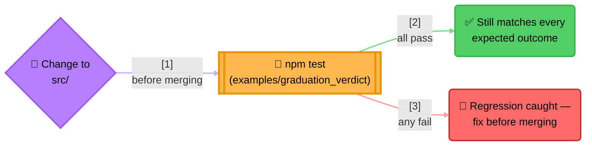
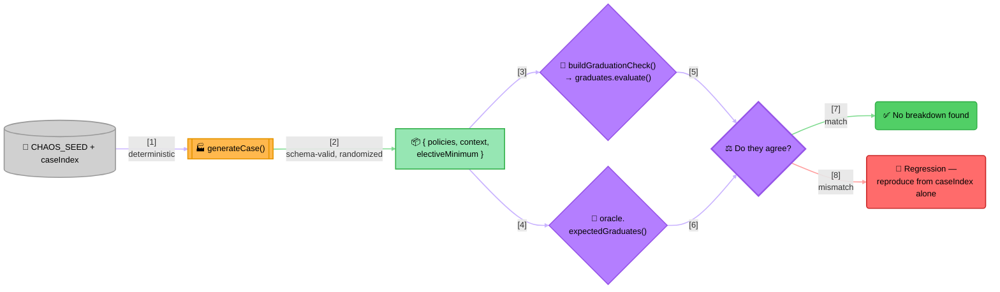

<!-- Title: Graduation Verdict — Testing -->
# Graduation Verdict — Testing

> How this project is tested, and why its five test files each serve a
> different purpose rather than being one bigger suite of the same
> kind. See
> [`fixtures/graduation_verdict/`](../../../../fixtures/graduation_verdict/README.md)
> for why it's built the way it is, and
> [its own extending section](../../../../fixtures/graduation_verdict/README.md#extending-the-curriculum)
> for how to extend the curriculum.

## Five suites, five different jobs

| File | Style | Proves |
| --- | --- | --- |
| `test/graduation-verdict.test.js` | Curated scenarios | Each subject type builds the right `Rule` shape; `runNamed`/`runGroup`/`runAll` each behave as documented; all 8 hand-picked, hand-verified students get exactly the verdict their own `expected` block says. |
| `test/chaos.test.js` | Differential/property-based | The real engine agrees with an independent oracle across 500 deterministically-generated, schema-valid random curricula and students -- a much wider space than anyone would hand-curate. |
| `test/invariants.test.js` | Structural, property-based | Every one of those same 500 cases' *result tree* -- not just its final boolean -- has the short-circuit shape AndRule/OrRule/AtLeastNRule each promise, at every nesting level; `runAll` reports exactly one result per registered rule; evaluating the same inputs twice is byte-for-byte reproducible. See [below](#structural-invariants-on-the-result-tree). |
| `test/fuzz-curriculum.test.js` | Fuzzing | `curriculumFromObject`/`loadCurriculum` never crash in an unrelated way, and never silently return a wrong-but-plausible policy list, across 170 deliberately malformed curriculum shapes and JSON texts. See [below](#fuzzing-the-curriculum-reader). |
| `test/shrink.test.js` | Unit tests of a debugging tool | `shrink.js`'s own simplification algorithm -- converges to a local minimum, stops exactly when a candidate would stop reproducing, never overshoots. See [below](#failing-run-to-fixture-shrinking). |

`npm test --workspace=@verdict-rules/example-graduation-verdict` runs
all five (1765 tests -- 84 curated scenarios, 500 chaos cases, 1006
structural cases, 170 fuzz cases, 5 shrinker unit tests). Also picked up
by the workspace root's own `npm test`, alongside `verdict-rules`' own
147-test core suite and the sibling `marketplace_eligibility` example's
33, no extra configuration needed.

## Why this project is a regression net for verdict-rules itself, not just a sample

This project isn't only a sample -- because its test suite exercises
`FunctionRule`, `AndRule`, `OrRule`, a custom `Rule` shape
(`AtLeastNRule`), and all three `RulesEngine` run modes *together*,
against real, varied data, it functions as an integration/e2e test for
verdict-rules itself. It's a different, complementary kind of coverage
from verdict-rules' own `test/`:

- verdict-rules' own `test/rule.test.js`/`test/engine.test.js` prove
  narrow, unit-level contracts in isolation -- short-circuit behavior,
  vacuous-truth polarity -- each against minimal fixtures built just to
  exercise that one contract. See verdict-rules' own
  [`testing/`](../../../../docs/testing/README.md) for the full reasoning.
- This project proves those same primitives compose correctly *together*,
  the way a real consumer's code actually uses them -- heterogeneous
  rule shapes built from external data, `Rule` objects shared between
  an engine and a separate composite, a custom rule type nested inside
  a built-in one. A regression that breaks some *interaction* between
  primitives, rather than one primitive's own contract, is exactly the
  class of bug the core suite's narrow, isolated fixtures are least
  likely to catch -- and exactly what this project's broader, realistic
  scenario is positioned to catch instead.



> **Reading the Diagram**: `npm test --workspace=@verdict-rules/example-graduation-verdict`
> (or the whole workspace's own `npm test`, which picks up this project
> alongside `verdict-rules`' own tests with no extra configuration) is
> the concrete action -- run it after any change to
> `packages/verdict-rules/src/`, not just a change to this project.

## The chaos suite: differential testing against an independent oracle

`test/graduation-verdict.test.js` proves 8 hand-picked, hand-verified
scenarios come out right. `test/chaos.test.js` checks a much wider
space, using a different technique than fixture matching: **differential
testing** against `oracle.js`, a second, deliberately dumb,
verdict-rules-free re-implementation of the same decision (the "naive
way" from
[the scenario spec](../../../../fixtures/graduation_verdict/README.md#what-the-naive-approach-gets-wrong),
generalized to score *any* policy list). If the real engine and the
oracle ever disagree on a generated case, one of them is wrong -- that
disagreement is the signal, not a fixed expected value.



> **Why This Needs Two Implementations, Not One Plus Assertions**: for
> the 8 curated students, "what should happen" was known before the
> data was written, so asserting against `expected` works. For 500
> randomly-generated curricula, nobody hand-computed the right answer
> for each one -- there's nothing to assert against *except* a second,
> independent computation. `oracle.js` is that second computation: a
> plain loop with ordinary `if`/`&&`/`||`, no `Rule` objects anywhere,
> so it can't share a bug with the thing it's checking. Its only job is
> to be obviously correct by reading it, not to be elegant.
>
> **Determinism is the entire point, not an implementation detail**:
> `Math.random()` cannot be seeded, so `rng.js` implements a small,
> explicit generator (`Rng`) that every `chaos-data.js` function takes
> as an argument -- never an ambient source. `test/chaos.test.js` seeds
> one per case as `new Rng(CHAOS_SEED + caseIndex)`. "The chaos suite
> passed" is therefore a real, re-checkable claim on every future run,
> and any single failure reproduces on its own from just its
> `caseIndex`, with nothing to replay first. `CHAOS_SEED` is pinned
> deliberately -- bumping it reshuffles every case's data, which trades
> away coverage rather than adding to it; raise `NUM_CASES` instead to
> test more.

## Structural invariants on the result tree

`test/chaos.test.js` only ever checks the final boolean verdict against
the oracle. `test/invariants.test.js` reuses the exact same
`CHAOS_SEED`-derived cases (via `chaos-data.js`'s `generateCase`, never a
second generator) to check something the oracle can't: the *shape* of the
result tree `graduates.evaluate(context)` produces.

It rebuilds the same `Rule` tree `buildGraduationCheck` builds, using
only exported, pure constructors (`ruleForSubject`,
`vocationalChildRules`/`languageChildRules`, `AtLeastNRule`, and
verdict-rules' own `AndRule`/`OrRule`/`FunctionRule`) rather than reaching
into an `AndRule`/`OrRule`'s own private fields, which aren't
introspectable from outside the class. Because every `Rule` in this
package is a pure function of its context, this "shadow tree" evaluated
against the same context is guaranteed to reproduce the identical result
tree the real one did -- which is also exactly what the suite's own
purity check (below) independently confirms.

A recursive checker then walks a `(rule, result)` pair together, keyed by
the rule's own concrete type -- a lookup table, not an if/else-if ladder:

- **`AndRule`**: failed means every entry in `result.subResults` passed
  except the last, which failed (short-circuited at exactly the first
  failure); passed means every entry passed (nothing skipped).
- **`OrRule`**: the mirror image -- passed means every entry failed except
  the last, which passed; failed means every entry failed (an all-fail
  result proves nothing stopped early, since `OrRule` only stops on a
  pass).
- **`AtLeastNRule`**: composes `SequentialEvaluator` directly and
  short-circuits once its own minimum is mathematically decided either
  way -- `result.subResults` holds exactly the sub-rules actually
  evaluated before that point, not necessarily every sub-rule the rule
  was given.
- **`FunctionRule`**: a leaf -- `result.subResults` is always empty, and
  nothing recurses further.

The recursion reaches every nesting level this tree actually has: from
`graduates` down into `all_core_subjects_pass`/`elective_requirement`,
and from there into each subject's own rule -- including the nested
`AndRule`/`OrRule` `rule_for_subject` builds for vocational/language
subjects, not just `graduates`' own immediate four children. (It stops
there rather than one level deeper, into a vocational subject's own
written/practical pair, only because there's nothing deeper in this tree
to check -- those two are `FunctionRule` leaves by construction, which
the checker also confirms structurally.)

The same suite separately checks two more things against the same cases:

- **`runAll` reports exactly one result per registered rule** --
  `engine.runAll(context).results.length === policies.length`, a
  structural count, independent of any verdict.
- **Purity** -- evaluating the same `(policies, context,
  electiveMinimum)` twice, via two separate `buildGraduationCheck` calls,
  produces two result trees that are identical in every field, recursively
  (`assert.deepStrictEqual`, not just a matching top-level `passed`).
  Checked against a handful of the existing 500 cases, not a new sample.

## Fuzzing the curriculum reader

`test/fuzz-curriculum.test.js` feeds `curriculumFromObject` (and, for the
JSON-text-decoding path specifically, `loadCurriculum`) 170 deliberately
malformed variants of policies.json's shape, built from a seeded `Rng`
the same way every other generator in this project is. Every malformed
curriculum starts from a schema-valid one (`chaos-data.js`'s own
`randomPolicy`, reused rather than reimplemented), then has exactly one
corruption applied, chosen from a table: a required key dropped, a field
holding a value of the wrong type, an unexpected key added, a row that's
`null` or not an object at all, `subjects` that isn't an array, an empty
`subjects` array, or (fed through `loadCurriculum` instead, to reach the
JSON-decode path) truncated or otherwise corrupted JSON text.

The only acceptable outcomes: the reader parses the malformed input into
a genuinely well-shaped policy list (not just "returns an array" -- every
policy must still carry the three fields this module has no default
for), or it raises `TypeError` (`loadCurriculum` also accepts
`SyntaxError`, for invalid JSON text). Never an unrelated crash, and
never a silent, wrong-but-plausible policy list.

The silently-wrong outcome is the one fuzzing is here to catch, and it
is what a reader that only indexes into whatever it is handed produces:
a subject row that is a bare string or number yields a policy with every
field `undefined` rather than an error, and so does a row missing
`subject_id`, `subject_type`, or `written_min_pct`. So
`curriculumFromObject` validates exactly the shape it depends on -- that
`curriculum` and each row are plain objects, that `subjects` is an array,
and that every field this module's own `subjectPolicy` has no default for
is present -- raising a `TypeError` with a clear message instead of
either an accidental, confusingly-worded `TypeError` from deep inside
unguarded property access, or silence. It deliberately does not check
field *types* (a string where a number was expected, say) or validate
that `subject_type` names a known type: this reader is not a
general-purpose JSON schema validator, and fuzzing finds no crash
anywhere in that territory.

## Failing-run-to-fixture shrinking

`shrink.js` ships a small, general shrinking helper,
`shrinkFailingCase(failingCase, stillFails)`: given a `{ policies,
context, electiveMinimum }` case that fails some check, and a predicate
that re-runs that same check, it tries progressively simpler variants --
removing one subject at a time, lowering the elective threshold, rounding
numeric fields toward 0 -- keeping the first simplification that still
reproduces the failure and restarting from there, until no single-step
simplification reproduces it anymore. `writeShrunkFixture` then writes
the result out as a standalone, human-readable JSON file -- a per-language
debugging aid, never a shared cross-language fixture under
`fixtures/graduation_verdict/`.

`test/shrink.test.js` proves the algorithm itself converges correctly
using synthetic predicates (a tautological "always fails", a threshold
that should stop the shrinker at a specific subject count, and so on) --
it does not depend on any real or injected engine bug, since nothing in
this example's real engine is broken.

### Verifying the shrinker

Because the engine is correct, there is no real failing case to shrink,
so the mechanism is validated against a deliberately injected bug
instead. The injection lives in a scratch script, never in a tracked
file -- it wraps (never edits) `buildGraduationCheck`'s real
`evaluate()` with one wrong context override, forcing
`attendancePct`/`attendanceFloor` so the attendance check can never
fail, regardless of the student's real attendance. Scanning the same 500
`CHAOS_SEED`-derived cases `test/chaos.test.js` uses finds the first
disagreement with `oracle.js` at case 147, a 7-subject curriculum, and
`shrinkFailingCase` reduces it from 7 subjects down to 0: an empty
curriculum with `attendancePct: 0`, `attendanceFloor: 1`, where the real
engine correctly fails attendance and the bugged one doesn't.
`writeShrunkFixture` then writes that case out, and the script
re-checks it still reproduces the disagreement before reporting success.

That the shrinker converges on exactly the `attendancePct`/
`attendanceFloor` pair the injected bug is blind to, with every other
field simplified away, is the evidence that it finds the relevant
difference rather than an arbitrary smaller case. Nothing from the
injection runs as part of the shipped suite.

## Running the tests

```bash
# From js/
npm test --workspace=@verdict-rules/example-graduation-verdict
```

## Related

- [`fixtures/graduation_verdict/`](../../../../fixtures/graduation_verdict/README.md) --
  the language-agnostic spec, why it's built the way it is.
- [`fixtures/graduation_verdict/` -- extending the curriculum](../../../../fixtures/graduation_verdict/README.md#extending-the-curriculum) --
  how to add a subject, a student scenario, or a new subject type, on top
  of the shared cross-language fixture contract.
- [`../README.md`](../README.md) -- how to run the demo.
- [`../../../../docs/maintenance/`](../../../../docs/maintenance/README.md) --
  verdict-rules' own maintenance guide, whose consumer-impact checklist
  points back here.
- [`../../../../docs/testing/`](../../../../docs/testing/README.md) -- verdict-rules'
  own testing guide, which this project complements rather than
  duplicates.
