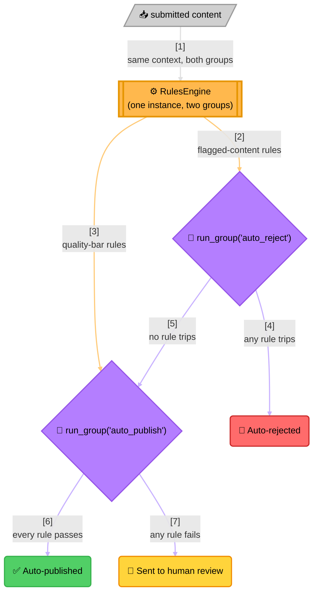

<!-- Title: Sample — Content Moderation Routing -->
# Sample: Content Moderation Routing

> **The question**: should this piece of user-submitted content be
> auto-published, sent to human review, or auto-rejected? **Why it's a
> good fit**: this isn't one yes/no decision, it's two independent
> decisions sharing a common set of facts about the same content — "does
> it trip any auto-reject rule?" and, separately, "does it clear every
> auto-publish rule?" — evaluated against the same context but drawing
> from two different named subsets of one rule collection. That's exactly
> what `RulesEngine.run_group()` is for: partitioning one engine's rules
> into named groups without standing up two separate engines.

## The naive way (and why it breaks down)

The obvious first implementation is one function with an `if`/`if`
ladder, one line per signal:

```python
async def route_submission(content: dict) -> str:
    if content["has_banned_terms"] or content["spam_score"] >= content["spam_threshold"]:
        return "auto_rejected"
    if content["length"] >= content["min_length"] and content["author_post_count"] >= 10:
        return "auto_published"
    return "sent_to_review"
```

This is readable at four signals. It stops being readable well before
it stops being *used*:

- **"Reject" and "publish" signals are distinguished only by which side
  of which `if` they're written on.** There's no list anywhere of
  "every currently-active reject rule" for a moderation dashboard or an
  audit — that list only exists by reading this function's source.
- **Every new signal is a code change and a full re-test of the whole
  ladder.** A new spam heuristic added by the trust & safety team means
  editing application code and re-verifying every existing branch still
  behaves the same way, even though only one signal actually changed.
- **There's no partial picture.** `or`/`and` short-circuit the same way
  here as anywhere else in Python — a submission that trips the *first*
  reject condition never reveals whether it would have tripped the
  second one too, which a reviewer auditing "why was this rejected"
  might actually want to know.

## The verdict way



> **Reading the Diagram**:
> 1. **One engine, two groups** — every rule is registered once, tagged
>    with a `group` of either `"auto_reject"` or `"auto_publish"`; the
>    engine itself doesn't distinguish the groups beyond that label.
> 2. **`run_group()` never short-circuits** — like `run_all()`, it
>    evaluates every rule in the requested group unconditionally, which
>    is what makes it possible to know "every reject rule that *would*
>    have tripped," not just the first one, useful for moderation
>    tooling that shows a reviewer everything flagged, not just one hit.
> 3. **The reject check gates whether the publish check even runs** —
>    that branching decision is the caller's own logic, sitting outside
>    `verdict` entirely; the engine only answers "did this named group of
>    rules pass," the caller decides what a pass/fail combination means.

## The code

```python
from verdict import FunctionRule, RulesEngine, RuleResult


async def contains_banned_terms(context: dict) -> RuleResult:
    hit = any(term in context["text"].lower() for term in context["banned_terms"])
    return RuleResult(rule_name="contains_banned_terms", passed=not hit)


async def flagged_by_spam_score(context: dict) -> RuleResult:
    return RuleResult(rule_name="flagged_by_spam_score", passed=context["spam_score"] < context["spam_threshold"])


async def meets_length_minimum(context: dict) -> RuleResult:
    return RuleResult(rule_name="meets_length_minimum", passed=len(context["text"]) >= context["min_length"])


async def author_is_established(context: dict) -> RuleResult:
    return RuleResult(rule_name="author_is_established", passed=context["author_post_count"] >= 10)


engine = RulesEngine([
    FunctionRule("contains_banned_terms", contains_banned_terms, group="auto_reject"),
    FunctionRule("flagged_by_spam_score", flagged_by_spam_score, group="auto_reject"),
    FunctionRule("meets_length_minimum", meets_length_minimum, group="auto_publish"),
    FunctionRule("author_is_established", author_is_established, group="auto_publish"),
])


async def route_submission(context: dict) -> str:
    reject_check = await engine.run_group("auto_reject", context)
    if not reject_check.passed:
        return "auto_rejected"

    publish_check = await engine.run_group("auto_publish", context)
    return "auto_published" if publish_check.passed else "sent_to_review"
```

## Related

- [`loyalty-tier-promotion.md`](4_loyalty-tier-promotion.md) — the
  `run_all()` counterpart, for a single engine's every rule rather than
  a named subset.
- [`../architecture.md`](../../../docs/architecture.md#three-ways-to-run-rules-and-when-each-is-the-right-one) —
  the full comparison of all three `RulesEngine` run modes.
