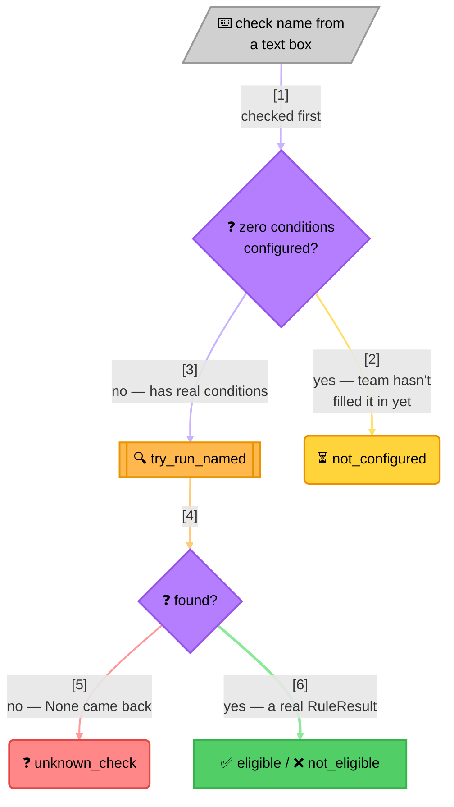

<!-- Title: Sample — Admin Eligibility Lookup -->
# Sample: Admin Eligibility Lookup

> **The question**: a support screen lets an agent type a check name and
> run it against one customer, to answer "why didn't this customer
> qualify?" **Why it's a good fit**: a typo in that text box and a check
> the team hasn't finished configuring yet are two completely different
> facts, but both are "absence-shaped" — neither one is a real verdict
> about the customer — and it's easy to accidentally collapse both, and a
> genuine rejection, into the same "not eligible" the screen shows. That
> collapse is exactly what `try_run_named` and vacuous-truth polarity, used
> together and *distinguished* from each other, exist to prevent.

## The naive way (and why it breaks down)

Before reaching for a rule engine at all, the obvious first
implementation is a plain dict of configured checks and a lookup
function — no `verdict` in sight yet:

```python
ELIGIBILITY_CHECKS = {
    "gold_tier": [("spend", 1000)],
    "beta_feature": [],  # not filled in yet
}


async def check_eligibility(check_name: str, customer: dict) -> bool:
    try:
        conditions = ELIGIBILITY_CHECKS[check_name]
    except KeyError:
        return False  # "not eligible" either way

    return all(customer.get(field) == expected for field, expected in conditions)
```

This looks complete, and it stops the page from 500ing on a typo, which
is real progress — but:

- **A typo and a genuine rejection now render identically.** The support
  agent asked "why didn't this customer qualify," and for a mistyped
  check name, the honest answer is "you typed the wrong name," not "the
  customer failed a real condition." Collapsing the two into one `False`
  answers a different question than the one that was asked.
- **A check with no conditions configured yet passes silently, and this
  bug is already here, not something a rule engine introduces.**
  `all()` over an empty iterable is `True` — Python's own vacuous truth,
  the same identity `AndRule([])` will turn out to have — so
  `check_eligibility("beta_feature", ...)` above returns `True` right
  now, today, before `verdict` enters the picture at all. A check the
  team is still building shows as "eligible," indistinguishable from a
  real, considered pass.
- **Two different problems, one bug report.** The first support ticket
  about either of these looks identical from the outside — "the checker
  said eligible/not eligible and that was wrong" — and nothing about the
  boolean the screen renders points at which absence-shaped situation
  actually happened.

## The verdict way

Both bugs above already existed before `verdict` was involved — a rule
engine doesn't introduce the "typo collapses into a rejection" or
"empty means pass" problems, it just gives them names and a documented,
deliberate answer instead of an accidental one. Two decisions, made once,
rather than left to whatever the engine happens to do by default: an
unknown check name uses `try_run_named` and gets its own status, and a
check with zero configured conditions is detected and given a *different*
status — neither one ever
renders as a real `eligible`/`not_eligible` verdict.



> **Reading the branches**: the top path is checked first and needs no
> engine lookup at all — a check known to have zero conditions is caught
> before `try_run_named` ever runs. Everything below it is a real lookup,
> and `None` versus a real `RuleResult` is the only distinction that
> decides "unknown" from "genuinely evaluated." Three of these four
> outcomes are absence-shaped in one way or another; only one is an
> actual verdict about the customer.

## The code

```python
from __future__ import annotations

from dataclasses import dataclass
from typing import Literal

from verdict import AndRule, FunctionRule, Rule, RuleResult, RulesEngine

# "eligible"/"not_eligible" come from a check that exists and actually ran.
# "unknown_check" and "not_configured" are both absence-shaped, and kept
# distinct from each other and from a genuine verdict so a support agent
# never mistakes "we don't know" for "we checked and the answer is no".
CheckStatus = Literal["eligible", "not_eligible", "unknown_check", "not_configured"]


@dataclass(frozen=True)
class LookupResult:
    status: CheckStatus
    detail: str


def _condition_predicate(field: str, expected: object):
    async def predicate(context: dict) -> RuleResult:
        actual = context.get(field)
        return RuleResult(
            rule_name=field,
            passed=actual == expected,
            detail=f"{field}={actual!r}, needs {expected!r}",
        )

    return predicate


def _build_check(name: str, conditions: list[dict]) -> tuple[Rule, bool]:
    """One configured check, plus whether it currently has zero conditions.

    An empty ``conditions`` list still produces a valid `AndRule` — it
    just vacuously passes if ever evaluated directly. `EligibilityLookup`
    intercepts that case before evaluation (see `check` below), so the
    vacuous pass never reaches the caller as a real "eligible".
    """
    condition_rules = [
        FunctionRule(f"{name}[{i}]", _condition_predicate(c["field"], c["expected"]))
        for i, c in enumerate(conditions)
    ]
    return AndRule(name, condition_rules), len(conditions) == 0


class EligibilityLookup:
    """Looks up one named eligibility check by name, typed fresh each time.

    `configured_checks` mirrors whatever an admin settings screen already
    holds: one entry per check, each a list of condition dicts. A check
    with an empty list is a real, valid state a row can be in while a
    team is still filling it in — not an error.
    """

    def __init__(self, configured_checks: dict[str, list[dict]]) -> None:
        rules: list[Rule] = []
        self._unconfigured: set[str] = set()
        for name, conditions in configured_checks.items():
            rule, is_empty = _build_check(name, conditions)
            rules.append(rule)
            if is_empty:
                self._unconfigured.add(name)
        self._engine = RulesEngine(rules)

    async def check(self, name: str, customer: dict) -> LookupResult:
        """Look up and run one named check. Never raises on a bad `name` —
        that is the entire point of this class existing between the raw
        engine and the screen that renders its result."""
        if name in self._unconfigured:
            return LookupResult("not_configured", f"'{name}' has no conditions configured yet")

        result = await self._engine.try_run_named(name, customer)
        if result is None:
            return LookupResult("unknown_check", f"no eligibility check named '{name}' exists")

        return LookupResult("eligible" if result.passed else "not_eligible", result.detail)
```

Run against a small configuration — one real check, one the team hasn't
finished, and one lookup with a typo:

```python
lookup = EligibilityLookup({
    "gold_tier": [{"field": "spend", "expected": 1000}],
    "beta_feature": [],  # not filled in yet
})

await lookup.check("gold_tier", {"spend": 1000})
# LookupResult(status='eligible', detail='')

await lookup.check("gold_tier", {"spend": 5})
# LookupResult(status='not_eligible', detail="'gold_tier[0]' failed: spend=5, needs 1000")

await lookup.check("beta_feature", {"spend": 1000})
# LookupResult(status='not_configured', detail="'beta_feature' has no conditions configured yet")

await lookup.check("gold_teir", {"spend": 1000})  # typo
# LookupResult(status='unknown_check', detail="no eligibility check named 'gold_teir' exists")
```

The screen can still show "not eligible" for the last two — the page
keeps working, exactly as the naive version intended — but `status` is
what tells a support agent *which* of the four things actually happened,
rather than one boolean standing in for all of them.

### Why not just wrap `run_named` in a `try`/`except KeyError`?

`try_run_named` and `run_named` share one lookup path — the strict form
is a two-line assertion on top of the lenient one, not a second
implementation. Reaching for `try_run_named` directly says "absence is
expected here and I have an answer for it," which is true on this
screen; wrapping the strict form in `try`/`except` says the same thing
by accident, and reads as "I expect this to raise and I'm suppressing
it" to the next person editing this file. The behavior is identical
either way — the difference is only which one tells the truth about why.

### Why `not_configured` is checked before the engine ever runs

An alternative would be to just not build a rule for an empty check, and
let it fall into the same `unknown_check` bucket a typo does — one
`try_run_named` call handles everything. That was deliberately rejected:
"this check exists but isn't ready" and "this check doesn't exist at
all" are different facts a support agent would act on differently — the
first is a product gap to chase the team about, the second is almost
always a spelling mistake — so they earn their own status rather than
being merged for convenience.

## Related

- [`../extension.md`](../../../docs/extension.md#recipe-6--decide-for-yourself-what-a-missing-rule-set-means) —
  the general absence-vs-emptiness guidance this sample is one concrete
  instance of.
- [`data-driven-rule-sets.md`](6_data-driven-rule-sets.md) — building the
  `Rule` objects themselves from stored configuration, the same pattern
  `EligibilityLookup` uses to turn each check's conditions into an
  `AndRule`.
