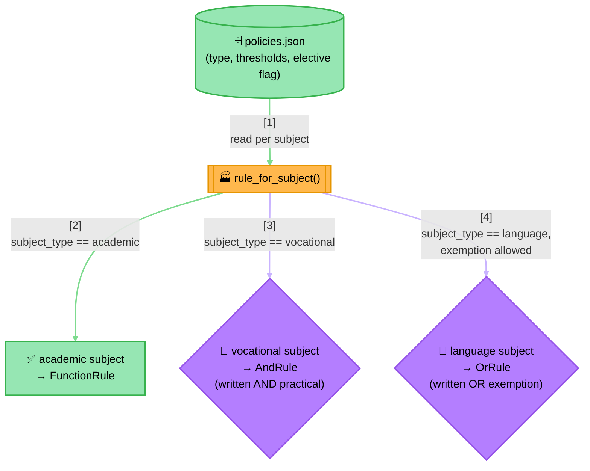
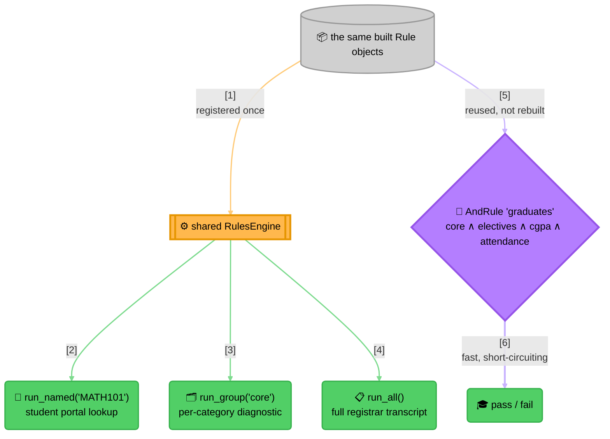

<!-- Title: Graduation Verdict — Architecture -->
# Graduation Verdict — Architecture

> Why this project is built the way it is — the naive alternative it
> replaces, and the two design decisions (heterogeneous rule shapes
> from one factory, and reusing the same rule objects in two different
> structures) that make it exercise the full breadth of `verdict` at
> once. See [`../README.md`](../README.md) for how to run it and
> [`maintenance.md`](maintenance.md) for how to extend it.

## The naive way (and why it breaks down)

The obvious first implementation is one large function mixing every
subject's own pass condition, the elective count, and the overall
floors:

```python
async def can_graduate(scores: dict, cgpa: float, attendance_pct: float) -> bool:
    if scores["MATH101"]["written_pct"] < 40:
        return False
    if scores["ENG101"]["written_pct"] < 40:
        return False
    if scores["WORKSHOP201"]["written_pct"] < 40 or scores["WORKSHOP201"]["practical_pct"] < 60:
        return False
    if scores["FRENCH101"]["written_pct"] < 40 and not scores["FRENCH101"].get("has_exemption"):
        return False

    elective_ids = ["ELECTIVE_ART", "ELECTIVE_MUSIC", "ELECTIVE_CS"]
    passed_electives = sum(1 for e in elective_ids if scores[e]["written_pct"] >= 40)
    if passed_electives < 2:
        return False

    if cgpa < 6.0:
        return False
    if attendance_pct < 75:
        return False

    return True
```

This tracks a real curriculum for exactly as long as the curriculum
never changes shape. In practice:

- **Every subject is a hand-copied `if`, in whichever shape its type
  happens to need.** Adding a new vocational subject means remembering
  to write the two-threshold `or` pattern correctly by hand, in a
  function that also contains a language subject's completely different
  `and`-with-exemption pattern a few lines above it — nothing stops the
  two shapes from getting silently swapped during a future edit.
- **The elective list and its "how many" threshold are both hard-coded,
  separately from which subjects are even electives.** Moving a subject
  from elective to core, or raising the requirement from 2-of-3 to
  3-of-4, means finding and editing this exact function correctly —
  there's no single place that says "these are this year's electives."
- **The function only ever answers yes or no.** A student asking "did I
  pass Physics," or a registrar needing every subject's own pass/fail
  for a transcript, gets nothing from this function — both would need
  their own, separately-maintained re-derivation of the same logic.

## The verdict way

Each subject's *policy* — its type, its thresholds, whether it's an
elective — comes from `policies.json`; the `Rule` *shape* each policy
turns into is decided once, by type, in one factory function
(`rule_for_subject` in `graduation_verdict.py`):



> **Reading the Diagram**: three genuinely different `Rule` shapes come
> out of one factory function reading one uniform row shape — nothing
> about `AndRule`/`OrRule`/`FunctionRule` needs to know *why* a
> particular subject picked its shape, and adding a fourth subject
> *type* later (say, a portfolio-reviewed elective) means one more
> branch in `rule_for_subject`, not a new concept anywhere else.

The built rules then serve **two separate purposes from the same
objects** — a diagnostic engine for lookups and reports, and a fast
composite for the actual pass/fail decision:



> **Why Two Structures, Not One**:
> 1. **`run_named`/`run_group`/`run_all` exist to answer questions about
>    individual subjects** — "did I pass X," "how did I do on my core
>    subjects," "give me the full transcript." None of them decide
>    graduation; all of them are read-only lookups a portal or a
>    registrar screen calls directly.
> 2. **`graduates` decides graduation, as cheaply as possible** — a
>    fresh `AndRule` (itself holding a nested `AndRule` for the core
>    subjects and a custom `AtLeastNRule` for electives, alongside the
>    CGPA/attendance checks) built from the *same* rule objects the
>    engine already holds. Nothing is re-evaluated to build it, and
>    nothing about it is retained between calls — see verdict's own
>    [`architecture.md`](../../../../docs/architecture.md#type-structure)
>    for why a `Rule` instance's lifecycle isn't owned by any one
>    structure that references it.
> 3. **The elective requirement is neither `AndRule` nor `OrRule`** —
>    "at least 2 of 3" is exactly verdict's
>    [`extension.md`](../../../../docs/extension.md#recipe-2--a-genuinely-new-rule-shape)
>    Recipe 2 (`ThresholdRule`), named `AtLeastNRule` here and used for
>    something a real curriculum actually needs, not a toy count.

## Where this lives in the code

| Diagram node | `graduation_verdict.py` |
|---|---|
| `policies.json` → `rule_for_subject()` | `load_curriculum()`, `rule_for_subject()` |
| The three `Rule` shapes | `_written_rule()`, `_practical_rule()`, `_exemption_rule()` compose into whichever shape `rule_for_subject()` returns |
| The custom `AtLeastNRule` | `AtLeastNRule` |
| `RulesEngine` + `graduates` built once | `build_graduation_check()` |
| The demo's two halves | `_demo()` (the detailed `alice` walkthrough, then the batch loop) |

See [`testing.md`](testing.md#the-chaos-suite-differential-testing-against-an-independent-oracle)
for `oracle.py` and `chaos_data.py` — a second implementation and a
deterministic case generator that don't appear in this diagram at all,
since they exist to *check* this design against a much wider space of
inputs, not to be part of it.

## Related

- [`../README.md`](../README.md) — how to run this project.
- [`maintenance.md`](maintenance.md) — how to extend it.
- [`testing.md`](testing.md) — how it's tested, and why it also serves
  as a regression net for `verdict` itself.
- [`../../../docs/samples/7_graduation-requirement-verdict.md`](../../../packages/verdict-rules/docs/samples/7_graduation-requirement-verdict.md) —
  the original framing question this project answers.
