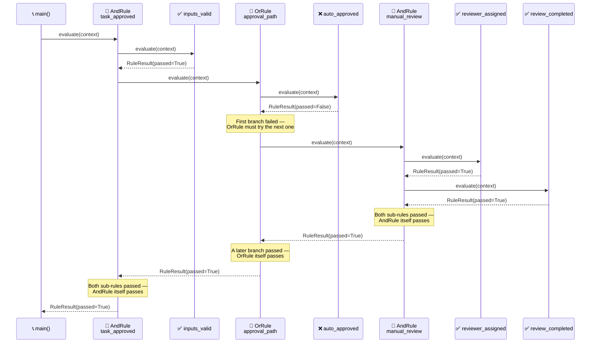

<!-- Title: Verdict Quickstart -->
# Verdict — Quickstart

> The five names you need, and one complete example using all of them.
> See [`../README.md`](../README.md) for this package's own
> pip-install/first-rule quickstart, the top-level
> [`../../README.md`](../../../../README.md) for what Verdict is in narrative
> form, and [`../../docs/architecture/`](../../../../docs/architecture/README.md)
> for the full design reasoning — this doc is just "how do I start."

## Core concepts

- **`Rule`** — anything with a `name`, an optional `group`, and an
  `async evaluate(context: dict) -> RuleResult` method. The structural
  `Protocol` any custom rule implementation can satisfy without
  inheriting from anything.
- **`FunctionRule`** — wraps a plain async predicate as a `Rule`. The
  common case: most rules are "run this function against the context."
- **`AndRule`** / **`OrRule`** — composite rules that combine other
  rules, short-circuiting the same way a boolean `and`/`or` expression
  would (`AndRule` stops at the first failure, `OrRule` stops at the
  first pass).
- **`RulesEngine`** — holds a set of rules and runs them three ways:
  `run_all` (every rule, full diagnostic picture — deliberately does
  **not** short-circuit), `run_named` (one specific rule by name),
  `run_group` (every rule sharing a group label). An unknown name or
  label raises; `try_run_named`/`try_run_group` return `None` instead,
  for callers whose own domain has an answer for absence — see
  [`extending/absence-vs-failure/`](../../../../docs/extending/absence-vs-failure/README.md).
- **`RuleResult`** / **`RunResult`** — plain, immutable outcome types.
  `RuleResult.data` is a fully opaque slot for a caller's own domain
  object to ride through evaluation — Verdict never reads or depends on
  its shape.

## One complete example

Composites nest arbitrarily deep — an `AndRule` can hold an `OrRule`,
which can hold another `AndRule`, and so on. The same leaf checks below
also get registered on a `RulesEngine` under one shared group label, so
`run_group` can report on all four regardless of whether the nested
decision above ever looked at each one:

```python
import asyncio
from verdict import AndRule, OrRule, FunctionRule, RuleResult, RulesEngine


async def inputs_valid(context: dict) -> RuleResult:
    return RuleResult(rule_name="inputs_valid", passed=context["has_required_fields"])


async def auto_approved(context: dict) -> RuleResult:
    return RuleResult(rule_name="auto_approved", passed=context["auto_approved"])


async def reviewer_assigned(context: dict) -> RuleResult:
    return RuleResult(rule_name="reviewer_assigned", passed=context["reviewer_assigned"])


async def review_completed(context: dict) -> RuleResult:
    return RuleResult(rule_name="review_completed", passed=context["review_completed"])


async def main() -> None:
    task_approved = AndRule(
        "task_approved",
        [
            FunctionRule("inputs_valid", inputs_valid),
            OrRule(
                "approval_path",
                [
                    FunctionRule("auto_approved", auto_approved),
                    AndRule(
                        "manual_review",
                        [
                            FunctionRule("reviewer_assigned", reviewer_assigned),
                            FunctionRule("review_completed", review_completed),
                        ],
                    ),
                ],
            ),
        ],
    )

    passing = {
        "has_required_fields": True,
        "auto_approved": False,
        "reviewer_assigned": True,
        "review_completed": True,
    }
    result = await task_approved.evaluate(passing)
    print(result.passed)  # True — auto_approved failed, but manual review covered it

    failing = {**passing, "review_completed": False}
    result = await task_approved.evaluate(failing)
    print(result.passed)  # False — neither approval path succeeded

    # The same four leaf checks, registered flat under one group for a full
    # diagnostic view — run_group never short-circuits, so every check
    # reports regardless of whether the nested decision above stopped early.
    engine = RulesEngine([
        FunctionRule("inputs_valid", inputs_valid, group="approval_checks"),
        FunctionRule("auto_approved", auto_approved, group="approval_checks"),
        FunctionRule("reviewer_assigned", reviewer_assigned, group="approval_checks"),
        FunctionRule("review_completed", review_completed, group="approval_checks"),
    ])
    diagnostic = await engine.run_group("approval_checks", passing)
    print([r.passed for r in diagnostic.results])
    # [True, False, True, True] — auto_approved's own failure is visible here,
    # even though the nested decision above never had to look at it once the
    # manual-review branch already succeeded


asyncio.run(main())
```



> **Reading the Sequence**:
>
> 1. **`inputs_valid` passes first** — a plain leaf check, no nesting
>    involved yet.
> 2. **`approval_path`'s first branch fails** — `auto_approved` is
>    `False`, so the `OrRule` has no choice but to try its next branch;
>    an `OrRule` only stops early once *something* passes, never on a
>    failure.
> 3. **`manual_review`, itself an `AndRule`, runs both its own checks**
>    and passes — this is the nesting: `approval_path`'s second branch
>    is a whole composite, not a leaf.
> 4. **Every result folds upward** — `manual_review`'s pass makes
>    `approval_path` pass, which makes `task_approved` pass. The caller
>    only ever sees the one top-level `RuleResult`.
> 5. **`run_group` tells a different story from the same rules** — it
>    reports `auto_approved`'s real failure, something the nested
>    decision above never had to surface once a later branch succeeded.

## Next: build rules from your own configuration, not just hard-coded ones

Because rules are just objects, they're straightforward to build up at
runtime from whatever configuration a caller already has, rather than
hand-writing one `FunctionRule` per case — see
[`extending/data-driven-rule-construction/`](../../../../docs/extending/data-driven-rule-construction/README.md)
for the scenario and
[`docs/samples/data-driven-rule-sets/`](../../../../docs/samples/data-driven-rule-sets/python.md)
for a fuller worked version of the same pattern.

## Related docs

- [`../../README.md`](../../../../README.md) — the narrative front door.
- [`../../docs/architecture/`](../../../../docs/architecture/README.md) — the full
  design reasoning.
- [`../../docs/extending/`](../../../../docs/extending/README.md) — building on top
  of this package from your own code.
- [`../../docs/testing/`](../../../../docs/testing/README.md) — `uv sync && uv run
  pytest`, and what a test here actually needs to prove.
- [`../../../../docs/samples/`](../../../../docs/samples/README.md) — more worked examples.
