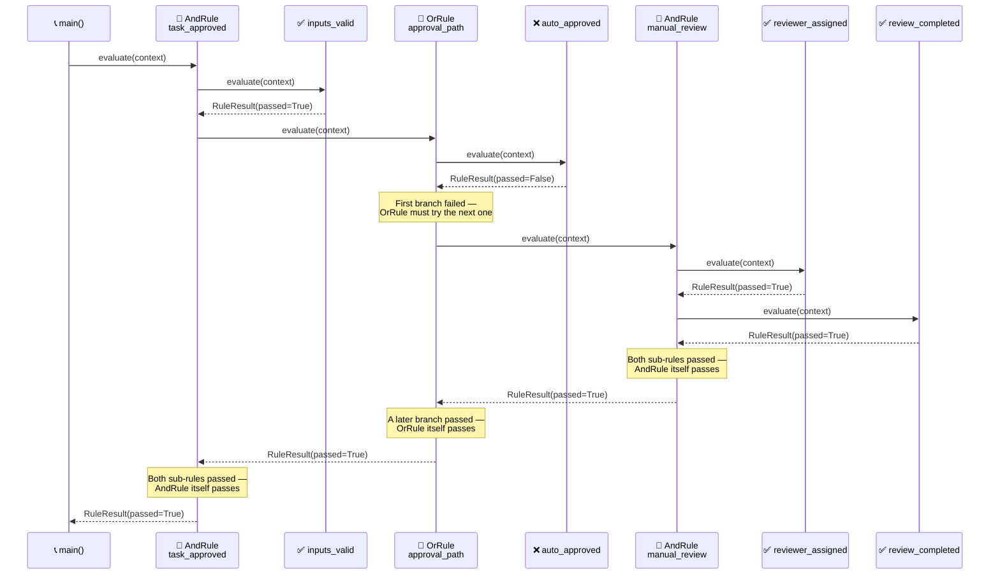

<!-- Title: Verdict Quickstart -->
# Verdict — Quickstart

> The five names you need, and one complete example using all of them.
> See [`../README.md`](../README.md) for this package's own
> pip-install/first-rule quickstart, the top-level
> [`../../README.md`](../../../../README.md) for what Verdict is in narrative
> form, and [`../../docs/architecture/`](../../../../docs/architecture/README.md)
> for the full design reasoning — this doc is just "how do I start."

## Core concepts

- **`Rule`** — anything with a `name`, an optional `group`, and an
  `async evaluate(context: dict) -> RuleResult` method. The structural
  `Protocol` any custom rule implementation can satisfy without
  inheriting from anything.
- **`FunctionRule`** — wraps a plain async predicate as a `Rule`. The
  common case: most rules are "run this function against the context."
- **`AndRule`** / **`OrRule`** — composite rules that combine other
  rules, short-circuiting the same way a boolean `and`/`or` expression
  would (`AndRule` stops at the first failure, `OrRule` stops at the
  first pass).
- **`RulesEngine`** — holds a set of rules and runs them three ways:
  `run_all` (every rule, full diagnostic picture — deliberately does
  **not** short-circuit), `run_named` (one specific rule by name),
  `run_group` (every rule sharing a group label). An unknown name or
  label raises; `try_run_named`/`try_run_group` return `None` instead,
  for callers whose own domain has an answer for absence — see
  [`extending/absence-vs-failure/`](../../../../docs/extending/absence-vs-failure/README.md).
- **`RuleResult`** / **`RunResult`** — immutable outcome types, each
  answering three different questions about a composite's decision:
  `sub_results` (what actually ran, one level), `decided_by` (which of
  those children explain *this* verdict, one level), and
  `leaves`/`failing_leaves` (the terminal checks, fully recursive).
  Only `sub_results` is stored; the rest are computed on access, which
  is what keeps a result serializable. `RuleResult.data` is a fully
  opaque slot for a caller's own domain object to ride through
  evaluation — Verdict never reads or depends on its shape.

## One complete example

Composites nest arbitrarily deep — an `AndRule` can hold an `OrRule`,
which can hold another `AndRule`, and so on. The same leaf checks below
also get registered on a `RulesEngine` under one shared group label, so
`run_group` can report on all four regardless of whether the nested
decision above ever looked at each one:

```python
import asyncio
from verdict import AndRule, FunctionRule, OrRule, PredicateOutcome, RulesEngine


async def inputs_valid(context: dict) -> PredicateOutcome:
    return PredicateOutcome(passed=context["has_required_fields"])


async def auto_approved(context: dict) -> PredicateOutcome:
    return PredicateOutcome(passed=context["auto_approved"])


async def reviewer_assigned(context: dict) -> PredicateOutcome:
    return PredicateOutcome(passed=context["reviewer_assigned"])


async def review_completed(context: dict) -> PredicateOutcome:
    return PredicateOutcome(passed=context["review_completed"])


async def main() -> None:
    task_approved = AndRule(
        "task_approved",
        [
            FunctionRule("inputs_valid", inputs_valid),
            OrRule(
                "approval_path",
                [
                    FunctionRule("auto_approved", auto_approved),
                    AndRule(
                        "manual_review",
                        [
                            FunctionRule("reviewer_assigned", reviewer_assigned),
                            FunctionRule("review_completed", review_completed),
                        ],
                    ),
                ],
            ),
        ],
    )

    passing = {
        "has_required_fields": True,
        "auto_approved": False,
        "reviewer_assigned": True,
        "review_completed": True,
    }
    result = await task_approved.evaluate(passing)
    print(result.passed)  # True — auto_approved failed, but manual review covered it

    failing = {**passing, "review_completed": False}
    result = await task_approved.evaluate(failing)
    print(result.passed)  # False — neither approval path succeeded

    # The same four leaf checks, registered flat under one group for a full
    # diagnostic view — run_group never short-circuits, so every check
    # reports regardless of whether the nested decision above stopped early.
    engine = RulesEngine([
        FunctionRule("inputs_valid", inputs_valid, group="approval_checks"),
        FunctionRule("auto_approved", auto_approved, group="approval_checks"),
        FunctionRule("reviewer_assigned", reviewer_assigned, group="approval_checks"),
        FunctionRule("review_completed", review_completed, group="approval_checks"),
    ])
    diagnostic = await engine.run_group("approval_checks", passing)
    print([r.passed for r in diagnostic.results])
    # [True, False, True, True] — auto_approved's own failure is visible here,
    # even though the nested decision above never had to look at it once the
    # manual-review branch already succeeded


asyncio.run(main())
```


```mermaid
sequenceDiagram
    participant Caller as 📞 main()
    participant Top as 🔀 AndRule<br/>task_approved
    participant R1 as ✅ inputs_valid
    participant Path as 🔀 OrRule<br/>approval_path
    participant R2 as ❌ auto_approved
    participant Manual as 🔀 AndRule<br/>manual_review
    participant R3 as ✅ reviewer_assigned
    participant R4 as ✅ review_completed

    Caller->>Top: evaluate(context)
    Top->>R1: evaluate(context)
    R1-->>Top: RuleResult(passed=True)
    Top->>Path: evaluate(context)
    Path->>R2: evaluate(context)
    R2-->>Path: RuleResult(passed=False)
    Note over Path: First branch failed —<br/>OrRule must try the next one
    Path->>Manual: evaluate(context)
    Manual->>R3: evaluate(context)
    R3-->>Manual: RuleResult(passed=True)
    Manual->>R4: evaluate(context)
    R4-->>Manual: RuleResult(passed=True)
    Note over Manual: Both sub-rules passed —<br/>AndRule itself passes
    Manual-->>Path: RuleResult(passed=True)
    Note over Path: A later branch passed —<br/>OrRule itself passes
    Path-->>Top: RuleResult(passed=True)
    Note over Top: Both sub-rules passed —<br/>AndRule itself passes
    Top-->>Caller: RuleResult(passed=True)
```

> **Reading the Sequence**:
>
> 1. **`inputs_valid` passes first** — a plain leaf check, no nesting
>    involved yet.
> 2. **`approval_path`'s first branch fails** — `auto_approved` is
>    `False`, so the `OrRule` has no choice but to try its next branch;
>    an `OrRule` only stops early once *something* passes, never on a
>    failure.
> 3. **`manual_review`, itself an `AndRule`, runs both its own checks**
>    and passes — this is the nesting: `approval_path`'s second branch
>    is a whole composite, not a leaf.
> 4. **Every result folds upward** — `manual_review`'s pass makes
>    `approval_path` pass, which makes `task_approved` pass. The caller
>    only ever sees the one top-level `RuleResult`.
> 5. **`run_group` tells a different story from the same rules** — it
>    reports `auto_approved`'s real failure, something the nested
>    decision above never had to surface once a later branch succeeded.

## A typed context

The example above uses a `dict`, which stays first-class permanently — a
rule reused across genuinely different aggregate shapes is naturally
served by it. But a cohesive family of rules sharing one shape can say
so, and then a sub-rule expecting a different shape stops being a
runtime `KeyError` and becomes something a type checker catches:

```python
import asyncio
from dataclasses import dataclass

from verdict import AndRule, FunctionRule, PredicateOutcome, RulesEngine


@dataclass(frozen=True)
class OrderContext:
    total: float
    is_member: bool


async def order_total_met(ctx: OrderContext) -> PredicateOutcome:
    return PredicateOutcome(passed=ctx.total >= 50)


async def is_member(ctx: OrderContext) -> PredicateOutcome:
    return PredicateOutcome(passed=ctx.is_member)


async def main() -> None:
    free_shipping = AndRule(
        "free_shipping",
        [
            FunctionRule("order_total_met", order_total_met),
            FunctionRule("is_member", is_member),
        ],
    )
    engine: RulesEngine[OrderContext] = RulesEngine([free_shipping])

    result = await engine.run_named("free_shipping", OrderContext(total=75.0, is_member=False))
    print(result.passed)                          # False
    print(result.failing_leaves[0].rule_name)     # is_member


asyncio.run(main())
```

`Rule` is generic over the context it reads from, with no default type
parameter, so dict-context is written out explicitly as
`Rule[dict[str, Any]]` rather than being what you get by forgetting.
[`../../../../docs/architecture/python.md`](../../../../docs/architecture/python.md)
covers the mechanics;
[`extending/reusing-a-rule-across-contexts/`](../../../../docs/extending/reusing-a-rule-across-contexts/README.md)
covers when dict-context is the better answer.

## Next: build rules from your own configuration, not just hard-coded ones

Because rules are just objects, they're straightforward to build up at
runtime from whatever configuration a caller already has, rather than
hand-writing one `FunctionRule` per case — see
[`extending/data-driven-rule-construction/`](../../../../docs/extending/data-driven-rule-construction/README.md)
for the scenario.

## Related docs

- [`../../README.md`](../../../../README.md) — the narrative front door.
- [`../../docs/architecture/`](../../../../docs/architecture/README.md) — the full
  design reasoning.
- [`../../docs/extending/`](../../../../docs/extending/README.md) — building on top
  of this package from your own code.
- [`../../docs/testing/`](../../../../docs/testing/README.md) — `uv sync && uv run
  pytest`, and what a test here actually needs to prove.
- [`../../../../fixtures/README.md`](../../../../fixtures/README.md) — more worked examples.
