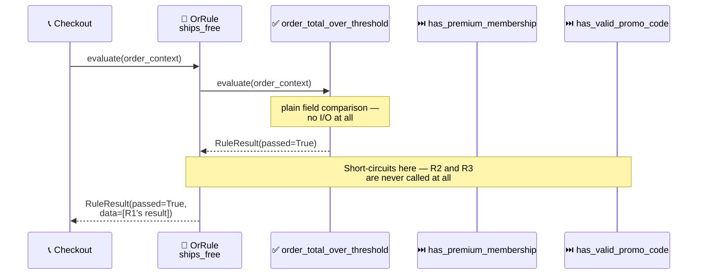

<!-- Title: Sample — Shipping Fee Waiver -->
# Sample: Shipping Fee Waiver

> **The question**: does this order ship free? **Why it's a good fit**:
> there are several independent, unrelated paths to "yes" — a large-enough
> order, an active premium membership, or a valid promo code — and only
> one needs to be true. That's `OrRule`'s exact shape, and the paths have
> very different costs to check, which makes evaluation *order* a real
> design decision, not an afterthought.

## The naive way (and why it breaks down)

The obvious first implementation is an `if`/`elif`/`else` ladder, one
branch per qualifying path:

```python
async def ships_free(order: dict) -> bool:
    if order["total"] >= order["free_shipping_threshold"]:
        return True
    elif order["is_premium_member"]:
        return True
    else:
        return await validate_promo_code(order.get("promo_code"))
```

This looks harmless at three branches, but:

- **The cost-ordering is an accident, not a decision.** Nothing in this
  function *says* the promo-code call is last because it's the most
  expensive — it's last because someone happened to write it last. A
  future edit adding a fourth `elif` above it, or reordering for
  "readability," can silently make every single order pay for an
  external service call it never needed to.
- **A new qualifying path is another `elif`, forever.** Ten qualifying
  paths later, this is a ten-branch ladder where the early-return
  short-circuit behavior — the entire reason ordering mattered — is
  buried in prose, not enforced anywhere.
- **There's no way to list "every path that could waive this fee"**
  without reading the function's source top to bottom — useful for a
  support agent, an audit, or a settings page describing the current
  policy in plain language.

## The verdict way

`OrRule` stops at the first passing sub-rule — ordering the cheapest,
most-likely-to-pass check first (a plain field comparison) before the
most expensive one (an external promo-code service call) means the
common case never pays for the expensive check at all.



> **Reading the Sequence**:
> 1. **`R1` is checked first because it's free** — comparing a number
>    already on the order context costs nothing.
> 2. **`R1` passes, `OrRule` stops immediately** — `R2` (a membership
>    flag lookup) and `R3` (an external promo-code validation call) are
>    never evaluated at all for this order.
> 3. **The expensive path only runs when it has to** — an order that
>    fails `R1` moves on to `R2` (still cheap: an in-memory flag), and
>    only an order failing both pays for `R3`'s external call. This
>    ordering is a real part of the contract, not an implementation
>    detail — see
>    [`../architecture.md`](../../../../../docs/architecture.md#execution-model-sequential-not-concurrent)
>    for why `verdict` guarantees rules run one at a time, in the order
>    given, rather than concurrently.

## The code

```python
from verdict import FunctionRule, OrRule, RuleResult


async def order_total_over_threshold(context: dict) -> RuleResult:
    passed = context["order_total"] >= context["free_shipping_threshold"]
    return RuleResult(rule_name="order_total_over_threshold", passed=passed)


async def has_premium_membership(context: dict) -> RuleResult:
    return RuleResult(rule_name="has_premium_membership", passed=context["is_premium_member"])


async def has_valid_promo_code(context: dict) -> RuleResult:
    # The expensive path: only reached if both cheaper checks above failed.
    is_valid = await context["promo_code_service"].validate(context.get("promo_code"))
    return RuleResult(rule_name="has_valid_promo_code", passed=is_valid)


ships_free = OrRule(
    "ships_free",
    [
        FunctionRule("order_total_over_threshold", order_total_over_threshold),
        FunctionRule("has_premium_membership", has_premium_membership),
        FunctionRule("has_valid_promo_code", has_valid_promo_code),  # cheapest-last, on purpose
    ],
)
```

## Related

- [`dynamic-discounts.md`](2_dynamic-discounts.md) — the `AndRule` mirror
  image (every condition must pass, not just one).
- [`../architecture.md`](../../../../../docs/architecture.md#execution-model-sequential-not-concurrent) —
  why short-circuiting only means something because evaluation is
  sequential, never concurrent.
